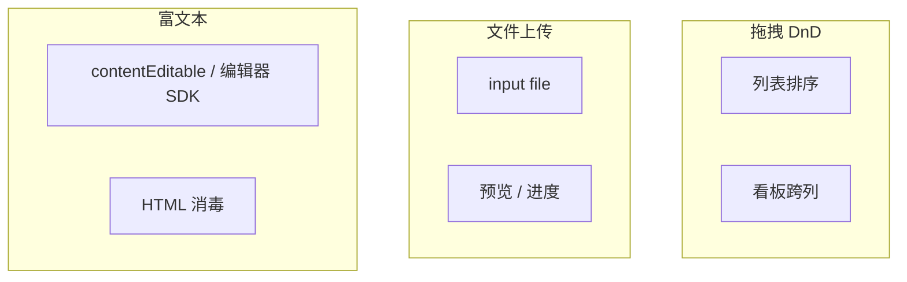
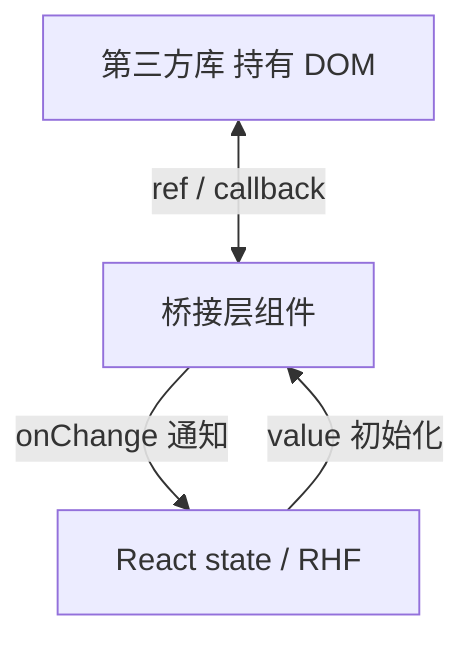

# 复杂交互：拖拽 · 上传 · 富文本

> 文件上传、拖拽排序、富文本编辑器往往**不完全受控**于 React state，需要与 **DOM / 第三方库** 协作。本篇讲常见模式、边界与坑。

---

## 一、三类复杂交互总览



| 类型 | 难点 | 常见库 |
|------|------|--------|
| 拖拽 | 指针事件、滚动容器、触摸 | **@dnd-kit**、react-beautiful-dnd（维护减弱） |
| 上传 | 非受控 file、大小限制、进度 | 原生 + axios/fetch |
| 富文本 | 大块 HTML、光标、与 React 同步 | **Tiptap**、Slate、Quill |

---

## 二、文件上传

### 2.1 原生 input（非受控）

```tsx
function AvatarUpload({ onFile }: { onFile: (file: File) => void }) {
  const inputRef = useRef<HTMLInputElement>(null);

  function handleChange(e: React.ChangeEvent<HTMLInputElement>) {
    const file = e.target.files?.[0];
    if (!file) return;
    if (file.size > 5 * 1024 * 1024) {
      alert('最大 5MB');
      e.target.value = ''; // 允许重选同一文件
      return;
    }
    onFile(file);
  }

  return (
    <>
      <button type="button" onClick={() => inputRef.current?.click()}>
        选择头像
      </button>
      <input
        ref={inputRef}
        type="file"
        accept="image/png,image/jpeg"
        className="hidden"
        onChange={handleChange}
      />
    </>
  );
}
```

| 要点 | 说明 |
|------|------|
| `type="file"` | 几乎总是非受控 |
| `accept` | 过滤 MIME / 扩展名（可被绕过，服务端再验） |
| 清空 `value` | 同文件可再次触发 change |

### 2.2 预览与进度

```tsx
function UploadWithPreview() {
  const [preview, setPreview] = useState<string | null>(null);
  const [progress, setProgress] = useState(0);

  function onFile(file: File) {
    setPreview(URL.createObjectURL(file));
    upload(file, {
      onProgress: p => setProgress(p),
    });
  }

  useEffect(() => {
    return () => {
      if (preview) URL.revokeObjectURL(preview);
    };
  }, [preview]);

  return (
    <>
      {preview && }
      {progress > 0 && <progress value={progress} max={100} />}
    </>
  );
}
```

| 注意 | 说明 |
|------|------|
| `revokeObjectURL` | 避免内存泄漏 |
| 大文件 | 分片上传走后端协议 |

### 2.3 拖拽上传区域

```tsx
function DropZone({ onFile }: { onFile: (f: File) => void }) {
  const [dragging, setDragging] = useState(false);

  return (
    <div
      onDragOver={e => { e.preventDefault(); setDragging(true); }}
      onDragLeave={() => setDragging(false)}
      onDrop={e => {
        e.preventDefault();
        setDragging(false);
        const file = e.dataTransfer.files?.[0];
        if (file) onFile(file);
      }}
      className={dragging ? 'drop-active' : ''}
    >
      拖放文件到此处
    </div>
  );
}
```

`preventDefault` on `dragover` 才能 drop。

---

## 三、拖拽排序（@dnd-kit）

```bash
pnpm add @dnd-kit/core @dnd-kit/sortable @dnd-kit/utilities
```

```tsx
import {
  DndContext,
  closestCenter,
  PointerSensor,
  useSensor,
  useSensors,
} from '@dnd-kit/core';
import {
  arrayMove,
  SortableContext,
  useSortable,
  verticalListSortingStrategy,
} from '@dnd-kit/sortable';
import { CSS } from '@dnd-kit/utilities';

function SortableItem({ id, label }: { id: string; label: string }) {
  const { attributes, listeners, setNodeRef, transform, transition } = useSortable({ id });
  const style = {
    transform: CSS.Transform.toString(transform),
    transition,
  };
  return (
    <div ref={setNodeRef} style={style} {...attributes} {...listeners}>
      {label}
    </div>
  );
}

function SortableList() {
  const [items, setItems] = useState([
    { id: '1', label: 'A' },
    { id: '2', label: 'B' },
  ]);

  const sensors = useSensors(useSensor(PointerSensor));

  return (
    <DndContext
      sensors={sensors}
      collisionDetection={closestCenter}
      onDragEnd={({ active, over }) => {
        if (!over || active.id === over.id) return;
        const oldIndex = items.findIndex(i => i.id === active.id);
        const newIndex = items.findIndex(i => i.id === over.id);
        setItems(arrayMove(items, oldIndex, newIndex));
      }}
    >
      <SortableContext items={items.map(i => i.id)} strategy={verticalListSortingStrategy}>
        {items.map(item => (
          <SortableItem key={item.id} id={item.id} label={item.label} />
        ))}
      </SortableContext>
    </DndContext>
  );
}
```

| 概念 | 说明 |
|------|------|
| `DndContext` | 拖拽上下文 |
| `useSortable` | 可排序项 |
| `arrayMove` | 更新 state 顺序 |
| **稳定 id** | 用业务 id，非 index |

### 3.1 与虚拟列表

长列表 DnD 需虚拟化 + DnD 库文档中的方案，避免上千 DOM 节点。

---

## 四、富文本编辑器

### 4.1 为什么难？

| 挑战 | 原因 |
|------|------|
| 光标/选区 | 浏览器 Selection API |
| 大块 HTML | 不宜每次 onChange 全量 diff |
| 粘贴 Word | 脏 HTML |
| 与 React 受控 | 频繁 setState 卡顿 |

### 4.2 Tiptap 示例（推荐方向）

```bash
pnpm add @tiptap/react @tiptap/starter-kit
```

```tsx
import { useEditor, EditorContent } from '@tiptap/react';
import StarterKit from '@tiptap/starter-kit';

function RichEditor({
  value,
  onChange,
}: {
  value: string;
  onChange: (html: string) => void;
}) {
  const editor = useEditor({
    extensions: [StarterKit],
    content: value,
    onUpdate: ({ editor }) => onChange(editor.getHTML()),
  });

  return <EditorContent editor={editor} className="prose border rounded p-2" />;
}
```

| 模式 | 说明 |
|------|------|
| 存 HTML 字符串 | 简单，须 **消毒** 后展示 |
| 存 JSON（ProseMirror doc） | 更安全、可版本化 |

### 4.3 安全：XSS

```tsx
import DOMPurify from 'dompurify';

const safeHtml = DOMPurify.sanitize(rawHtml);
<div dangerouslySetInnerHTML={{ __html: safeHtml }} />
```

**永远不要**直接渲染用户富文本 HTML。见 [16-安全](../16-可访问性-安全-国际化/03-XSS-安全与dangerouslySetInnerHTML.md)。

---

## 五、与 React 集成的通用模式



| 模式 | 适用 |
|------|------|
| **ref + imperative** | 地图、图表、老编辑器 |
| **受控 value + onChange** | 现代 React 友好库 |
| **仅 mount 一次** | 避免反复 destroy/create |
| **key 重置** | 切换文档 id 时 `key={docId}` remount |

```tsx
function Chart({ data }: { data: number[] }) {
  const ref = useRef<HTMLDivElement>(null);

  useEffect(() => {
    const chart = createChart(ref.current!, data);
    return () => chart.destroy();
  }, [data]);

  return <div ref={ref} />;
}
```

---

## 六、性能与体验

| 场景 | 建议 |
|------|------|
| 大文件上传 | 进度条、取消、后端直传 OSS |
| 拖拽 | `touch-action`、滚动容器 `modifiers` |
| 富文本 | debounce onChange 或库内置 |
| 粘贴图片 | 转上传 URL，别嵌 base64 巨串 |

---

## 七、无障碍

| 场景 | 要点 |
|------|------|
| 上传 | 按钮触发 + 隐藏 input 仍须可聚焦或通过按钮 |
| 拖拽 | 提供键盘替代（上移/下移按钮） |
| 编辑器 | 工具栏 `aria-label`、焦点管理 |

@dnd-kit 支持 KeyboardSensor，配置后可用键盘排序。

---

## 八、小结

| 场景 | 推荐 |
|------|------|
| 单文件上传 | `input type=file` + ref |
| 拖拽排序 | @dnd-kit |
| 富文本 | Tiptap + DOMPurify |
| 第三方 DOM | effect 生命周期 + 清理 |
| 安全 | 服务端校验 + HTML 消毒 |

**上一篇**：[03-React-Hook-Form与Schema校验](./03-React-Hook-Form与Schema校验.md)  
**下一批（P0-4）**：[05-Hooks体系](../05-Hooks体系/00-Hooks总览与规则.md)
