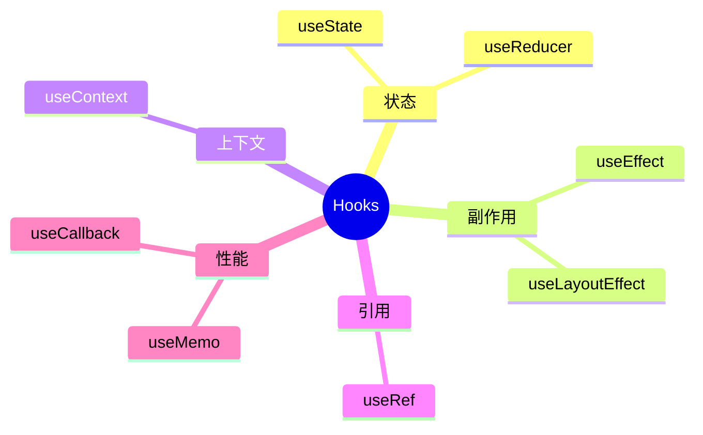
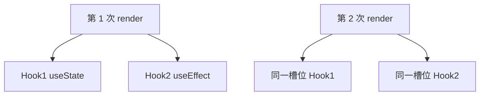

# Hooks 总览与规则

Hooks 是以 `use` 开头的函数，把 state、副作用、上下文等能力挂到函数组件上。日常开发只要守住两条铁律，**顶层调用、只在 React 函数里调用**，再配合 eslint-plugin-react-hooks，就能避开大部分 Invalid hook call。

---

## Hooks 是什么

```tsx
function Profile({ userId }: { userId: string }) {
  const [user, setUser] = useState<User | null>(null);

  useEffect(() => {
    fetchUser(userId).then(setUser);
  }, [userId]);

  return user ? <Card user={user} /> : <Spinner />;
}
```

| 没有 Hooks 时 | 有 Hooks 后 |
|---------------|-------------|
| 函数组件无 state | `useState` / `useReducer` |
| 无生命周期 | `useEffect` / `useLayoutEffect` |
| 逻辑难复用 | **自定义 Hook** |

---

## 内置 Hooks 分类

| Hook | 类别 | 一句话 |
|------|------|--------|
| `useState` | 状态 | 本地可变 state |
| `useReducer` | 状态 | 复杂 state + action |
| `useEffect` | 副作用 | 渲染后异步副作用 + 清理 |
| `useLayoutEffect` | 副作用 | 绘制前同步副作用 |
| `useContext` | 上下文 | 读 Context 值 |
| `useRef` | 引用 | DOM / 可变盒子 |
| `useMemo` / `useCallback` | 性能 | 缓存值/函数 |
| `useTransition` / `useDeferredValue` | 并发 | 低优先级更新 |
| `useId` | 其他 | SSR 安全 id |
| `useSyncExternalStore` | 其他 | 订阅外部 store |



---

## 两条规则（必须遵守）

### 只在顶层调用

```tsx
// ❌ 条件调用 — Hook 数量变化
function Bad({ show }: { show: boolean }) {
  if (show) {
    const [x, setX] = useState(0);
  }
}

// ✅ 始终调用，用 state 控制逻辑
function Good({ show }: { show: boolean }) {
  const [x, setX] = useState(0);
  if (!show) return null;
  return <div>{x}</div>;
}
```

React 靠**调用顺序**把 state 对应到 Hook 槽位；顺序变了 → Invalid hook call 或 silent 错乱。



### 只在 React 函数中调用

| ✅ 可以 | ❌ 不可以 |
|---------|-----------|
| 函数组件 | 普通 function |
| **自定义 Hook** | class 组件 |
| | 事件回调里**新调** useState |

```tsx
// ✅ 抽到自定义 Hook
function useCounter() {
  const [x, setX] = useState(0);
  return { x, inc: () => setX(c => c + 1) };
}
```

---

## eslint-plugin-react-hooks

```json
{
  "plugins": ["react-hooks"],
  "rules": {
    "react-hooks/rules-of-hooks": "error",
    "react-hooks/exhaustive-deps": "warn"
  }
}
```

`exhaustive-deps` 警告不是教条，故意省略依赖须注释说明。

---

## 自定义 Hook 与 class 对照

自定义 Hook 也必须遵守两条规则，命名以 **`use`** 开头：

```tsx
function useUser(id: string) {
  const [user, setUser] = useState<User | null>(null);
  useEffect(() => {
    let cancelled = false;
    fetchUser(id).then(u => { if (!cancelled) setUser(u); });
    return () => { cancelled = true; };
  }, [id]);
  return { user };
}
```

| class 生命周期 | Hooks 替代 |
|----------------|------------|
| 初始 state | `useState` / 惰性 init |
| `componentDidMount` | `useEffect(fn, [])` |
| `componentDidUpdate` | `useEffect(fn, [deps])` |
| `componentWillUnmount` | effect cleanup |
| `shouldComponentUpdate` | `React.memo` |

---

## 常见错误与性能误解

| 报错 | 常见原因 |
|------|----------|
| Invalid hook call | 多份 react、Hook 在非组件里调用 |
| Rendered more/fewer hooks | 条件里多/少调 Hook |
| Cannot update during render | render 里 setState |

**多份 react**：monorepo 里 `react` 解析到两个路径 → overrides/dedupe。

| 误解 | 事实 |
|------|------|
| 每个 state 一个 Hook 很慢 | 正常规模无问题 |
| 到处 useMemo | 可能更慢 |
| useEffect = mounted | 语义是「渲染后」；StrictMode 开发双跑 |

---

## 小结

Hooks 只在**组件或自定义 Hook 的顶层**调用；顺序固定，对应内部 state 槽位。

**复用**有状态逻辑用**自定义 Hook**（`use` 前缀），而非 HOC。

**ESLint**：`rules-of-hooks` + `exhaustive-deps`；多份 react 是 Invalid hook call 常见根因。

**useEffect ≠ mounted**；开发 StrictMode 双调 effect 要写好 cleanup。

**易混点**：事件回调里不能新调 useState；条件分支不能改变 Hook 数量。

常见错因：Hook 调用顺序是否稳定？是否装了多份 react？
