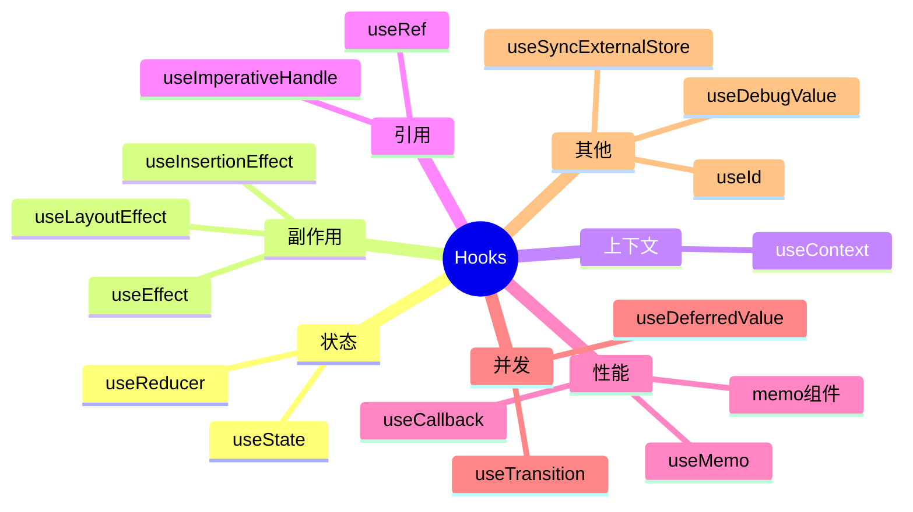
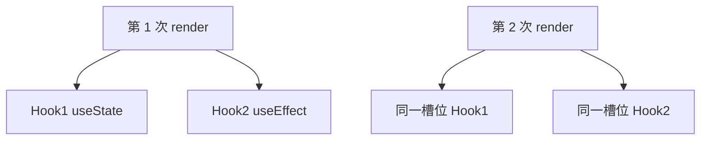

# Hooks 总览与规则

> **Hooks** 让函数组件拥有 state、副作用、Context、ref 等能力。本篇建立**全景分类表**，并强调两条**铁律**——违反会导致难以排查的 bug。

---

## 一、Hooks 是什么？

Hooks 是 **以 `use` 开头的函数**，仅在 React 渲染流程中调用，把「状态与能力」挂到函数组件上。

```tsx
function Profile({ userId }: { userId: string }) {
  const [user, setUser] = useState<User | null>(null);

  useEffect(() => {
    fetchUser(userId).then(setUser);
  }, [userId]);

  return user ? <Card user={user} /> : <Spinner />;
}
```

| 没有 Hooks 时 | 有 Hooks 后 |
|---------------|-------------|
| 函数组件无 state | `useState` / `useReducer` |
| 无生命周期 | `useEffect` / `useLayoutEffect` |
| 逻辑难复用 | **自定义 Hook** |

---

## 二、内置 Hooks 分类表



### 2.1 完整对照表

| Hook | 类别 | 一句话 |
|------|------|--------|
| `useState` | 状态 | 本地可变 state |
| `useReducer` | 状态 | 复杂 state + action |
| `useEffect` | 副作用 | 渲染后异步副作用 + 清理 |
| `useLayoutEffect` | 副作用 | 渲染后、绘制前同步副作用 |
| `useInsertionEffect` | 副作用 | CSS-in-JS 注入（库作者） |
| `useContext` | 上下文 | 读 Context 值 |
| `useRef` | 引用 | DOM / 可变盒子 |
| `useImperativeHandle` | 引用 | 定制 ref 暴露给父组件 |
| `useMemo` | 性能 | 缓存计算结果 |
| `useCallback` | 性能 | 缓存函数引用 |
| `useTransition` | 并发 | 标记低优先级更新 |
| `useDeferredValue` | 并发 | 延迟某值 |
| `useId` | 其他 | 稳定 id（SSR/a11y） |
| `useSyncExternalStore` | 其他 | 订阅外部 store |
| `useDebugValue` | 其他 | DevTools 显示自定义 Hook 标签 |

并发类见 [12-并发与Suspense](../12-并发与Suspense/)；本篇聚焦日常开发高频 Hook。

---

## 三、两条规则（必须遵守）

### 3.1 只在顶层调用

**不要在**循环、条件、嵌套函数里调用 Hooks。

```tsx
// ❌ 条件调用 — Hook 数量变化，React 无法对应
function Bad({ show }: { show: boolean }) {
  if (show) {
    const [x, setX] = useState(0);
  }
}

// ✅ 始终调用，用 state 控制逻辑
function Good({ show }: { show: boolean }) {
  const [x, setX] = useState(0);
  if (!show) return null;
  return <div>{x}</div>;
}
```

**原因**：React 靠**调用顺序**把 state 对应到每次 render 的 Hook 槽位。



顺序变了 → 槽位错乱 → 「Invalid hook call」或 silent 数据错乱。

### 3.2 只在 React 函数中调用

| ✅ 可以 | ❌ 不可以 |
|---------|-----------|
| 函数组件 | 普通 function |
| **自定义 Hook**（`use` 开头） | class 组件 |
| | 事件回调里**新调** useState |

```tsx
// ❌
function click() {
  const [x, setX] = useState(0);
}

// ✅ 抽到自定义 Hook
function useCounter() {
  const [x, setX] = useState(0);
  return { x, inc: () => setX(c => c + 1) };
}
```

---

## 四、eslint-plugin-react-hooks

```json
{
  "plugins": ["react-hooks"],
  "rules": {
    "react-hooks/rules-of-hooks": "error",
    "react-hooks/exhaustive-deps": "warn"
  }
}
```

| 规则 | 作用 |
|------|------|
| `rules-of-hooks` | 检查顶层调用 |
| `exhaustive-deps` | 检查 effect 依赖数组 |

**exhaustive-deps 警告**不是教条：有时故意省略依赖，须写注释说明。

---

## 五、Hook 调用顺序与自定义 Hook

自定义 Hook **也必须**遵守两条规则，且可以调用其他 Hook：

```tsx
function useUser(id: string) {
  const [user, setUser] = useState<User | null>(null);
  const [error, setError] = useState<Error | null>(null);

  useEffect(() => {
    let cancelled = false;
    fetchUser(id)
      .then(u => { if (!cancelled) setUser(u); })
      .catch(e => { if (!cancelled) setError(e); });
    return () => { cancelled = true; };
  }, [id]);

  return { user, error };
}
```

命名必须以 **`use`** 开头，便于 ESLint 与读者识别。

详见 [07-自定义Hooks设计与模式库](./07-自定义Hooks设计与模式库.md)。

---

## 六、Hooks 与 class 生命周期对照（速查）

| class 生命周期 | Hooks 替代 |
|----------------|------------|
| `constructor` / 初始 state | `useState` 初始值 / 惰性 init |
| `componentDidMount` | `useEffect(fn, [])` |
| `componentDidUpdate` | `useEffect(fn, [deps])` |
| `componentWillUnmount` | effect cleanup `return () => {}` |
| `shouldComponentUpdate` | `React.memo` + props |
| `getDerivedStateFromProps` | 渲染时计算或 key remount |
| `createRef` | `useRef` |

完整迁移见 [17-类组件与迁移](../17-类组件与迁移/)。

---

## 七、常见错误信息

| 报错 | 常见原因 |
|------|----------|
| Invalid hook call | 多份 react、Hook 在非组件里调用、违反规则 |
| Rendered more hooks than previous | 条件里多调了 Hook |
| Rendered fewer hooks than previous | 条件里少调了 Hook |
| Cannot update during render | render 里 setState |

**多份 react**：monorepo 里 `react` 被解析到两个路径 → `pnpm overrides` / dedupe。

---

## 八、Hooks 与性能（别误解）

| 误解 | 事实 |
|------|------|
| 每个 state 一个 Hook 很慢 | 正常规模无问题 |
| 应用 useMemo  everywhere | 可能更慢；见 [05-useMemo](./05-useMemo-useCallback.md) |
| useEffect = mounted | 语义是「渲染后同步」，StrictMode 会双跑 |

---

## 九、阅读顺序（本模块）

| 顺序 | 文档 |
|------|------|
| 1 | 本篇（规则 + 地图） |
| 2 | [01-useState与useReducer](./01-useState与useReducer.md) |
| 3 | [02-useEffect与useLayoutEffect](./02-useEffect与useLayoutEffect.md) |
| 4 | [03-useRef](./03-useRef-useImperativeHandle.md) |
| 5 | [04-useContext](./04-useContext与跨层通信.md) |
| 6 | [05-useMemo/useCallback](./05-useMemo-useCallback.md) |
| 7 | [06-其他内置 Hook](./06-useId-useSyncExternalStore等.md) |
| 8 | [07-自定义 Hooks](./07-自定义Hooks设计与模式库.md) |

---

## 十、小结

| 要点 | 记忆 |
|------|------|
| 顶层 + 仅 React 函数 | 两条规则 |
| 顺序固定 | 对应 state 槽位 |
| 自定义 Hook | `use` 前缀，复用逻辑 |
| ESLint | rules-of-hooks + exhaustive-deps |

**下一篇**：[01-useState与useReducer](./01-useState与useReducer.md)
