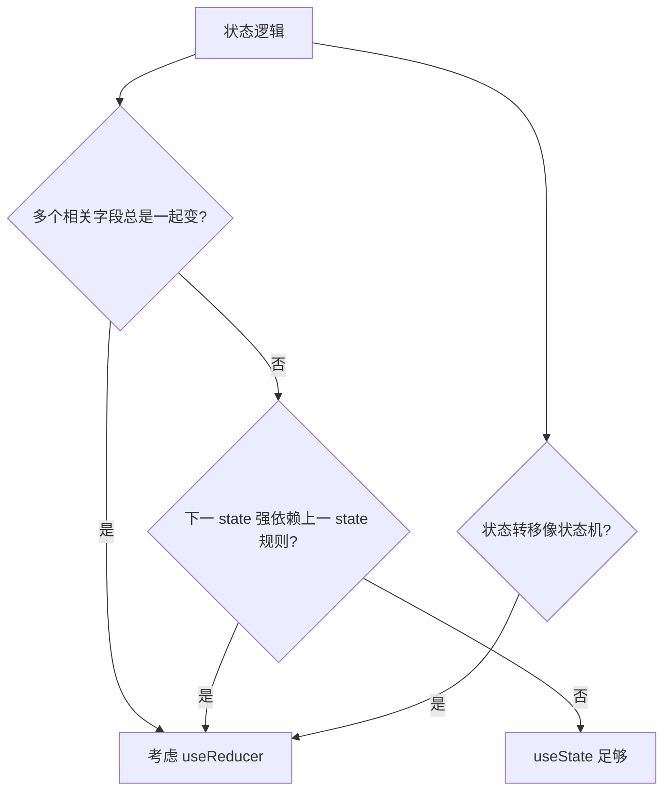

# useState 与 useReducer

> **`useState`** 管理简单本地 state；**`useReducer`** 用「当前 state + action → 新 state」处理复杂转移。二者共享同一套更新语义（快照、批处理、不可变）。

---

## 一、useState 回顾与深入

```tsx
const [state, setState] = useState(initialState);
```

### 1.1 初始 state 的三种写法

```tsx
useState(0);
useState({ count: 0, step: 1 });
useState(() => computeExpensiveInitial()); // 惰性，只算一次
```

| 写法 | 何时用 |
|------|--------|
| 直接值 | 字面量、简单对象 |
| 函数 init | 读 localStorage、大数组构造 |

### 1.2 更新方式对比

```tsx
setCount(count + 1);           // 依赖当前 render 快照
setCount(c => c + 1);          // 依赖最新 state，连续更新用此
setCount(5);                   // 直接赋值
```

见 [04-State基础与更新语义](../03-组件基础/04-State基础与更新语义.md)。

### 1.3 对象 state 更新

```tsx
setForm(prev => ({ ...prev, email: value }));
setItems(prev => prev.map(i => i.id === id ? { ...i, done: true } : i));
```

---

## 二、何时从 useState 升级到 useReducer？



| 适合 useState | 适合 useReducer |
|---------------|---------------|
| 单个计数、开关 | 多字段表单 wizard |
| 彼此独立字段 | todo 列表增删改 |
| 简单 UI  toggles | 明确 action 类型（undo/redo） |

---

## 三、useReducer 基础

```tsx
type State = { count: number; step: number };
type Action =
  | { type: 'increment' }
  | { type: 'decrement' }
  | { type: 'setStep'; step: number }
  | { type: 'reset' };

function reducer(state: State, action: Action): State {
  switch (action.type) {
    case 'increment':
      return { ...state, count: state.count + state.step };
    case 'decrement':
      return { ...state, count: state.count - state.step };
    case 'setStep':
      return { ...state, step: action.step };
    case 'reset':
      return { count: 0, step: 1 };
    default:
      return state;
  }
}

function Counter() {
  const [state, dispatch] = useReducer(reducer, { count: 0, step: 1 });

  return (
    <>
      <p>{state.count}</p>
      <button onClick={() => dispatch({ type: 'increment' })}>+</button>
      <button onClick={() => dispatch({ type: 'decrement' })}>-</button>
    </>
  );
}
```

| API | 说明 |
|-----|------|
| `reducer(state, action)` | **纯函数**，返回新 state |
| `dispatch(action)` | 触发更新，可传给子组件 |
| 第三参数 init | `useReducer(reducer, arg, initFn)` 惰性初始 state |

```tsx
function init(arg: number): State {
  return { count: arg, step: 1 };
}
useReducer(reducer, 0, init);
```

---

## 四、useReducer + Context（轻量全局）

```tsx
const DispatchContext = createContext<React.Dispatch<Action> | null>(null);
const StateContext = createContext<State | null>(null);

function Provider({ children }: { children: React.ReactNode }) {
  const [state, dispatch] = useReducer(reducer, initialState);
  return (
    <DispatchContext.Provider value={dispatch}>
      <StateContext.Provider value={state}>{children}</StateContext.Provider>
    </DispatchContext.Provider>
  );
}

function useAppState() {
  const ctx = useContext(StateContext);
  if (!ctx) throw new Error('missing provider');
  return ctx;
}

function useAppDispatch() {
  const ctx = useContext(DispatchContext);
  if (!ctx) throw new Error('missing provider');
  return ctx;
}
```

**拆分 dispatch 与 state**：只 dispatch 的组件不会因 state 变而 re-render（仍订阅 Context 时需注意，见 Context 篇）。

大规模应用更常用 **Redux Toolkit** 或 **Zustand**，见 [08-状态管理](../08-状态管理/)。

---

## 五、Immer 简化 reducer（可选）

```tsx
import { useImmerReducer } from 'use-immer';

function reducer(draft: State, action: Action) {
  switch (action.type) {
    case 'increment':
      draft.count += draft.step;
      break;
  }
}
```

写法接近「突变」，底层仍不可变。团队统一即可。

---

## 六、useState vs useReducer 对照

| 维度 | useState | useReducer |
|------|----------|------------|
| API 复杂度 | 低 | 中 |
| 逻辑位置 | 组件内 setX | 集中在 reducer |
| 测试 | 测组件 | **reducer 纯函数易单测** |
| 调试 | DevTools 看 state | action 类型清晰 |
| 与 dispatch 下发 | 多个 set 函数 | 单一 dispatch |

---

## 七、反模式

| 反模式 | 问题 |
|--------|------|
| reducer 里发请求 | 应 side effect 在 useEffect |
| reducer 里 `Math.random()` | 应纯函数 |
| 简单 boolean 用 reducer | 过度设计 |
| action 类型字符串无联合 | TS 难约束 |

```tsx
// ❌ reducer 不纯
case 'load':
  fetch('/api').then(...); // 副作用
  return state;
```

---

## 八、与 React 19 useActionState（了解）

React 19 提供 `useActionState` 把 async action 与 pending/error/state 绑定，表单场景可替代手写 loading。见 [18-React19](../18-React19与新特性/01-React19要点.md)。

---

## 九、小结

| 场景 | 选择 |
|------|------|
| 单值、少字段 | useState |
| 多步转移、action 日志 | useReducer |
| 测试 reducer | 导出 reducer 单测 |
| 全局 | reducer + Context 或 Zustand/RTK |

**上一篇**：[00-Hooks总览与规则](./00-Hooks总览与规则.md)  
**下一篇**：[02-useEffect与useLayoutEffect](./02-useEffect与useLayoutEffect.md)
