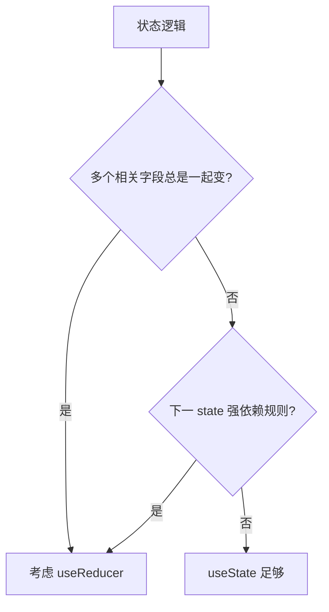

# useState 与 useReducer

`useState` 管简单本地状态；当多个字段总是一起变、转移像状态机时，升级到 `useReducer` 把规则收到纯函数里。两者都要求**不可变更新**；复杂全局可配 Context，但别与 Query 缓存重复。

---

## useState 深入

```tsx
useState(0);
useState(() => computeExpensiveInitial()); // 惰性，只算一次

setCount(count + 1);           // 依赖当前 render 快照
setCount(c => c + 1);          // 依赖最新 state，连续更新用此
```

对象/数组：

```tsx
setForm(prev => ({ ...prev, email: value }));
setItems(prev => prev.map(i => i.id === id ? { ...i, done: true } : i));
```

---

## 何时升级 useReducer



| 适合 useState | 适合 useReducer |
|---------------|-----------------|
| 单个计数、开关 | 多字段 wizard |
| 彼此独立字段 | todo 增删改 |
| 简单 UI toggles | 明确 action 类型 |

---

## useReducer 基础

```tsx
type State = { count: number; step: number };
type Action =
  | { type: 'increment' }
  | { type: 'decrement' }
  | { type: 'setStep'; step: number }
  | { type: 'reset' };

function reducer(state: State, action: Action): State {
  switch (action.type) {
    case 'increment':
      return { ...state, count: state.count + state.step };
    case 'decrement':
      return { ...state, count: state.count - state.step };
    case 'setStep':
      return { ...state, step: action.step };
    case 'reset':
      return { count: 0, step: 1 };
    default:
      return state;
  }
}

const [state, dispatch] = useReducer(reducer, { count: 0, step: 1 });
```

| API | 说明 |
|-----|------|
| `reducer(state, action)` | **纯函数**，返回新 state |
| `dispatch(action)` | 可传给子组件 |
| 第三参数 init | `useReducer(reducer, arg, initFn)` 惰性初始 |

---

## useReducer + Context

```tsx
const DispatchContext = createContext<React.Dispatch<Action> | null>(null);
const StateContext = createContext<State | null>(null);

function Provider({ children }: { children: React.ReactNode }) {
  const [state, dispatch] = useReducer(reducer, initialState);
  return (
    <DispatchContext.Provider value={dispatch}>
      <StateContext.Provider value={state}>{children}</StateContext.Provider>
    </DispatchContext.Provider>
  );
}
```

**拆分 dispatch 与 state**：只 dispatch 的组件不因 state 变而 re-render（仍要注意 Context 订阅方式）。

大规模应用更常用 **Zustand** 或 **Redux Toolkit**。

---

## Immer 与反模式

`useImmerReducer` 写法接近突变，底层仍不可变。

| 反模式 | 问题 |
|--------|------|
| reducer 里发请求 | 副作用应在 useEffect |
| reducer 里 `Math.random()` | 应纯函数 |
| 简单 boolean 用 reducer | 过度设计 |

```tsx
// ❌ reducer 不纯
case 'load':
  fetch('/api').then(...);
  return state;
```

---

## useState vs useReducer

| 维度 | useState | useReducer |
|------|----------|------------|
| API 复杂度 | 低 | 中 |
| 逻辑位置 | 组件内 setX | 集中在 reducer |
| 测试 | 测组件 | **reducer 易单测** |
| 下发 | 多个 set | 单一 dispatch |

React 19 **useActionState** 可把 async action 与 pending/error 绑定，表单场景可替代手写 loading。

---

## 小结

**单值、少字段**用 useState；**多步转移、action 日志**用 useReducer。

**Reducer 必须纯**；副作用在 effect；复杂对象可用 Immer。

**轻量全局**：useReducer + Context，拆分 state/dispatch；大型用 Zustand/RTK。

**勿与 Query 重复缓存**服务端列表数据。

**易混点**：reducer 里 fetch；连续 set 不用函数式更新（useState 侧）。

常见错因：该用 reducer 还是多个 useState？reducer 是否纯？
