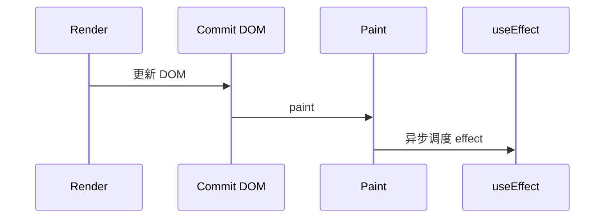

# useEffect 与 useLayoutEffect

副作用是影响 React 外部世界或依赖外部的操作，fetch、订阅、改 `document.title` 等。`useEffect` 在浏览器 **paint 之后**异步跑；`useLayoutEffect` 在 paint **之前**同步跑，仅在有可见闪烁时用。

---

## 副作用边界

| 是副作用 | 不是副作用（应在 render） |
|----------|---------------------------|
| fetch 数据 | 由 props 计算 className |
| 订阅 WebSocket | `items.filter` |
| `document.title = ...` | 格式化日期显示 |
| 定时器 | 纯 JSX 返回 |

```tsx
useEffect(() => {
  // 副作用
  return () => { /* 清理 */ };
}, [deps]);
```

---

## useEffect 执行时机



| deps | 行为 |
|------|------|
| 省略 | **每次** commit 后都执行 |
| `[]` | mount 后一次（开发 StrictMode 双调） |
| `[a, b]` | a 或 b 变则执行；先 cleanup 再 effect |

```tsx
useEffect(() => {
  const id = setInterval(() => tick(), 1000);
  return () => clearInterval(id);
}, []);
```

清理时机：卸载前，或**下一次 effect 执行前**。

---

## 典型场景：请求与订阅

```tsx
useEffect(() => {
  let cancelled = false;
  async function load() {
    const data = await fetchUser(userId);
    if (!cancelled) setUser(data);
  }
  load();
  return () => { cancelled = true; };
}, [userId]);
```

更推荐 **TanStack Query** 管服务端数据；手写 fetch 须防**竞态**（cancelled 或 AbortController）。

```tsx
useEffect(() => {
  const ctrl = new AbortController();
  fetch(`/api/users/${userId}`, { signal: ctrl.signal })
    .then(r => r.json())
    .then(setUser)
    .catch(e => { if (e.name !== 'AbortError') setError(e); });
  return () => ctrl.abort();
}, [userId]);
```

```tsx
useEffect(() => {
  function onResize() { setW(window.innerWidth); }
  window.addEventListener('resize', onResize);
  return () => window.removeEventListener('resize', onResize);
}, []);
```

---

## useLayoutEffect

```tsx
useLayoutEffect(() => {
  const height = ref.current?.getBoundingClientRect().height;
  setTooltipHeight(height ?? 0);
}, [visible]);
```

| | useEffect | useLayoutEffect |
|---|-----------|-----------------|
| 时机 | paint **之后** | paint **之前** |
| 阻塞绘制 | 否 | **是** |
| 适用 | 大多数副作用 | 测量 DOM、防闪 |

**默认 useEffect**；只有用户可见**闪烁**才改 layoutEffect。SSR 无 DOM，`useLayoutEffect` 会 warning。

`useInsertionEffect` 供 CSS-in-JS 库注入，业务代码几乎不用。

---

## 误用 effect 的场景

| 误用 | 应用 |
|------|------|
| props → state 同步 | 渲染时算或 `key` remount |
| 用户点击触发的请求 | 事件 handler |
| 纯派生数据 | render 或 useMemo |
| 无 deps 里 setState | 死循环 |

```tsx
// ❌ 无限循环
useEffect(() => { setCount(c => c + 1); });
```

---

## exhaustive-deps 与 StrictMode

对象/函数 deps 每次是新引用 → effect 频繁触发；拆原始依赖、父级 useCallback，或 eslint-disable 并注释。

开发 StrictMode：**mount → cleanup → mount → effect**，暴露未清理订阅；生产 `[]` 只跑一次。

---

## 小结

**副作用进 effect**，render 保持纯；配 **cleanup** 防泄漏与竞态。

**deps** 决定频率；省略 = 每次 render 后都跑。

**DOM 测量防闪**用 useLayoutEffect；数据请求优先 **Query** 或 abort 竞态。

**勿用 effect** 同步 props 到 state、代替事件处理、无 deps 循环 setState。

**易混点**：useEffect ≠ componentDidMount 语义；StrictMode 双跑不是 bug。

常见错因：这段逻辑依赖谁？cleanup 写了吗？是否该放事件里而非 effect？
