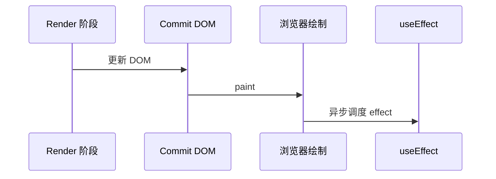
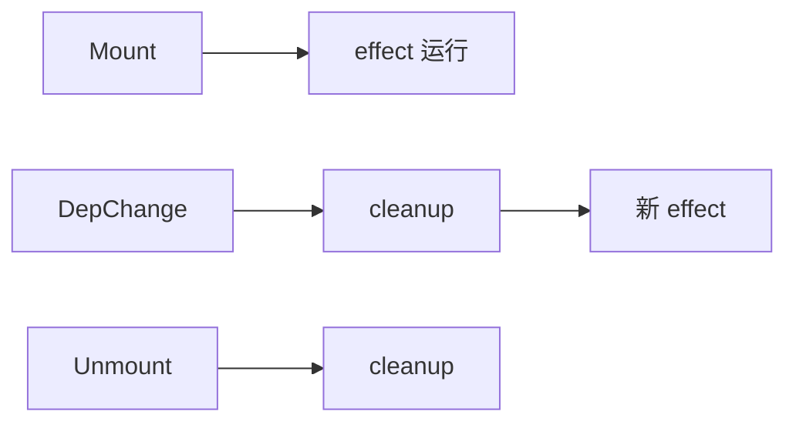
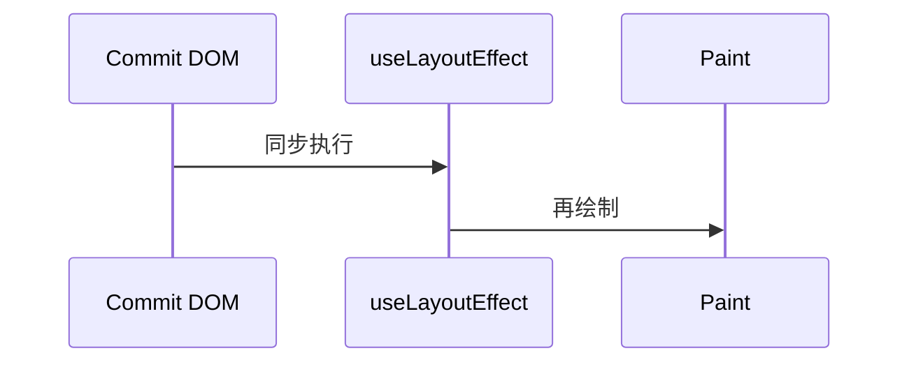

# useEffect 与 useLayoutEffect

> **`useEffect`** 在浏览器**绘制之后**运行副作用，并支持**清理函数**。**`useLayoutEffect`** 在 DOM 更新后、**用户看到画面之前**同步运行。选对 Hook，才能避免闪烁、竞态和泄漏。

---

## 一、副作用是什么？

**副作用**：影响 React 外部世界，或依赖外部变化的操作。

| 是副作用 | 不是副作用（应在 render） |
|----------|---------------------------|
| fetch 数据 | 由 props 计算 className |
| 订阅 WebSocket | 过滤列表 `items.filter` |
| `document.title = ...` | 格式化日期显示 |
| 操作非 React 管理的 DOM | 纯 JSX 返回 |
| 定时器 | |

```tsx
useEffect(() => {
  // 副作用逻辑
  return () => {
    // 清理（可选）
  };
}, [deps]);
```

---

## 二、useEffect 执行时机



| 阶段 | 做什么 |
|------|--------|
| Render | 调用组件，算 JSX（纯） |
| Commit | 改 DOM |
| Paint | 用户可见 |
| **useEffect** | 跑订阅、请求等 |

因此 effect **不能**在首次 paint 前测量布局（会闪）→ 用 `useLayoutEffect`。

---

## 三、依赖数组 `[deps]`

```tsx
useEffect(() => {
  console.log('每次 render 后都跑');
});

useEffect(() => {
  console.log('仅 mount 一次');
}, []);

useEffect(() => {
  console.log('count 变时跑');
}, [count]);

useEffect(() => {
  console.log('count 或 id 变时跑');
}, [count, id]);
```

| deps | 行为 |
|------|------|
| 省略 | **每次** commit 后都执行 |
| `[]` | 仅 mount 后一次（+ StrictMode 开发双调） |
| `[a, b]` | a 或 b 变则执行；先 cleanup 再 effect |

### 3.1 清理函数

```tsx
useEffect(() => {
  const id = setInterval(() => tick(), 1000);
  return () => clearInterval(id);
}, []);
```

**时机**：组件卸载前，或**下一次 effect 执行前**（deps 变了）。



---

## 四、典型场景

### 4.1 数据获取

```tsx
useEffect(() => {
  let cancelled = false;

  async function load() {
    const data = await fetchUser(userId);
    if (!cancelled) setUser(data);
  }
  load();

  return () => { cancelled = true; };
}, [userId]);
```

| 要点 | 说明 |
|------|------|
| **竞态** | 快速切换 id 时，旧请求后返回会覆盖新数据 → cancelled / AbortController |
| 服务端数据 | 更推荐 **TanStack Query**，见 [09-数据获取](../09-数据获取与缓存/) |

```tsx
useEffect(() => {
  const ctrl = new AbortController();
  fetch(`/api/users/${userId}`, { signal: ctrl.signal })
    .then(r => r.json())
    .then(setUser)
    .catch(e => { if (e.name !== 'AbortError') setError(e); });
  return () => ctrl.abort();
}, [userId]);
```

### 4.2 订阅

```tsx
useEffect(() => {
  function onResize() { setW(window.innerWidth); }
  window.addEventListener('resize', onResize);
  return () => window.removeEventListener('resize', onResize);
}, []);
```

### 4.3 同步 document

```tsx
useEffect(() => {
  document.title = `${count} 条未读`;
}, [count]);
```

---

## 五、useLayoutEffect

```tsx
useLayoutEffect(() => {
  const height = ref.current?.getBoundingClientRect().height;
  setTooltipHeight(height ?? 0);
}, [visible]);
```



| | useEffect | useLayoutEffect |
|---|-----------|-----------------|
| 时机 | paint **之后** | paint **之前** |
| 阻塞绘制 | 否 | **是**，慎用 |
| 适用 | 大多数副作用 | 测量 DOM、同步改 DOM 防闪 |

**默认用 useEffect**；只有用户可见**闪烁**时才改 layoutEffect。

### 5.1 SSR 注意

服务端无 DOM，`useLayoutEffect` 会 warning。SSR 组件可：

- 仅在 client 用 dynamic import，或
- 用 `useEffect` 替代，接受首帧可能闪一下

---

## 六、useInsertionEffect（了解）

CSS-in-JS 库在 DOM 变更前注入 style，**应用代码几乎不用**。优先级：`useInsertionEffect` → `useLayoutEffect` → `useEffect`。

---

## 七、不要误用 useEffect 的场景

| 误用 | 应用 |
|------|------|
| props → state 同步 | 渲染时算或 `key` remount |
| 用户点击触发的请求 | 事件 handler 里 fetch |
| 纯派生数据 | render 或 useMemo |
| 每次 render 无 deps 的 setState | 死循环 |

```tsx
// ❌ 无限循环
useEffect(() => {
  setCount(c => c + 1);
});

// ❌ 应用事件处理
useEffect(() => {
  submitForm();
}, [form]);
```

---

## 八、exhaustive-deps 与稳定依赖

```tsx
useEffect(() => {
  log(userId);
}, [userId]); // ✅

// 对象/函数每次 render 是新引用
useEffect(() => {
  opts.onDone();
}, [opts]); // ⚠️ 可能每次触发

// 解：拆原始依赖，或 useCallback 父级，或 eslint-disable 并注释
```

---

## 九、Effect 与 StrictMode（开发）

开发环境 StrictMode **mount → cleanup → mount → effect**，模拟「卸载再挂载」，暴露未清理的订阅。

生产环境**只执行一次**（deps `[]` 时）。

见 [06-StrictMode](../06-渲染与调和/06-StrictMode与开发态行为.md)。

---

## 十、小结

| 要点 | 记忆 |
|------|------|
| 副作用进 effect | render 保持纯 |
| deps 控制频率 | 省略 = 每次 |
| cleanup | 防泄漏、防竞态 |
| 测量 DOM | useLayoutEffect |
| 数据请求 | 竞态处理或 TanStack Query |

**上一篇**：[01-useState与useReducer](./01-useState与useReducer.md)  
**下一篇**：[03-useRef-useImperativeHandle](./03-useRef-useImperativeHandle.md)
