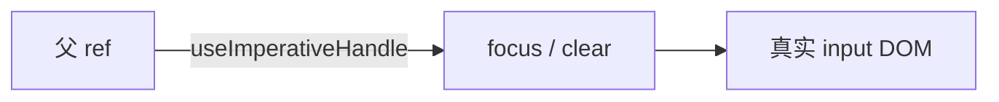

# useRef 与 useImperativeHandle

`useRef` 提供跨 render 的 `.current` 盒子，改 current **不触发** re-render。典型用途：拿 DOM、存 timer id、保存上一次值；向父暴露少量命令式 API 用 forwardRef + useImperativeHandle。

---

## useRef 基础

```tsx
const ref = useRef(initialValue);
// ref.current 可读可写，改 current 不触发 re-render
```

```tsx
function Timer() {
  const intervalRef = useRef<number | null>(null);
  const [count, setCount] = useState(0);

  function start() {
    if (intervalRef.current != null) return;
    intervalRef.current = window.setInterval(() => setCount(c => c + 1), 1000);
  }

  function stop() {
    if (intervalRef.current != null) {
      clearInterval(intervalRef.current);
      intervalRef.current = null;
    }
  }

  return (<>...</>);
}
```

| ref vs state | ref | state |
|--------------|-----|-------|
| 变更是否 re-render | **否** | 是 |
| 用途 | DOM、timer id、上一次值 | UI 展示 |

---

## 访问 DOM 与回调 ref

```tsx
function FocusInput() {
  const inputRef = useRef<HTMLInputElement>(null);
  return (
    <>
      <input ref={inputRef} />
      <button type="button" onClick={() => inputRef.current?.focus()}>聚焦</button>
    </>
  );
}
```

mount 前 `current` 为 null；在 effect 或事件里访问。不要用 ref 驱动应在 UI 显示的数据。

**回调 ref**，节点挂载/卸载时调用，适合测量：

```tsx
const callbackRef = (node: HTMLDivElement | null) => {
  if (node) onHeight(node.getBoundingClientRect().height);
};
```

---

## 保存「上一次」值

```tsx
function usePrevious<T>(value: T): T | undefined {
  const ref = useRef<T>();
  useEffect(() => { ref.current = value; }, [value]);
  return ref.current;
}
```

非受控 input 用 ref 读值（`defaultValue` + 提交时读 DOM）。

---

## forwardRef 与 useImperativeHandle

React 19 起 ref 可作普通 prop；旧代码仍常见 `forwardRef`。

```tsx
interface TextInputHandle {
  focus: () => void;
  clear: () => void;
}

const TextInput = forwardRef<TextInputHandle, { placeholder?: string }>(
  function TextInput(props, ref) {
    const inputRef = useRef<HTMLInputElement>(null);

    useImperativeHandle(ref, () => ({
      focus() { inputRef.current?.focus(); },
      clear() { if (inputRef.current) inputRef.current.value = ''; },
    }), []);

    return <input ref={inputRef} {...props} />;
  },
);
```



**命令式越少越好**，优先 props + state；适用焦点、滚动、集成非 React 库。

---

## ref 误用

| 误用 | 应用 |
|------|------|
| ref 存应在 UI 显示的数据 | useState |
| ref 绕过数据流 | 提升 state 或 callback |

---

## 小结

**useRef**：跨 render 持久 `.current`；改 ref **不触发** re-render。

**典型**：DOM 聚焦、timer id、上一值对比、非受控读值。

**useImperativeHandle**：向父暴露 focus 等少量 API；优先声明式。

**回调 ref**：挂载时测量；第三方库桥接。

**易混点**：ref 变不 re-render，不能替代 state 展示；mount 前 current 为 null。

常见错因：该用 state 还是 ref？命令式 API 能否改成 props？
