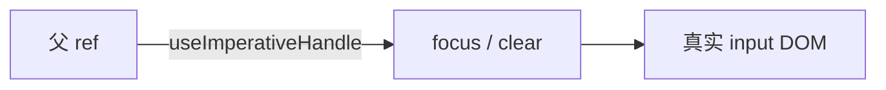

# useRef 与 useImperativeHandle

> **`useRef`** 提供跨渲染持久的**可变盒子**，常指向 DOM 或保存「不触发渲染的值」。**`useImperativeHandle`** 定制通过 ref 暴露给父组件的实例 API（少用，但模态框、输入框聚焦等场景需要）。

---

## 一、useRef 基础

```tsx
const ref = useRef(initialValue);
// ref.current 可读可写，改 current 不触发 re-render
```

```tsx
function Timer() {
  const intervalRef = useRef<number | null>(null);
  const [count, setCount] = useState(0);

  function start() {
    if (intervalRef.current != null) return;
    intervalRef.current = window.setInterval(() => {
      setCount(c => c + 1);
    }, 1000);
  }

  function stop() {
    if (intervalRef.current != null) {
      clearInterval(intervalRef.current);
      intervalRef.current = null;
    }
  }

  return (
    <>
      <p>{count}</p>
      <button onClick={start}>开始</button>
      <button onClick={stop}>停止</button>
    </>
  );
}
```

| ref vs state | ref | state |
|--------------|-----|-------|
| 变更是否 re-render | **否** | 是 |
| 用途 | DOM、定时器 id、上一次的值 | UI 展示 |

---

## 二、访问 DOM

```tsx
function FocusInput() {
  const inputRef = useRef<HTMLInputElement>(null);

  function focus() {
    inputRef.current?.focus();
  }

  return (
    <>
      <input ref={inputRef} />
      <button type="button" onClick={focus}>聚焦</button>
    </>
  );
}
```

| 注意 | 说明 |
|------|------|
| mount 前 `current` 为 null | 在 effect 或事件里访问 |
| 不要写 `ref.current` 驱动 UI | 应 setState |

### 2.1 回调 ref

```tsx
function Measure({ onHeight }: { onHeight: (h: number) => void }) {
  const callbackRef = (node: HTMLDivElement | null) => {
    if (node) onHeight(node.getBoundingClientRect().height);
  };
  return <div ref={callbackRef}>内容</div>;
}
```

节点挂载/卸载时会调用，适合测量或第三方库。

---

## 三、保存「上一次」的值

```tsx
function usePrevious<T>(value: T): T | undefined {
  const ref = useRef<T>();
  useEffect(() => {
    ref.current = value;
  }, [value]);
  return ref.current;
}
```

---

## 四、ref 与受控组件

非受控 input 用 ref 读值（见 [05-受控与非受控](../03-组件基础/05-受控与非受控组件.md)）。

---

## 五、forwardRef 与 useImperativeHandle

React 19 起 **ref 可作为普通 prop**；旧代码仍常见 `forwardRef`。

```tsx
interface TextInputHandle {
  focus: () => void;
  clear: () => void;
}

const TextInput = forwardRef<TextInputHandle, { placeholder?: string }>(
  function TextInput(props, ref) {
    const inputRef = useRef<HTMLInputElement>(null);

    useImperativeHandle(ref, () => ({
      focus() {
        inputRef.current?.focus();
      },
      clear() {
        if (inputRef.current) inputRef.current.value = '';
      },
    }), []);

    return <input ref={inputRef} {...props} />;
  },
);

// 父组件
const ref = useRef<TextInputHandle>(null);
ref.current?.focus();
```



| 原则 | 说明 |
|------|------|
| **命令式越少越好** | 优先 props + state |
| 适用 | 焦点、滚动、媒体播放、集成非 React 库 |

---

## 六、ref 不要误用

| 误用 | 应用 |
|------|------|
| 用 ref 存应在 UI 显示的数据 | useState |
| 用 ref 绕过数据流 | 提升 state 或 callback |
| 大量 imperative API | 重新设计组件边界 |

---

## 七、小结

| API | 用途 |
|-----|------|
| `useRef` | DOM、可变值、实例 id |
| `useImperativeHandle` | 定制暴露给父的 ref 方法 |
| 回调 ref | 挂载时测量、库集成 |

**上一篇**：[02-useEffect与useLayoutEffect](./02-useEffect与useLayoutEffect.md)  
**下一篇**：[04-useContext与跨层通信](./04-useContext与跨层通信.md)
