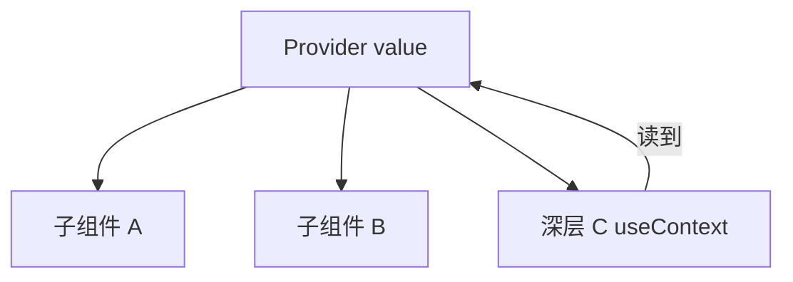

# useContext 与跨层通信

> **Context** 让子树共享数据，无需逐层 props。**`useContext`** 读取最近的 Provider 值。适合主题、语言、认证等「全局配置」；滥用会导致性能问题。

---

## 一、创建与使用

```tsx
const ThemeContext = createContext<'light' | 'dark'>('light');

function ThemeProvider({ children }: { children: React.ReactNode }) {
  const [theme, setTheme] = useState<'light' | 'dark'>('light');
  const value = useMemo(() => ({ theme, setTheme }), [theme]);

  return (
    <ThemeContext.Provider value={value}>
      {children}
    </ThemeContext.Provider>
  );
}

function ThemedButton() {
  const { theme, setTheme } = useContext(ThemeContext);
  return (
    <button onClick={() => setTheme(t => (t === 'light' ? 'dark' : 'light'))}>
      当前：{theme}
    </button>
  );
}
```



---

## 二、默认值

```tsx
createContext(defaultValue);
```

| 无 Provider 时 | 使用 defaultValue |
|----------------|-------------------|
| 仅 default | 可能静默错误 |

**推荐**：default 设为 `null` + 自定义 Hook 抛错：

```tsx
const AuthContext = createContext<AuthValue | null>(null);

function useAuth() {
  const ctx = useContext(AuthContext);
  if (!ctx) throw new Error('useAuth must be within AuthProvider');
  return ctx;
}
```

---

## 三、何时用 Context？

| ✅ 适合 | ❌ 不适合 |
|---------|-----------|
| 主题、locale | 高频变化的大列表数据 |
| 当前用户（读多写少） | 替代 TanStack Query |
| 依赖注入（Router、QueryClient） | 所有 props drilling（先试组合） |

见 [08-状态管理 · 放置原则](../08-状态管理/01-状态分类与放置原则.md)。

---

## 四、性能：拆分 Context

**问题**：value 是 `{ user, theme, cart }` 对象，任一字段变 → **所有** consumer re-render。

```tsx
// ❌ 大对象一个 Context
const AppContext = createContext({ user, theme, cart, setCart });

// ✅ 按变更频率拆分
<UserContext.Provider value={user}>
  <ThemeContext.Provider value={theme}>
    {children}
  </ThemeContext.Provider>
</UserContext.Provider>
```

| 策略 | 说明 |
|------|------|
| 拆分 Provider | theme 变不影响只读 user 的组件 |
| value 稳定 | `useMemo` 包 value 对象 |
| state + dispatch 分离 | dispatch 引用稳定（useReducer） |
| 选 Zustand | 细粒度订阅 |

---

## 五、Context + useReducer 模板

```tsx
type State = { count: number };
type Action = { type: 'inc' } | { type: 'dec' };

const StateCtx = createContext<State | null>(null);
const DispatchCtx = createContext<React.Dispatch<Action> | null>(null);

function CounterProvider({ children }: { children: React.ReactNode }) {
  const [state, dispatch] = useReducer(reducer, { count: 0 });
  return (
    <DispatchCtx.Provider value={dispatch}>
      <StateCtx.Provider value={state}>{children}</StateCtx.Provider>
    </DispatchCtx.Provider>
  );
}

function CounterView() {
  const state = useContext(StateCtx)!;
  return <span>{state.count}</span>;
}

function IncButton() {
  const dispatch = useContext(DispatchCtx)!;
  return <button onClick={() => dispatch({ type: 'inc' })}>+</button>;
}
```

`IncButton` 只订阅 DispatchContext 时，若 dispatch 引用不变，count 变不导致按钮 re-render（State 与 Dispatch 分离）。

---

## 六、与 Provider 嵌套

```tsx
<QueryClientProvider client={queryClient}>
  <ThemeProvider>
    <AuthProvider>
      <App />
    </AuthProvider>
  </ThemeProvider>
</QueryClientProvider>
```

可抽 `AppProviders` 减少视觉噪音。

---

## 七、Context 与 Server Components

Server Component **不能** `useContext` 读 Client Context。Client 子树用 `'use client'` + Provider。见 [14-RSC](../14-服务端与元框架/03-React-Server-Components.md)。

---

## 八、小结

| 要点 | 实践 |
|------|------|
| 跨层静态/低频配置 | Context |
| 性能 | 拆分、memo value、dispatch 分离 |
| 类型安全 | 自定义 `useXxx` + null 检查 |
| 服务端数据 | Query，非 Context 缓存 |

**上一篇**：[03-useRef-useImperativeHandle](./03-useRef-useImperativeHandle.md)  
**下一篇**：[05-useMemo-useCallback](./05-useMemo-useCallback.md)
