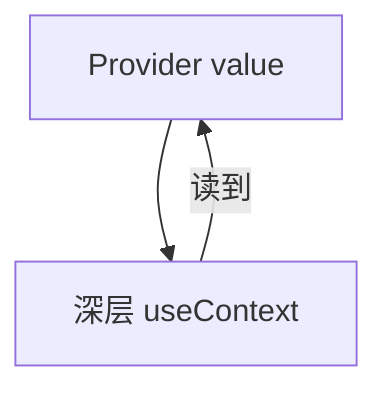

# useContext 与跨层通信

Context 把值从 Provider 向下传给任意深度的 consumer，适合主题、语言、auth 壳层等**低频、跨层**配置。高频大数据或 API 缓存别塞 Context，用 Query 或带 selector 的 store。

---

## 创建与使用

```tsx
const ThemeContext = createContext<'light' | 'dark'>('light');

function ThemeProvider({ children }: { children: React.ReactNode }) {
  const [theme, setTheme] = useState<'light' | 'dark'>('light');
  const value = useMemo(() => ({ theme, setTheme }), [theme]);

  return (
    <ThemeContext.Provider value={value}>{children}</ThemeContext.Provider>
  );
}

function ThemedButton() {
  const { theme, setTheme } = useContext(ThemeContext);
  return (
    <button onClick={() => setTheme(t => (t === 'light' ? 'dark' : 'light'))}>
      当前：{theme}
    </button>
  );
}
```



---

## 默认值与安全封装

```tsx
const AuthContext = createContext<AuthValue | null>(null);

function useAuth() {
  const ctx = useContext(AuthContext);
  if (!ctx) throw new Error('useAuth must be within AuthProvider');
  return ctx;
}
```

default 设 `null` + 自定义 Hook 抛错，比静默用错 default 好。

---

## 何时用 Context

| ✅ 适合 | ❌ 不适合 |
|---------|-----------|
| 主题、locale | 高频变化的大列表 |
| 当前用户（读多写少） | 替代 TanStack Query |
| QueryClient、Router 注入 | 所有 drilling（先试组合） |

---

## 性能：拆分 Context

```tsx
// ❌ 任一字段变 → 所有 consumer re-render
const AppContext = createContext({ user, theme, cart, setCart });

// ✅ 按变更频率拆分
<UserContext.Provider value={user}>
  <ThemeContext.Provider value={theme}>
    {children}
  </ThemeContext.Provider>
</UserContext.Provider>
```

| 策略 | 说明 |
|------|------|
| 拆分 Provider | theme 变不影响只读 user 的组件 |
| value 稳定 | `useMemo` 包 value 对象 |
| state + dispatch 分离 | dispatch 引用稳定 |
| 选 Zustand | 细粒度 selector |

---

## Context + useReducer

```tsx
function CounterProvider({ children }: { children: React.ReactNode }) {
  const [state, dispatch] = useReducer(reducer, { count: 0 });
  return (
    <DispatchCtx.Provider value={dispatch}>
      <StateCtx.Provider value={state}>{children}</StateCtx.Provider>
    </DispatchCtx.Provider>
  );
}
```

`IncButton` 只读 DispatchContext 时，count 变不必导致按钮 re-render（若未订阅 StateContext）。

---

## Provider 嵌套与 RSC

```tsx
<QueryClientProvider client={queryClient}>
  <ThemeProvider>
    <AuthProvider><App /></AuthProvider>
  </ThemeProvider>
</QueryClientProvider>
```

Server Component **不能** `useContext` 读 Client Context；Client 子树用 `'use client'` + Provider。

---

## 小结

Context 适合**低频跨层配置**；**API 列表缓存用 Query**。

**性能**：拆分 Context、memo value、state/dispatch 分离；高频大对象用 Zustand。

**封装 `useXxx()`** 做 null 检查与类型安全。

**勿**用单一巨大 Context 包一切；**勿**用 Context 替代服务端数据层。

**易混点**：value 每次新对象导致全树 render；Consumer 未包 Provider 静默错值。

常见错因：这份数据是否变更太频？能否拆分 Provider？
