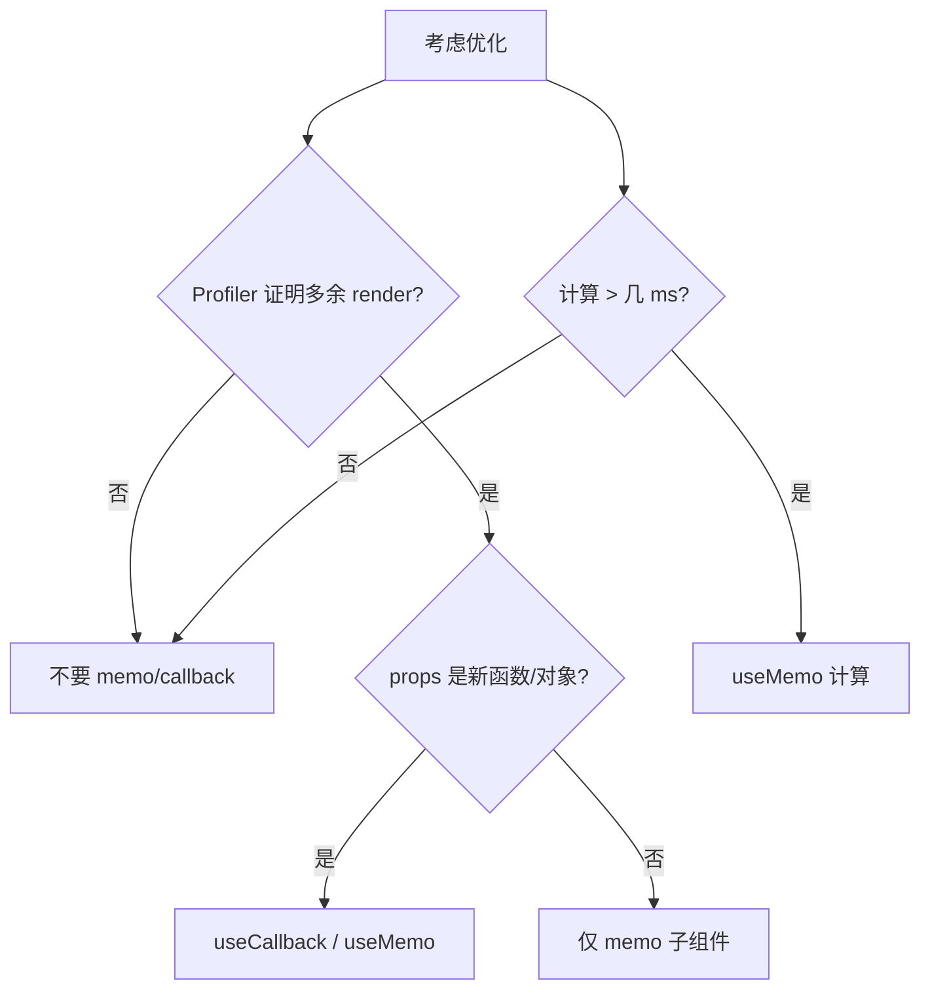

# useMemo 与 useCallback

`React.memo` 靠 props 浅比较跳过子组件 render；若父每次传入**新函数/新对象**，memo 失效。`useCallback` / `useMemo` 用来稳定引用或缓存昂贵计算，但**先 Profiler 再优化**，别默认给每个组件加 memo。

---

## React.memo 与稳定 props

```tsx
const Child = memo(function Child({ onClick, label }: Props) {
  return <button onClick={onClick}>{label}</button>;
});

function Parent() {
  const [n, setN] = useState(0);
  return <Child onClick={() => setN(n + 1)} label="+" />;
  // 每次 Parent render，onClick 是新函数 → Child 仍会 render
}
```

---

## useCallback

```tsx
const handleClick = useCallback(() => {
  setN(c => c + 1);
}, []);

return <Child onClick={handleClick} label="+" />;
```

| 签名 | `useCallback(fn, deps)` |
|------|-------------------------|
| 等价 | `useMemo(() => fn, deps)` |

deps 变了 → 新函数引用。

---

## useMemo

```tsx
const sorted = useMemo(() => heavySort(items), [items]);

const chartOptions = useMemo(() => ({
  data: items,
  color: theme.primary,
}), [items, theme.primary]);
```

昂贵计算、或稳定对象/数组传给 memo 子组件或 effect deps。

---

## 何时需要、何时不需要



| 通常**不需要** | 通常**值得考虑** |
|----------------|------------------|
| 小组件、列表不长 | 虚拟列表行、大表格 Cell |
| props 本就稳定 | 图表重绘 |
| 过早优化 | effect 依赖大对象 |

React Compiler 目标自动插入 memo，未全面推广前热点仍按 18 方式显式优化。

---

## 常见误用

```tsx
// ❌ 简单拼接不必 useMemo
const fullName = useMemo(() => `${first} ${last}`, [first, last]);
// ✅
const fullName = `${first} ${last}`;

// ❌ deps 不全 → 闭包旧 count
const fn = useCallback(() => console.log(count), []);
```

Context value 变化仍会穿透 memo，需拆分或 selector。

---

## 列表 + memo 示例

```tsx
const Row = memo(function Row({ item, onSelect }: RowProps) {
  return <tr onClick={() => onSelect(item.id)}>...</tr>;
});

function Table({ items }: { items: Item[] }) {
  const onSelect = useCallback((id: string) => { ... }, [/* 稳定依赖 */]);
  return items.map(item => (
    <Row key={item.id} item={item} onSelect={onSelect} />
  ));
}
```

---

## useMemo vs useCallback

| | useMemo | useCallback |
|---|---------|-------------|
| 返回 | 任意**值** | **函数** |
| 典型 | 计算结果、对象 | 事件 handler |

---

## 小结

**先 Profiler**，再 memo；简单派生直接算，不必 useMemo。

**useCallback** 稳定传给 memo 子的函数；**useMemo** 缓存贵计算或大对象引用。

**过度 memo** 增加 deps 比较成本；Compiler 未来可减手写。

**Context** 变会穿透 memo；列表行 memo + 稳定 onSelect 是常见组合。

**易混点**：useMemo 包 `${a}${b}`；useCallback deps 漏变量闭包旧值。

常见错因：Profiler 证明有多余 render 吗？deps 是否每次是新对象？
