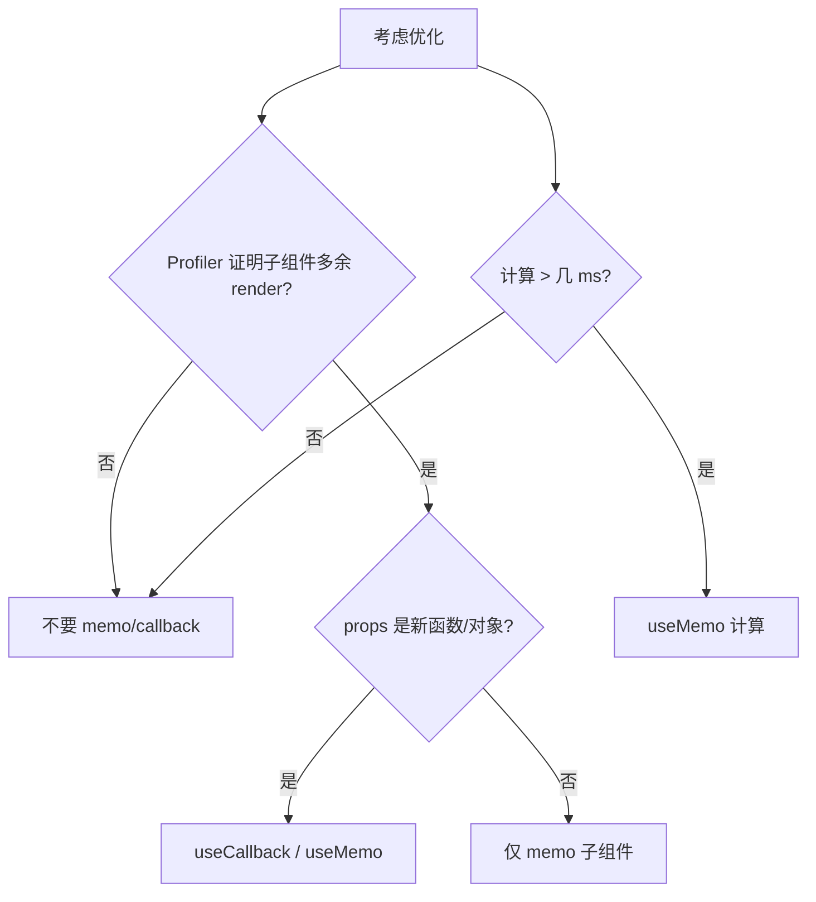

# useMemo 与 useCallback

> **`useMemo`** 缓存**计算结果**；**`useCallback`** 缓存**函数引用**。二者用于减少子组件无效重渲染或昂贵计算——但**不是**默认必写，滥用可能更慢。

---

## 一、React.memo 回顾

```tsx
const Child = memo(function Child({ onClick, label }: Props) {
  console.log('Child render');
  return <button onClick={onClick}>{label}</button>;
});
```

**props 浅比较**不变则跳过 render。若父每次传入**新函数**：

```tsx
function Parent() {
  const [n, setN] = useState(0);
  return <Child onClick={() => setN(n + 1)} label="+" />;
  // 每次 Parent render，onClick 是新函数 → Child 仍会 render
}
```

---

## 二、useCallback

```tsx
function Parent() {
  const [n, setN] = useState(0);
  const handleClick = useCallback(() => {
    setN(c => c + 1);
  }, []);

  return <Child onClick={handleClick} label="+" />;
}
```

| 签名 | `useCallback(fn, deps)` |
|------|-------------------------|
| 等价 | `useMemo(() => fn, deps)` |

**deps 变了** → 新函数引用。

---

## 三、useMemo

```tsx
const sorted = useMemo(() => {
  return heavySort(items);
}, [items]);

const chartOptions = useMemo(() => ({
  data: items,
  color: theme.primary,
}), [items, theme.primary]);
```

| 用途 | 说明 |
|------|------|
| 昂贵计算 | 排序、大列表过滤 |
| 稳定引用 | 对象/数组传给 memo 子组件或 effect deps |

---

## 四、何时需要、何时不需要



| 通常**不需要** | 通常**值得考虑** |
|----------------|------------------|
| 小组件、列表不长 | 虚拟列表行组件 memo |
| props 本就稳定 | 大表格 Cell、图表 |
| 过早优化 | effect 依赖大对象 |

**React Compiler**（19 生态）目标自动插入 memo，见 [18-Compiler](../18-React19与新特性/03-React-Compiler概览.md)。

---

## 五、常见误用

### 5.1 包 everything

```tsx
// ❌ 每个 render 仍要比较 deps，函数也占内存
const onClick = useCallback(() => ..., [a, b, c, d, e]);
```

### 5.2 useMemo 做「派生 state」

```tsx
// ❌ 能直接算
const fullName = useMemo(() => `${first} ${last}`, [first, last]);

// ✅
const fullName = `${first} ${last}`;
```

### 5.3 deps 不全

```tsx
const fn = useCallback(() => {
  console.log(count); // 闭包旧 count
}, []); // eslint 会警告
```

---

## 六、与 Context、列表配合

```tsx
const Row = memo(function Row({ item, onSelect }: RowProps) {
  return <tr onClick={() => onSelect(item.id)}>...</tr>;
});

function Table({ items }: { items: Item[] }) {
  const onSelect = useCallback((id: string) => {
    ...
  }, [/* 稳定依赖 */]);

  return items.map(item => (
    <Row key={item.id} item={item} onSelect={onSelect} />
  ));
}
```

---

## 七、useMemo vs useCallback 对照

| | useMemo | useCallback |
|---|---------|-------------|
| 返回 | 任意类型的**值** | **函数** |
| 典型 | 计算结果、对象 | 事件 handler、回调 props |

---

## 八、小结

| 原则 | 说明 |
|------|------|
| 先测量 | React DevTools Profiler |
| 稳定引用 | 为 memo 子组件服务 |
| 派生简单 | 直接算，不 useMemo |
| Compiler 未来 | 减手动 memo |

**上一篇**：[04-useContext与跨层通信](./04-useContext与跨层通信.md)  
**下一篇**：[06-useId-useSyncExternalStore等](./06-useId-useSyncExternalStore等.md)
