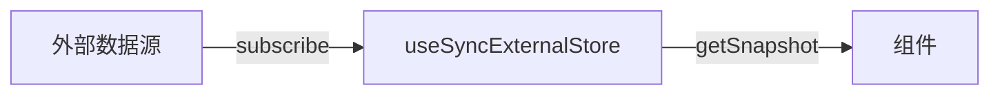

# useId、useSyncExternalStore 与其他内置 Hook

除日常高频 Hook 外，还有一批解决特定边界问题的内置 API：`useId` 做 SSR 安全的 a11y 关联；`useSyncExternalStore` 订阅外部 store；其余多在库作者或并发场景出现。

---

## useId

生成**跨 SSR/CSR 一致**的唯一 id，用于 `htmlFor` / `aria-describedby`：

```tsx
function EmailField() {
  const id = useId();
  return (
    <>
      <label htmlFor={id}>邮箱</label>
      <input id={id} type="email" aria-describedby={`${id}-hint`} />
      <span id={`${id}-hint`}>邮箱不会公开</span>
    </>
  );
}
```

| 要点 | 说明 |
|------|------|
| **不是**列表 key | 列表 key 仍用业务 id |
| SSR | 避免 `Math.random()` hydration 不匹配 |
| 前缀 | 可拼接后缀如 `${id}-error` |

```tsx
// ❌ SSR 不一致
const id = Math.random().toString();

// ✅
const id = useId();
```

---

## useSyncExternalStore

订阅 **React 外部**数据源（浏览器 API、外部 store）：

```tsx
function useOnline() {
  return useSyncExternalStore(
    subscribe,
    getSnapshot,
    getServerSnapshot, // SSR
  );
}

function subscribe(callback: () => void) {
  window.addEventListener('online', callback);
  window.addEventListener('offline', callback);
  return () => {
    window.removeEventListener('online', callback);
    window.removeEventListener('offline', callback);
  };
}

function getSnapshot() {
  return navigator.onLine;
}

function getServerSnapshot() {
  return true;
}
```



`getSnapshot` 须纯；同 snapshot 应 `Object.is` 相等。应用层更常用 Zustand `useStore`，理解原理即可。

---

## useDebugValue

自定义 Hook 在 DevTools 显示标签：

```tsx
function useFriendStatus(friendId: string) {
  const online = useSyncExternalStore(...);
  useDebugValue(online ? 'Online' : 'Offline');
  return online;
}
```

仅开发可见，无运行时行为。

---

## useInsertionEffect

CSS-in-JS 在 DOM 变更前注入 style；**业务组件不用**。顺序：`useInsertionEffect` → `useLayoutEffect` → `useEffect`。

---

## 并发与 React 19 速览

| Hook / API | 作用 |
|------------|------|
| `useTransition` | 标记低优先级更新 |
| `useDeferredValue` | 延迟某值的可见版本 |
| `useActionState` | form action + pending/error |
| `useOptimistic` | 乐观 UI |
| `use` | 读 Promise/Context（条件读 Context） |

---

## 选用表

| 需求 | Hook |
|------|------|
| 表单 label 关联 | useId |
| window 尺寸 / online | useSyncExternalStore |
| 自定义 Hook 调试 | useDebugValue |
| 搜索框卡顿 | useTransition / useDeferredValue |

---

## 小结

**useId**：a11y 关联 id，SSR 安全；**勿当 list key**。

**useSyncExternalStore**：订阅外部 store/浏览器 API；支持并发 tearing 防护。

**useDebugValue**：DevTools 展示自定义 Hook 状态。

**useInsertionEffect**：CSS-in-JS 专用；业务代码一般用不到。

**并发 Hook**：transition / deferred 优化交互卡顿；19 的 Actions/Optimistic 面向表单与乐观 UI。

**易混点**：useId ≠ 全局唯一业务 id；getSnapshot 不纯会导致无限循环。

常见错因：hydration 报错是否用了 random id？外部 store 是否用对 subscribe/getSnapshot？
