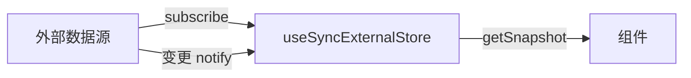

# useId、useSyncExternalStore 与其他内置 Hook

> 除日常高频 Hook 外，React 还提供 **`useId`**（稳定 id）、**`useSyncExternalStore`**（外部 store）、**`useDebugValue`**（DevTools）等。了解场景，需要时查阅即可。

---

## 一、useId

生成**跨 SSR/CSR 一致**的唯一 id，用于 `aria-*` 与 `htmlFor` 关联。

```tsx
function EmailField() {
  const id = useId();
  return (
    <>
      <label htmlFor={id}>邮箱</label>
      <input id={id} type="email" aria-describedby={`${id}-hint`} />
      <span id={`${id}-hint`}>我们不会公开邮箱</span>
    </>
  );
}
```

| 要点 | 说明 |
|------|------|
| **不是**全局唯一 key | 列表 key 仍用业务 id |
| SSR | 避免 `Math.random()` 导致 hydration 不匹配 |
| 前缀 | React 18 生成 `:r1:` 形式，可拼接后缀 |

```tsx
// ❌ SSR 不一致
const id = Math.random().toString();

// ✅
const id = useId();
```

---

## 二、useSyncExternalStore

订阅 **React 外部** 的 store（浏览器 API、Redux、Zustand 内部也用类似机制）。

```tsx
function useOnline() {
  return useSyncExternalStore(
    subscribe,   // (callback) => unsubscribe
    getSnapshot, // () => snapshot（客户端）
    getServerSnapshot?, // SSR 可选
  );
}

function subscribe(callback: () => void) {
  window.addEventListener('online', callback);
  window.addEventListener('offline', callback);
  return () => {
    window.removeEventListener('online', callback);
    window.removeEventListener('offline', callback);
  };
}

function getSnapshot() {
  return navigator.onLine;
}

function getServerSnapshot() {
  return true; // SSR 默认在线
}
```



| 要求 | 说明 |
|------|------|
| `getSnapshot` 纯 | 同 snapshot 应 `Object.is` 相等 |
|  tearing 安全 | 并发渲染下与外部 store 同步 |

**应用层**更常用 Zustand `useStore` 而非手写；理解原理即可。

---

## 三、useDebugValue

在 **自定义 Hook** 里给 React DevTools 显示标签：

```tsx
function useFriendStatus(friendId: string) {
  const online = useSyncExternalStore(...);
  useDebugValue(online ? 'Online' : 'Offline');
  return online;
}
```

仅开发 DevTools 可见，无运行时行为。

---

## 四、useInsertionEffect

CSS-in-JS（styled-components、emotion 新版本）在 DOM 变更前插入 style 规则。**业务组件不用**。

执行顺序：`useInsertionEffect` → `useLayoutEffect` → `useEffect`。

---

## 五、并发相关 Hook（速览）

| Hook | 作用 | 详见 |
|------|------|------|
| `useTransition` | `startTransition` 包低优先级 setState | [12-并发](../12-并发与Suspense/02-useTransition与useDeferredValue.md) |
| `useDeferredValue` | 延迟某 prop/state 的「可见版本」 | 同上 |

---

## 六、React 19 相关（速览）

| API | 作用 |
|-----|------|
| `useActionState` | form action + pending/error |
| `useOptimistic` | 乐观 UI |
| `use` | 读 Promise/Context（条件读 Context） |

见 [18-React19](../18-React19与新特性/01-React19要点.md)。

---

## 七、内置 Hook 选用表

| 需求 | Hook |
|------|------|
| 表单 label 关联 | useId |
| window 尺寸/online | useSyncExternalStore |
| 自定义 Hook 调试 | useDebugValue |
| 外部 Redux-like | useSyncExternalStore（或库封装） |
| 搜索框卡顿 | useTransition / useDeferredValue |

---

## 八、小结

| Hook | 一句话 |
|------|--------|
| useId | a11y id，SSR 安全 |
| useSyncExternalStore | 订阅外部 store |
| useDebugValue | DevTools 标注 |
| useInsertionEffect | CSS-in-JS 库专用 |

**上一篇**：[05-useMemo-useCallback](./05-useMemo-useCallback.md)  
**下一篇**：[07-自定义Hooks设计与模式库](./07-自定义Hooks设计与模式库.md)
