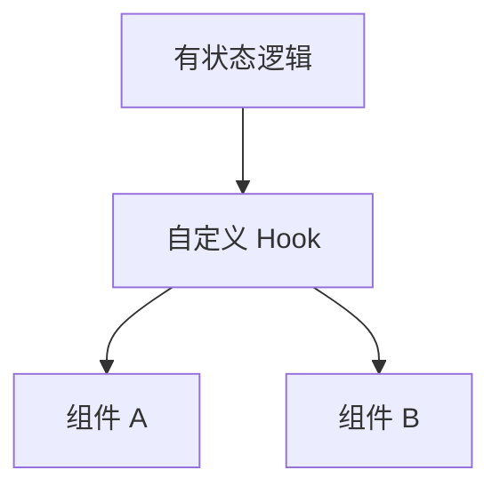

# 自定义 Hooks 设计与模式库

> **自定义 Hook** = 以 `use` 开头的函数，内部可调用其他 Hook，用于**复用有状态逻辑**。好的自定义 Hook 像标准库：命名清晰、参数稳定、易测。

---

## 一、设计原则



| 原则 | 说明 |
|------|------|
| **`use` 前缀** | 规则 + 可读性 |
| **单一职责** | `useUser` vs `useUserAndPostsAndTheme` 拆开 |
| **返回值稳定** | 考虑 `[value, actions]` 对象 vs 元组 |
| **错误边界** | 缺 Provider 时 throw 明确错误 |
| **可测试** | 逻辑可抽离 reducer/纯函数单测 |

---

## 二、基础模板

```tsx
function useToggle(initial = false) {
  const [on, setOn] = useState(initial);
  const toggle = useCallback(() => setOn(v => !v), []);
  const setTrue = useCallback(() => setOn(true), []);
  const setFalse = useCallback(() => setOn(false), []);
  return { on, toggle, setTrue, setFalse };
}
```

```tsx
function useLocalStorage<T>(key: string, initial: T) {
  const [value, setValue] = useState<T>(() => {
    try {
      const raw = localStorage.getItem(key);
      return raw ? (JSON.parse(raw) as T) : initial;
    } catch {
      return initial;
    }
  });

  useEffect(() => {
    localStorage.setItem(key, JSON.stringify(value));
  }, [key, value]);

  return [value, setValue] as const;
}
```

---

## 三、模式库（常用）

### 3.1 数据请求（简化版；生产用 Query）

```tsx
function useFetch<T>(url: string | null) {
  const [data, setData] = useState<T | null>(null);
  const [error, setError] = useState<Error | null>(null);
  const [loading, setLoading] = useState(false);

  useEffect(() => {
    if (!url) return;
    let cancelled = false;
    setLoading(true);
    fetch(url)
      .then(r => r.json())
      .then(json => { if (!cancelled) setData(json); })
      .catch(e => { if (!cancelled) setError(e); })
      .finally(() => { if (!cancelled) setLoading(false); });
    return () => { cancelled = true; };
  }, [url]);

  return { data, error, loading };
}
```

### 3.2 useDebounce / useThrottle

```tsx
function useDebounce<T>(value: T, delay: number): T {
  const [debounced, setDebounced] = useState(value);
  useEffect(() => {
    const id = setTimeout(() => setDebounced(value), delay);
    return () => clearTimeout(id);
  }, [value, delay]);
  return debounced;
}

// 搜索：keyword 即时，debouncedKeyword 触发请求
const debouncedKeyword = useDebounce(keyword, 300);
```

### 3.3 useMediaQuery

```tsx
function useMediaQuery(query: string) {
  return useSyncExternalStore(
    cb => {
      const m = window.matchMedia(query);
      m.addEventListener('change', cb);
      return () => m.removeEventListener('change', cb);
    },
    () => window.matchMedia(query).matches,
    () => false,
  );
}
```

### 3.4 useEventListener

```tsx
function useEventListener<K extends keyof WindowEventMap>(
  target: Window | HTMLElement | null,
  type: K,
  handler: (e: WindowEventMap[K]) => void,
) {
  const handlerRef = useRef(handler);
  handlerRef.current = handler;

  useEffect(() => {
    if (!target) return;
    const listener = (e: Event) => handlerRef.current(e as WindowEventMap[K]);
    target.addEventListener(type, listener);
    return () => target.removeEventListener(type, listener);
  }, [target, type]);
}
```

`handlerRef` 避免 handler 变导致重复绑定。

### 3.5 useIntersectionObserver（懒加载）

```tsx
function useInView(options?: IntersectionObserverInit) {
  const ref = useRef<HTMLElement>(null);
  const [inView, setInView] = useState(false);

  useEffect(() => {
    const el = ref.current;
    if (!el) return;
    const io = new IntersectionObserver(([entry]) => {
      setInView(entry.isIntersecting);
    }, options);
    io.observe(el);
    return () => io.disconnect();
  }, [options]);

  return { ref, inView };
}
```

### 3.6 useClipboard

```tsx
function useClipboard() {
  const [copied, setCopied] = useState(false);

  const copy = useCallback(async (text: string) => {
    await navigator.clipboard.writeText(text);
    setCopied(true);
    setTimeout(() => setCopied(false), 2000);
  }, []);

  return { copy, copied };
}
```

---

## 四、组合 Hooks

```tsx
function useUserProfile(userId: string) {
  const userQuery = useQuery({
    queryKey: ['user', userId],
    queryFn: () => fetchUser(userId),
  });
  const postsQuery = useQuery({
    queryKey: ['posts', userId],
    queryFn: () => fetchPosts(userId),
    enabled: !!userQuery.data,
  });

  return {
    user: userQuery.data,
    posts: postsQuery.data,
    isLoading: userQuery.isLoading || postsQuery.isLoading,
    error: userQuery.error ?? postsQuery.error,
  };
}
```

---

## 五、测试自定义 Hook

```tsx
import { renderHook, act } from '@testing-library/react';

test('useToggle', () => {
  const { result } = renderHook(() => useToggle(false));
  expect(result.current.on).toBe(false);
  act(() => result.current.toggle());
  expect(result.current.on).toBe(true);
});
```

见 [15-测试 · Hooks](../15-测试/04-Hooks与Provider测试.md)。

---

## 六、反模式

| 反模式 | 问题 |
|--------|------|
| Hook 里直接改 DOM 全局 | 难测、多实例冲突 |
| 返回每次新建的 `{}` | 消费者 memo 失效 |
| 一个 Hook 包整个 App | 拆小 |
| 条件调用其他 Hook | 违反规则 |

---

## 七、团队「模式库」维护

建议在 `src/hooks/` 目录：

| 文件 | 内容 |
|------|------|
| `useToggle.ts` | 布尔 |
| `useDebounce.ts` | 防抖 |
| `useLocalStorage.ts` | 持久化 |
| `index.ts` | 统一导出 |

文档注释 + 单测 + Storybook 示例（可选）。

---

## 八、小结

| 要点 | 实践 |
|------|------|
| 复用逻辑 | 自定义 Hook，非 HOC |
| 稳定 API | useCallback 内联或 ref 存 handler |
| 数据 | 优先 TanStack Query 封装 |
| 测试 | renderHook + act |

**上一篇**：[06-useId-useSyncExternalStore等](./06-useId-useSyncExternalStore等.md)  
**下一模块**：[06-渲染与调和 · 渲染流程总览](../06-渲染与调和/01-渲染流程总览.md)
