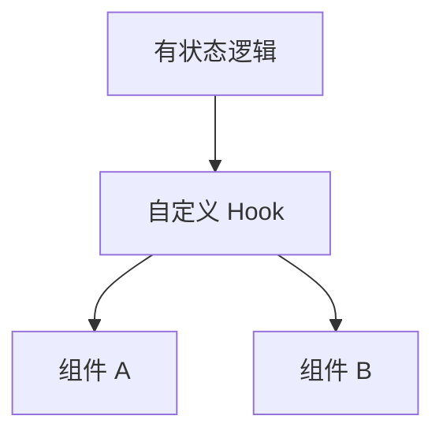

# 自定义 Hooks 设计与模式库

有状态逻辑重复出现时，抽成 **`use` 前缀的自定义 Hook** 比 HOC 更清晰。原则是单一职责、稳定 API、可测试；数据请求优先封装进 Query，而非 `useEffect` + `useState`。

---

## 设计原则



| 原则 | 说明 |
|------|------|
| **`use` 前缀** | 规则 + 可读性 |
| **单一职责** | `useUser` 与 `useUserPosts` 拆开 |
| **返回值稳定** | handler 用 useCallback 或 ref 存最新回调 |
| **错误边界** | 缺 Provider 时 throw 明确错误 |
| **可测试** | reducer/纯函数可单测 |

---

## 基础模板

```tsx
function useToggle(initial = false) {
  const [on, setOn] = useState(initial);
  const toggle = useCallback(() => setOn(v => !v), []);
  const setTrue = useCallback(() => setOn(true), []);
  const setFalse = useCallback(() => setOn(false), []);
  return { on, toggle, setTrue, setFalse };
}

function useLocalStorage<T>(key: string, initial: T) {
  const [value, setValue] = useState<T>(() => {
    try {
      const raw = localStorage.getItem(key);
      return raw ? (JSON.parse(raw) as T) : initial;
    } catch {
      return initial;
    }
  });

  useEffect(() => {
    localStorage.setItem(key, JSON.stringify(value));
  }, [key, value]);

  return [value, setValue] as const;
}
```

---

## 模式库

**useDebounce**：

```tsx
function useDebounce<T>(value: T, delay: number): T {
  const [debounced, setDebounced] = useState(value);
  useEffect(() => {
    const id = setTimeout(() => setDebounced(value), delay);
    return () => clearTimeout(id);
  }, [value, delay]);
  return debounced;
}
```

**useMediaQuery**（useSyncExternalStore）：

```tsx
function useMediaQuery(query: string) {
  return useSyncExternalStore(
    cb => {
      const m = window.matchMedia(query);
      m.addEventListener('change', cb);
      return () => m.removeEventListener('change', cb);
    },
    () => window.matchMedia(query).matches,
    () => false,
  );
}
```

**useEventListener**，`handlerRef` 避免 handler 变导致重复绑定：

```tsx
function useEventListener<K extends keyof WindowEventMap>(
  target: Window | HTMLElement | null,
  type: K,
  handler: (e: WindowEventMap[K]) => void,
) {
  const handlerRef = useRef(handler);
  handlerRef.current = handler;

  useEffect(() => {
    if (!target) return;
    const listener = (e: Event) => handlerRef.current(e as WindowEventMap[K]);
    target.addEventListener(type, listener);
    return () => target.removeEventListener(type, listener);
  }, [target, type]);
}
```

**useFetch 简化版**（生产用 Query）：

```tsx
function useFetch<T>(url: string | null) {
  const [data, setData] = useState<T | null>(null);
  const [error, setError] = useState<Error | null>(null);
  const [loading, setLoading] = useState(false);

  useEffect(() => {
    if (!url) return;
    let cancelled = false;
    setLoading(true);
    fetch(url)
      .then(r => r.json())
      .then(json => { if (!cancelled) setData(json); })
      .catch(e => { if (!cancelled) setError(e); })
      .finally(() => { if (!cancelled) setLoading(false); });
    return () => { cancelled = true; };
  }, [url]);

  return { data, error, loading };
}
```

还有 `useInView`、`useClipboard` 等，按团队在 `src/hooks/` 沉淀。

---

## 组合 Hooks

```tsx
function useUserProfile(userId: string) {
  const userQuery = useQuery({
    queryKey: ['user', userId],
    queryFn: () => fetchUser(userId),
  });
  const postsQuery = useQuery({
    queryKey: ['posts', userId],
    queryFn: () => fetchPosts(userId),
    enabled: !!userQuery.data,
  });

  return {
    user: userQuery.data,
    posts: postsQuery.data,
    isLoading: userQuery.isLoading || postsQuery.isLoading,
    error: userQuery.error ?? postsQuery.error,
  };
}
```

---

## 测试与反模式

```tsx
import { renderHook, act } from '@testing-library/react';

test('useToggle', () => {
  const { result } = renderHook(() => useToggle(false));
  expect(result.current.on).toBe(false);
  act(() => result.current.toggle());
  expect(result.current.on).toBe(true);
});
```

| 反模式 | 问题 |
|--------|------|
| Hook 里改 DOM 全局 | 难测、多实例冲突 |
| 返回每次新建的 `{}` | 消费者 memo 失效 |
| 一个 Hook 包整个 App | 应拆小 |
| 条件调用其他 Hook | 违反规则 |

---

## 小结

复用**有状态逻辑**用自定义 Hook（`use` 前缀），优先于 HOC。

**API 稳定**：handler 用 useCallback 或 ref；缺 Provider 显式 throw。

**数据请求**封装进 **Query Hook**，而非 useEffect + useState 重复造轮子。

**模式库**：toggle、debounce、localStorage、mediaQuery、eventListener 等在 `src/hooks/` 统一导出+单测。

**测试**：**renderHook + act** 测 Hook 逻辑。

**易混点**：Hook 内条件调用其他 Hook；返回新对象导致 memo 失效。

常见错因：这段逻辑是否该拆成更小 Hook？是否该用 Query 替代 useFetch？
