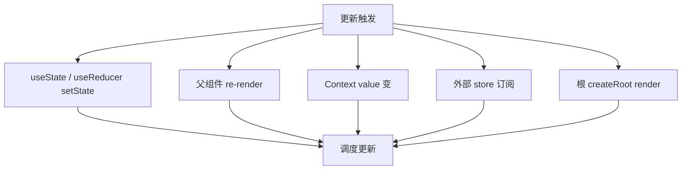
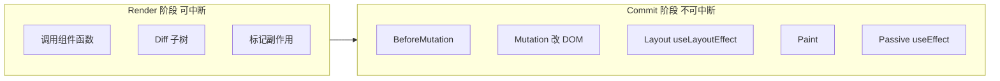
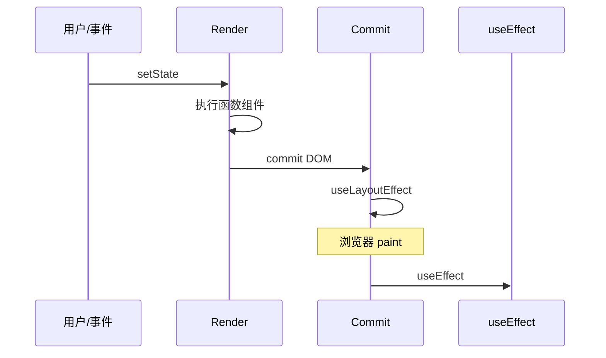

# 渲染流程总览

一次 UI 更新从触发到屏幕变化的完整链路：**Render 阶段算 UI、Commit 阶段改 DOM**，以及函数组件 render 与 `useEffect` 各自落在哪一步。

---

## 触发更新的来源



| 来源 | 说明 |
|------|------|
| `setState` / `dispatch` | 最常见 |
| 父 render | 默认子也会 render |
| Context | consumer 订阅的 value 变 |
| `forceUpdate` | 罕见（class） |

---

## 两阶段：Render vs Commit



| 阶段 | 做什么 | 可中断？ |
|------|--------|----------|
| **Render** | 算新 UI 描述（React Element 树），对比旧 Fiber | Concurrent 下**可以** |
| **Commit** | 真正改 DOM、跑 layout/passive effect | **不可以** |

**Render 纯计算**（理想情况下组件无副作用）；**Commit 有副作用**（DOM、layout effect）。

---

## Render 阶段细节

1. 从更新节点开始，重新执行函数组件 / 更新 class
2. 得到新的 **React Element** 树
3. 与旧 **Fiber** 树协调（reconciliation），标记增删改
4. 收集 **useEffect** 等需要在 commit 后执行的工作

```tsx
function Counter() {
  const [n, setN] = useState(0);
  console.log('render', n); // render 阶段执行
  return <button onClick={() => setN(n + 1)}>{n}</button>;
}
```

一次点击 → 一次（或批处理后一次）render + commit。

---

## Commit 阶段子步骤

| 子阶段 | 内容 |
|--------|------|
| **BeforeMutation** | 读 DOM 快照（如 scroll） |
| **Mutation** | 插入/更新/删除 DOM 节点 |
| **Layout** | `useLayoutEffect`、class `componentDidMount/Update` |
| **Paint** | 浏览器绘制 |
| **Passive** | `useEffect` 异步调度 |

因此：**useLayoutEffect 早于 paint；useEffect 晚于 paint**。

---

## 单组件生命周期（函数组件视角）



---

## 递归与子树

父 render → 默认**所有子组件** render（除非 `memo` 且 props 浅相等）。

```tsx
function Parent() {
  const [n, setN] = useState(0);
  return (
    <>
      <button onClick={() => setN(n + 1)}>{n}</button>
      <Child label="静态" />  {/* 每次 Parent render，Child 也 render */}
    </>
  );
}
```

优化：`memo(Child)`、状态下放、Context 拆分。

---

## 与浏览器一帧的关系

| 理想 | 说明 |
|------|------|
| render 过长 | 掉帧、输入延迟 |
| Concurrent | 可中断 render，优先用户输入 |
| transition | 低优先级 render 让路 |

Concurrent 模式下，React 可以在一帧内做一部分 render 后让出主线程，保证输入响应；`startTransition` 标记的更新优先级更低，适合大列表过滤等重计算场景。

---

## 开发调试

| 工具 | 看什么 |
|------|--------|
| React DevTools **Profiler** | 哪次 commit、谁耗时 |
| **Highlight updates** | 哪些组件 re-render |
| console 计数 | render 次数是否异常 |

---

## 常见误解

| 误解 | 事实 |
|------|------|
| setState 立刻改 DOM | 异步批处理，下一 commit |
| render = 改 DOM | render 只算；commit 才改 |
| 只有 changed 组件 render | 子组件默认跟随父 |
| useEffect = mounted | 每次 deps 变都会重跑 |

---

## 小结

React 的一次 UI 更新可以收成一条链：**触发** → **Render**（算 UI、Diff，Concurrent 下可中断）→ **Commit**（改 DOM、layout、跑 effect）。

**Render 阶段**重新执行函数组件，产出新的 Element 树并与旧 Fiber 协调；此阶段理想情况下无副作用。**Commit 阶段**同步完成 DOM 变更，依次跑 `useLayoutEffect`、浏览器 paint、`useEffect`，用户可见的变化发生在这里。

**子树默认跟随父 render**，除非用 `memo` 等手段阻断。排查性能时，Profiler 看 commit 次数与耗时，Highlight updates 看哪些组件在频繁重渲染。

常见错因：render 里有没有副作用？`useLayoutEffect` 与 `useEffect` 的时序是否符合预期？子组件是否因父 render 被连带刷新？
