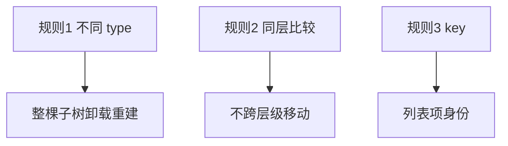

# Virtual DOM 与 Diff

Virtual DOM 让声明式 UI 的更新可预测、可批量，目标不是永远比手写 DOM 快； React Element 是什么、Diff 的三条规则，以及同 type 组件为何能保留 state。

---

## 为什么需要 Virtual DOM？

| 命令式 | 声明式 + Virtual DOM |
|--------|----------------------|
| 手动改 N 处 DOM | 描述新 UI，React 算差异 |
| 易漏改 | 同一 state 对应同一描述 |
| 跨平台难 | RN 等可对接不同宿主 |

```tsx
// 你写的
return <ul>{items.map(i => <li key={i.id}>{i.name}</li>)}</ul>;

// React 内部：Element 树 → 对比 → patch DOM
```

---

## React Element 结构

```tsx
const el = <div className="a">hi</div>;
// 近似：
{
  type: 'div',
  props: { className: 'a', children: 'hi' },
  key: null,
}
```

| 字段 | 含义 |
|------|------|
| `type` | 标签名 `'div'` 或函数组件 `Button` |
| `props` | 属性 + children |
| `key` | 兄弟间身份 |

**Element 不可变**；每次 render 生成新 Element 树。

---

## Diff 三条启发式规则

React 对比两棵树时采用 **O(n) 近似** 算法（非最优树编辑距离）：



### 不同类型 → 整树替换

```tsx
// 从 div 变 span → 内部全部重建
{ cond ? <div><Child /></div> : <span><Child /></span> }
```

**避免**频繁切换根 type 导致 state 丢失。可用 **相同 type + key** 强制 remount：

```tsx
<Profile key={userId} userId={userId} />
```

### 只比较同层兄弟

不会自动识别「把节点从左边移到右边」跨层级，**同层** reorder 靠 key。

### key 标识列表项

列表场景下，key 帮 React 识别「哪一行还是同一项」，避免错误复用 DOM 与组件 state。

---

## 同 type 的 DOM 节点

只更新**变化的属性**：

| 旧 | 新 | DOM 操作 |
|----|-----|----------|
| className="a" | className="b" | 改 class |
| 无 style | style={{ color: 'red' }} | 设 style |
| children "hi" | "hello" | 改文本 |

未变的属性不动。

---

## 组件 type 的 Diff

`type === Button`（函数）→ 同一组件 **更新**，保留 state，执行新 render。

`type` 从 `Button` 变 `Link` → 卸载 Button 实例，挂载 Link，**state 重置**。

---

## children Diff

### 单 child

新旧都是单个 element → 递归 diff。

### 多 child 列表

1. 无 key：按**索引**对比，插入删除可能低效  
2. 有 key：按 key 匹配，支持 reorder

```
旧: A(key=1) B(key=2)
新: B(key=2) A(key=1)  → 移动，不销毁重建
```

---

## 与性能的关系

| 说法 | 真相 |
|------|------|
| Virtual DOM 总是更快 | 多一层 diff；小更新可能不如手写 DOM |
| 优势在复杂 UI | 批量、跨组件、可预测 |
| 优化方向 | 减少 render 次数、稳定 key、memo |

---

## 宿主环境（Host）

| 环境 | 宿主 |
|------|------|
| Web | DOM |
| React Native | 原生 View |
| 测试 | react-test-renderer 内存 |

Fiber 是协调的实现结构，把 Element 树映射为可中断的工作单元。

---

## 小结

**React Element** 是轻量 UI 描述对象，不是真实 DOM；每次 render 生成新树，旧树用于对比。

Diff 遵循三条规则：**类型变 → 整棵子树替换**；**只比较同层兄弟**；**列表靠 key 识别身份**。同 type 的组件实例会复用、state 保留；type 变则 remount。

Virtual DOM 换的是可预测的开发模型，性能靠减少 render、稳定 key、`memo` 等优化手段。出问题时先查：是否频繁切换根 type 导致 state 丢失？列表 key 是否稳定？
