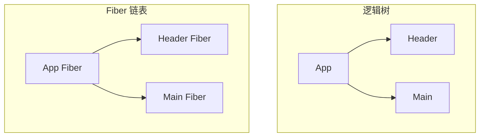
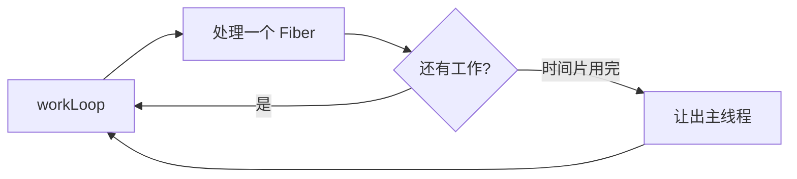

# Fiber 架构与可中断渲染

> **Fiber** 是 React 16 起的协调引擎：把渲染工作拆成**可中断的小单元**，支持**优先级调度**，是 Concurrent 特性的基础。

---

## 一、为什么替换旧 reconciler？

| 旧栈 reconciler | 问题 |
|-----------------|------|
| 递归遍历整棵树 | **同步**，不可中断 |
| 大更新占用主线程 | 动画、输入卡顿 |

Fiber 把「一个递归」变成「链表上的工作单元」，可 pause、resume、abort。

---

## 二、Fiber 节点是什么？

每个 DOM 节点 / 组件对应一个 **Fiber 对象**（工作单元），大致包含：

| 字段（概念） | 作用 |
|--------------|------|
| `type` | 组件或标签 |
| `pendingProps` / `memoizedProps` | 新旧 props |
| `stateNode` | 对应 DOM 或实例 |
| `return` / `child` / `sibling` | **链表**指针 |
| `alternate` | 双缓冲中的另一棵树 |
| `flags` | 增删改标记 |



---

## 三、双缓冲（Double Buffering）

| 树 | 名称 |
|----|------|
| 当前屏幕 | **current** |
| 正在构建 | **workInProgress** |

Render 在 workInProgress 上改；commit 后 **交换指针**，workInProgress 变 current。

类似图形学双缓冲，避免用户看到半成品。

---

## 四、工作循环



| 概念 | 说明 |
|------|------|
| **时间切片** | 每帧做一点，留时间给输入 |
| **优先级 Lane** | 不同更新不同优先级（内部实现） |
| **Concurrent Mode** | 可中断 render 的能力 |

---

## 五、Render 与 Commit 再区分

| | Render | Commit |
|---|--------|--------|
| 可中断 | ✅ | ❌ |
| 改 DOM | ❌ | ✅ |
| 跑 useEffect | ❌ | ✅（passive 阶段） |

Commit 必须一口气完成，避免半更新 DOM。

---

## 六、对开发者的意义

| 特性 | 依赖 Fiber |
|------|------------|
| `useTransition` | 低优先级 render |
| `Suspense` | 可暂停子树 |
| 错误边界 | Fiber 树标记 |
| StrictMode 双调 | 模拟 mount/unmount |

你**不写** Fiber API，但理解后可解释：

- 为什么长列表 filter 会卡（render 重）
- 为什么 transition 能改善输入（优先级）

---

## 七、Lane 与优先级（直觉）

React 18 内部用 **Lane** 模型表示更新优先级（源码级细节）。

| 更新类型 | 直觉优先级 |
|----------|------------|
| 用户输入、点击 | 高 |
| `startTransition` 内 | 低 |
| Suspense 重试 | 中 |

```tsx
startTransition(() => {
  setFiltered(hugeFilter(keyword));
});
```

---

## 八、与 Scheduler 的关系

React 使用 **Scheduler**（独立包）调度 Fiber 任务，类似 `requestIdleCallback` 的 polyfill 策略，在浏览器帧间隙执行 work。

---

## 九、不必深挖的部分

| 源码话题 | 建议 |
|----------|------|
| completeUnitOfWork | 读源码时再查 |
| Lane 位运算 | 面试深挖用 |
| 日常开发 | 掌握 render/commit + transition 即可 |

---

## 十、小结

| 要点 | 记忆 |
|------|------|
| Fiber | 工作单元 + 链表 |
| 双缓冲 | current / WIP |
| 可中断 | render 可 yield |
| Commit | 同步改 DOM |

**上一篇**：[02-Virtual-DOM与Diff](./02-Virtual-DOM与Diff.md)  
**下一篇**：[04-Key与列表调和](./04-Key与列表调和.md)
