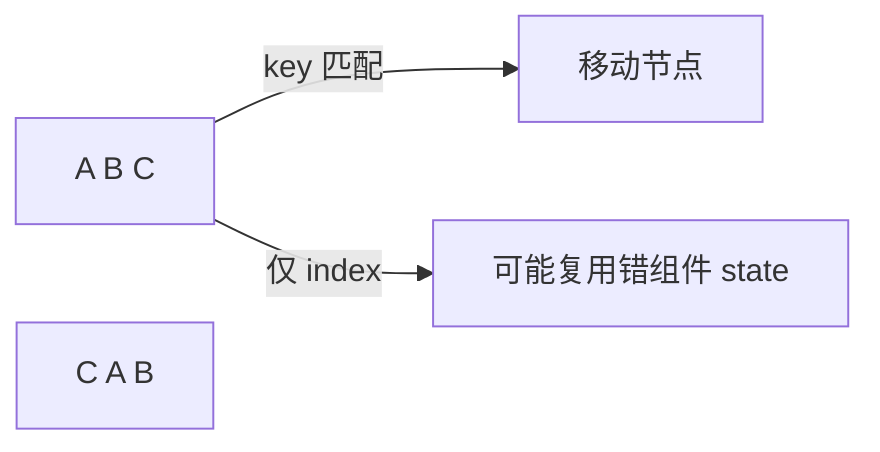

# Key 与列表调和

列表渲染时，**key 帮 React 识别「哪一行还是同一项」**。选错 key（尤其用 index）会在增删、排序时让本地 state 跟错行；改 key 还会强制 remount； key 的放置、index 的适用边界，以及 Fragment 列表的写法。

---

## key 的作用

```tsx
{todos.map(todo => (
  <TodoItem key={todo.id} todo={todo} />
))}
```

| 无 key / 不稳定 key | 稳定唯一 key |
|---------------------|--------------|
| 按索引匹配，reorder 易错 | 按身份匹配，移动 DOM |
| 输入框内容跟错行 | 状态跟 item 走 |



---

## key 放在哪？

**key 在兄弟之间**唯一，不是全局唯一。

```tsx
<ul>
  {items.map(i => <li key={i.id}>...</li>)}
</ul>

<div>
  {sections.map(s => (
    <Section key={s.id}>  {/* 不同父下的 key 可重复 id 字符串 */}
      {s.items.map(i => <Row key={i.id} />)}
    </Section>
  ))}
</div>
```

**不要** `key={Math.random()}` 或 `key={Date.now()}`，每次 render 变，等于销毁重建。

---

## index 作为 key 何时有问题？

```tsx
// ⚠️ 列表会 reorder、过滤、头部插入
items.map((item, index) => <Row key={index} item={item} />);
```

| 操作 | index key 后果 |
|------|----------------|
| 头部插入 | 所有 index 变，state 错位 |
| 删除中间项 | 最后一项 state 残留到错误行 |
| 仅静态、无 state | **可勉强**用 index |

```tsx
// 每行有输入框
function Row({ item }: { item: Item }) {
  const [text, setText] = useState('');
  return <input value={text} onChange={e => setText(e.target.value)} />;
}
// 删除第一行后，原第二行输入内容会「跑到」第一行 — 因为 key=0 的组件实例被复用
```

**规则**：列表项有 **本地 state / 动画 / 焦点** → 必须用 **稳定 id**。

---

## key 与 remount

```tsx
<Profile key={userId} userId={userId} />
```

`userId` 变 → React **卸载旧 Profile、挂载新 Profile**，state 重置。适合「切换用户清空表单」。

| 意图 | 手段 |
|------|------|
| 保留 state 更新 props | **不要**改 key |
| 切换实体重置 | 改 key |

---

## key 与 Fragment

```tsx
{pairs.map(p => (
  <Fragment key={p.id}>
    <dt>{p.term}</dt>
    <dd>{p.def}</dd>
  </Fragment>
))}
```

`<>...</>` 不能带 key，用 `<Fragment key={}>`。

---

## 调和过程（列表插入）

```
旧:  A(1) B(2) C(3)
新:  A(1) X(9) B(2) C(3)

有 key：识别 X 为新插入，B、C 移动
无 key/index：可能误判为 B、C、某节点内容被替换
```

---

## 与性能

| 现象 | 原因 |
|------|------|
| 随机 key | 每次 unmount/mount，慢 |
| 正确 key + reorder | 仅移动 DOM，较快 |
| 超大列表 | key 正确仍慢 → 虚拟化 |

可重排且带本地 state 的列表，**禁止**用 index 作 key。

---

## 小结

**key** 标识列表项身份，帮助 Diff 复用或移动 DOM；放在 **map 返回的最外层元素**上。用**数据稳定 id**，勿用 random；**index 仅适合静态、不重排**的列表。

**key 变化 = remount**，可用来切换实体时重置 state（如 `<Profile key={userId} />`）。Fragment 列表需 `<Fragment key={}>`，短语法 `<>` 不支持 key。

删行后输入框内容跟错行、用了 random key 导致每次 render 重建，都是 key 选错的典型表现。超大列表 key 正确仍慢时，该上虚拟化，别指望改 key 救性能。
