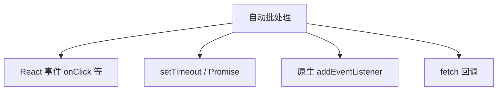

# 批处理与自动批处理

> **批处理（Batching）**：多次 `setState` 合并为**一次 re-render**。React 18 **自动批处理**扩展到更多场景，减少无效渲染。

---

## 一、为什么需要批处理？

```tsx
function handleClick() {
  setA(a => a + 1);
  setB(b => b + 1);
  setC(c => c + 1);
  // 理想：只 commit 一次，不是三次
}
```

| 无批处理 | 有批处理 |
|----------|----------|
| 每次 setState → render + commit | 同一「事件」内合并 |
| DOM 操作多、慢 | 更快、中间态不 paint |

---

## 二、React 18 自动批处理范围



| 场景 | React 17 | React 18+ |
|------|----------|-----------|
| React 合成事件内 | ✅ 批处理 | ✅ |
| setTimeout / Promise | ❌ 各 render 一次 | ✅ **自动批处理** |
| 原生事件 | ❌ | ✅ |

```tsx
function App() {
  const [a, setA] = useState(0);
  const [b, setB] = useState(0);

  useEffect(() => {
    setTimeout(() => {
      setA(1);
      setB(2);
      // React 18：一次 render
    }, 1000);
  }, []);

  console.log('render', a, b);
  return null;
}
```

---

## 三、如何退出批处理：flushSync

**强制同步** flush，用于必须立刻读 DOM 的 rare 场景：

```tsx
import { flushSync } from 'react-dom';

function handle() {
  flushSync(() => {
    setExpanded(true);
  });
  // 此处 DOM 已更新，可测量高度
  const h = ref.current!.scrollHeight;
}
```

| 注意 | 说明 |
|------|------|
| 性能 | 破坏批处理，慎用 |
| 用途 | 测量、与第三方库同步 |

---

## 四、批处理与 state 快照

批处理不改变「**同一事件处理函数内读到同一快照**」：

```tsx
function handle() {
  setCount(c => c + 1);
  setCount(c => c + 1);
  // 函数式更新会合并计算 → +2
  console.log(count); // 仍是旧值，不是 +2 后的
}
```

---

## 五、React 18 根 API

必须用 **`createRoot`** 才能开启 React 18 完整行为（含自动批处理、Concurrent）：

```tsx
import { createRoot } from 'react-dom/client';
createRoot(el).render(<App />);
```

`ReactDOM.render`（legacy）行为不同。

---

## 六、与 Suspense / transition

| API | 批处理关系 |
|-----|------------|
| `startTransition` | 更新标记低优先级，可中断 |
| `flushSync` | 强制高优先级同步 commit |

低优先级更新仍可能批处理，但与 urgent 更新分开调度。

---

## 七、调试多次 render

| 原因 | 排查 |
|------|------|
| StrictMode 双 render | 仅开发 |
| 多个独立事件 | 各批处理一次，正常 |
| 父 + 子各 setState | 可能两次 commit |
| Context 大 value 变 | 多 consumer render |

用 **Profiler** 看 commit 次数。

---

## 八、小结

| 要点 | 记忆 |
|------|------|
| React 18 | 多数异步回调也批处理 |
| flushSync | 例外，同步 flush |
| createRoot | 启用新行为 |
| 函数式 setState | 批处理内仍正确累加 |

**上一篇**：[04-Key与列表调和](./04-Key与列表调和.md)  
**下一篇**：[06-StrictMode与开发态行为](./06-StrictMode与开发态行为.md)
