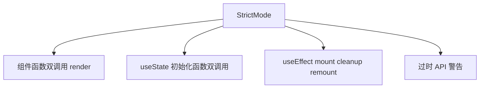

# Strict Mode 与开发态行为

`StrictMode` 是开发态辅助工具：故意**双调 render 和 effect**，暴露 render 中的副作用、缺失的 cleanup 等问题。**生产环境不会双 render / 双调 effect**，行为与无 StrictMode 一致。

---

## 如何启用

```tsx
import { StrictMode } from 'react';
import { createRoot } from 'react-dom/client';

createRoot(document.getElementById('root')!).render(
  <StrictMode>
    <App />
  </StrictMode>,
);
```

可包整个 App 或子树。

---

## 开发环境会做什么？



| 行为 | 目的 |
|------|------|
| **双调用 render** | 暴露 render 中副作用 |
| **双调用 initializer** | 暴露昂贵 init 无缓存 |
| **effect: mount→cleanup→mount** | 暴露缺少 cleanup 的订阅 |
| 检测 legacy API | `findDOMNode`、`UNSAFE_*` 等 |

---

## effect 双调用示例

```tsx
useEffect(() => {
  console.log('effect run');
  return () => console.log('cleanup');
}, []);

// 开发 + StrictMode 控制台：
// effect run
// cleanup
// effect run

// 生产：仅 effect run 一次
```

| 要求 | effect 必须 |
|------|-------------|
| cleanup 对称 | 取消订阅、abort、clearTimeout |
| 幂等 | 重复 mount 不出错 |

```tsx
useEffect(() => {
  const ctrl = new AbortController();
  fetch(url, { signal: ctrl.signal });
  return () => ctrl.abort();
}, [url]);
```

---

## render 双调用

```tsx
function Counter() {
  console.log('render');
  const [n, setN] = useState(0);
  return <button onClick={() => setN(n + 1)}>{n}</button>;
}
// 开发 StrictMode：首次 mount 可能 log 两次 render
// 点击后仍按正常批处理
```

**不要在 render 里**：

- fetch
- 改全局变量
- 无 guard 的 `setState`

---

## useState 惰性初始化双调用

```tsx
useState(() => {
  console.log('init');
  return expensive();
});
// StrictMode 可能 log init 两次 — init 应纯且可重复，或接受两次计算
```

昂贵 init 且只算一次需求：模块级缓存或 ref guard（少见）。

---

## 常见困惑

| 问题 | 答案 |
|------|------|
| 生产会双 render 吗？ | **不会** |
| 要关掉 StrictMode 吗？ | 不建议；修 cleanup 而非关 |
| 请求发两次？ | 开发 effect 双调；加 cleanup 或 Query dedupe |
| 计数器点击翻倍？ | 不是 StrictMode；查重复绑定事件 |

---

## 与 Concurrent 的关系

StrictMode 还帮助准备 **Concurrent** 可中断/重试 语义：组件应能安全「丢弃一次 render 再重来」。

---

## 何时可暂时移除 StrictMode

| 场景 | 说明 |
|------|------|
| 调试第三方库不兼容 | 临时定位 |
| 库 fix 后 | 加回 |

长期应保留 StrictMode。

---

## 小结

**StrictMode 仅开发环境**生效；生产不会双 render / 双调 effect。它故意**双调 effect** 以检测缺失 **cleanup**（订阅泄漏、未 abort 的请求等）。

**render 须纯**：无副作用；`useState` 惰性 init 也会被双测，init 函数应可重复执行。双调用不是 bug，是帮助发现不安全模式的工具，应修 cleanup 而非关掉 StrictMode。

常见错因：effect 有没有对称 cleanup？开发态请求双发是否因 effect 双调？计数器异常是否另有重复事件绑定？
