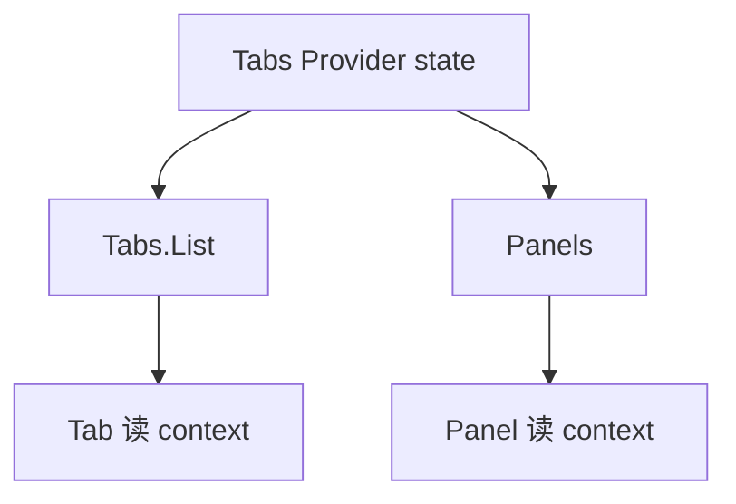

# 复合组件与状态共享

Tabs、Accordion 这类 UI 若用一长串 props 配置，扩展和维护都困难。**复合组件**用 Context 共享隐式 state，配合 `Parent.Child` 静态 API，让用法接近原生控件；实现模式、受控/非受控双模式，以及性能注意点。

---

## 问题：配置 props 爆炸

```tsx
// ❌ 开关过多，扩展难
<Tabs
  activeIndex={0}
  onChange={setIndex}
  showBorder
  tabLabels={['A', 'B']}
  tabPanels={[panelA, panelB]}
/>
```

```tsx
// ✅ 组合式 API
<Tabs defaultIndex={0}>
  <Tabs.List>
    <Tabs.Tab index={0}>概览</Tabs.Tab>
    <Tabs.Tab index={1}>详情</Tabs.Tab>
  </Tabs.List>
  <Tabs.Panels>
    <Tabs.Panel index={0}>...</Tabs.Panel>
    <Tabs.Panel index={1}>...</Tabs.Panel>
  </Tabs.Panels>
</Tabs>
```

---

## 实现模式

```tsx
interface TabsContextValue {
  activeIndex: number;
  setActiveIndex: (i: number) => void;
}

const TabsContext = createContext<TabsContextValue | null>(null);

function useTabsContext() {
  const ctx = useContext(TabsContext);
  if (!ctx) throw new Error('Tabs 子组件必须在 Tabs 内使用');
  return ctx;
}

function Tabs({
  defaultIndex = 0,
  children,
}: {
  defaultIndex?: number;
  children: React.ReactNode;
}) {
  const [activeIndex, setActiveIndex] = useState(defaultIndex);
  const value = useMemo(
    () => ({ activeIndex, setActiveIndex }),
    [activeIndex],
  );
  return (
    <TabsContext.Provider value={value}>
      <div className="tabs">{children}</div>
    </TabsContext.Provider>
  );
}

function Tab({ index, children }: { index: number; children: React.ReactNode }) {
  const { activeIndex, setActiveIndex } = useTabsContext();
  return (
    <button
      type="button"
      role="tab"
      aria-selected={activeIndex === index}
      onClick={() => setActiveIndex(index)}
    >
      {children}
    </button>
  );
}

function Panel({ index, children }: { index: number; children: React.ReactNode }) {
  const { activeIndex } = useTabsContext();
  if (activeIndex !== index) return null;
  return <div role="tabpanel">{children}</div>;
}

Tabs.List = function TabsList({ children }: { children: React.ReactNode }) {
  return <div role="tablist">{children}</div>;
};
Tabs.Tab = Tab;
Tabs.Panel = Panel;
```



---

## 受控 vs 非受控

| 模式 | API |
|------|-----|
| 非受控 | `defaultIndex` 内部 state |
| 受控 | `index` + `onIndexChange` |

```tsx
function Tabs({
  index: controlledIndex,
  onIndexChange,
  defaultIndex = 0,
  children,
}: {
  index?: number;
  onIndexChange?: (i: number) => void;
  defaultIndex?: number;
  children: React.ReactNode;
}) {
  const [internal, setInternal] = useState(defaultIndex);
  const activeIndex = controlledIndex ?? internal;
  const setActiveIndex = (i: number) => {
    onIndexChange?.(i);
    if (controlledIndex === undefined) setInternal(i);
  };
  ...
}
```

---

## 与 Radix / Headless UI

生产环境常用 **Radix UI**、**Headless UI** 提供 a11y 完整的 compound 组件；shadcn/ui 在其上封装样式。

| 自研 | 用库 |
|------|------|
| 学习模式 | 省 a11y 与键盘逻辑 |
| 完全定制 | 改源码（shadcn 方式） |

---

## 性能注意

Context value 变化 → **所有** consumer re-render。可：

- 拆分 Context（state / dispatch）
- 仅 Panel 内容重渲染（`activeIndex` 变时 Tab 按钮也要更新 aria）

---

## 小结

**复合组件**用 Context 共享隐式 state，配合 **`Parent.Child`** 静态属性，API 像原生控件一样可组合扩展。应同时支持**受控**（外部 index/value）与**非受控**（内部 state）双模式。

Radix / Headless UI 是生产级参考，自带 role、aria-selected 等 a11y 逻辑。自研时注意 Context value 变化会触发所有 consumer 重渲染，可拆分 Context、memo 子组件、稳定 callback。

常见错因：子组件是否在 Provider 外使用？Context value 是否每次 render 新建对象导致多余刷新？
