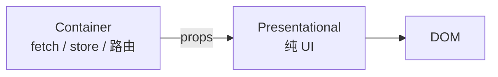

# 容器与展示分离

**Container** 负责拉数据、调路由；**Presentational** 只收 props 渲染 UI。Hooks 时代不必再写 class 式 fat Container，用**自定义 Hook 管逻辑 + 薄 View** 即可，分离思想不变。

---

## 经典划分



| 容器 | 展示 |
|------|------|
| `useQuery`、`useParams` | 只收 props |
| 少或无样式 | className、布局 |
| 难 Storybook 单独 | **易 Storybook** |

```tsx
// 展示
function UserListView({
  users,
  loading,
  error,
  onSelect,
}: {
  users: User[];
  loading: boolean;
  error: Error | null;
  onSelect: (id: string) => void;
}) {
  if (loading) return <Spinner />;
  if (error) return <Alert message={error.message} />;
  return (
    <ul>
      {users.map(u => (
        <li key={u.id}>
          <button type="button" onClick={() => onSelect(u.id)}>{u.name}</button>
        </li>
      ))}
    </ul>
  );
}

// 容器
function UserListContainer() {
  const { data, isLoading, error } = useQuery({
    queryKey: ['users'],
    queryFn: fetchUsers,
  });
  const navigate = useNavigate();
  return (
    <UserListView
      users={data ?? []}
      loading={isLoading}
      error={error}
      onSelect={id => navigate(`/users/${id}`)}
    />
  );
}
```

---

## 现代变体：Hooks 取代 fat Container

| 旧 | 新 |
|----|-----|
| Class Container | 函数 + **自定义 Hook** |
| `UserListContainer` | `useUserList()` + `UserListView` |

```tsx
function useUserList() {
  const query = useQuery({ queryKey: ['users'], queryFn: fetchUsers });
  const navigate = useNavigate();
  return {
    users: query.data ?? [],
    loading: query.isLoading,
    error: query.error,
    select: (id: string) => navigate(`/users/${id}`),
  };
}

function UserListPage() {
  const props = useUserList();
  return <UserListView {...props} />;
}
```

逻辑在 Hook，View 仍纯展示，**分离思想不变**。

---

## Feature 模块边界

```plaintext
features/users/
├── api.ts
├── hooks/useUserList.ts
├── components/UserListView.tsx
├── UserListPage.tsx
└── types.ts
```

| 文件 | 职责 |
|------|------|
| `*Page` | 路由入口，拼 Hook + View |
| `*View` | 展示 |
| `hooks/` | 容器逻辑 |

按 feature 聚合，比全局平铺 components/hooks 更易维护。

---

## 何时不必强行拆分

| 场景 | 建议 |
|------|------|
| 简单静态页 | 单组件即可 |
| 逻辑 3 行 | 不必 Page/View 两套 |
| 强耦合动画 | 合并可读性更好 |

---

## 测试策略

| 层 | 测什么 |
|----|--------|
| View | props → 输出，RTL |
| Hook | renderHook + mock Query |
| Container/Page | 集成测可选 |

---

## 小结

**Container** 拉数据、调 API、处理路由；**Presentational** 只收 props 渲染 UI，无 fetch，便于 Storybook 与 RTL 单测。

现代写法：**自定义 Hook 管逻辑** + 薄 View，不必 class 式 Container。小页面不必强行拆分；复杂页面按 feature 模块组织 Page / View / hooks。

常见错因：View 里是否混入了 fetch？Hook 返回的 props 是否与 View 接口对齐？
