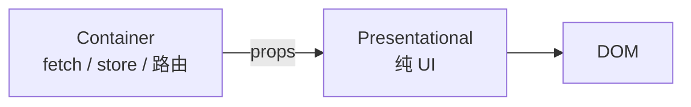

# 容器与展示分离

> **容器组件（Container）** 管数据与逻辑；**展示组件（Presentational）** 管 UI 渲染。分离后 UI 易测、易 Storybook、逻辑可换数据源。

---

## 一、经典划分



| 容器 | 展示 |
|------|------|
| `useQuery`、`useParams` | 只收 props |
| 少或无样式 | className、布局 |
| 难 Storybook 单独 | **易 Storybook** |

```tsx
// 展示
function UserListView({
  users,
  loading,
  error,
  onSelect,
}: {
  users: User[];
  loading: boolean;
  error: Error | null;
  onSelect: (id: string) => void;
}) {
  if (loading) return <Spinner />;
  if (error) return <Alert message={error.message} />;
  return (
    <ul>
      {users.map(u => (
        <li key={u.id}>
          <button type="button" onClick={() => onSelect(u.id)}>{u.name}</button>
        </li>
      ))}
    </ul>
  );
}

// 容器
function UserListContainer() {
  const { data, isLoading, error } = useQuery({
    queryKey: ['users'],
    queryFn: fetchUsers,
  });
  const navigate = useNavigate();
  return (
    <UserListView
      users={data ?? []}
      loading={isLoading}
      error={error}
      onSelect={id => navigate(`/users/${id}`)}
    />
  );
}
```

---

## 二、现代变体：Hooks 取代 fat Container

| 旧 | 新 |
|----|-----|
| Class Container | 函数 + **自定义 Hook** |
| `UserListContainer` | `useUserList()` + `UserListView` |

```tsx
function useUserList() {
  const query = useQuery({ queryKey: ['users'], queryFn: fetchUsers });
  const navigate = useNavigate();
  return {
    users: query.data ?? [],
    loading: query.isLoading,
    error: query.error,
    select: (id: string) => navigate(`/users/${id}`),
  };
}

function UserListPage() {
  const props = useUserList();
  return <UserListView {...props} />;
}
```

逻辑在 Hook，View 仍纯展示——**分离思想不变**。

---

## 三、Feature 模块边界

```plaintext
features/users/
├── api.ts
├── hooks/useUserList.ts
├── components/UserListView.tsx
├── UserListPage.tsx
└── types.ts
```

| 文件 | 职责 |
|------|------|
| `*Page` | 路由入口，拼 Hook + View |
| `*View` | 展示 |
| `hooks/` | 容器逻辑 |

见 [05-特性目录与模块边界](./05-特性目录与模块边界.md)。

---

## 四、何时不必强行拆分

| 场景 | 建议 |
|------|------|
| 简单静态页 | 单组件即可 |
| 逻辑 3 行 | 不必 Page/View 两套 |
| 强耦合动画 | 合并可读性更好 |

---

## 五、测试策略

| 层 | 测什么 |
|----|--------|
| View | props → 输出，RTL |
| Hook | renderHook + mock Query |
| Container/Page | 集成测可选 |

---

## 六、小结

| 要点 | 实践 |
|------|------|
| 展示组件纯 | 无 fetch |
| 逻辑 | Hook 或 Container |
| Storybook | 针对 View |

**上一篇**：[01-复合组件与状态共享](./01-复合组件与状态共享.md)  
**下一篇**：[03-HOC与Render-Props](./03-HOC与Render-Props.md)
