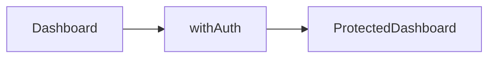

# HOC 与 Render Props

**HOC** 和 **Render Props** 是 Hooks 之前复用逻辑的主流模式。新项目应优先**自定义 Hook**；维护遗留代码、阅读 Radix 等库源码时，仍需认识这两种写法。

---

## 高阶组件（HOC）

**HOC**：接收组件，返回增强后的新组件。

```tsx
function withAuth<P extends object>(Component: React.ComponentType<P>) {
  return function AuthenticatedComponent(props: P) {
    const { user, loading } = useAuth();
    if (loading) return <Spinner />;
    if (!user) return <Navigate to="/login" />;
    return <Component {...props} />;
  };
}

const ProtectedDashboard = withAuth(Dashboard);
```



| 用途 | 示例 |
|------|------|
| 鉴权 | withAuth |
| 注入数据 | connect (Redux 旧) |
| 日志 | withLogger |

### HOC 约定

| 规则 | 原因 |
|------|------|
| 透传 props | 不破坏原组件 |
| 复制 displayName | DevTools 可读 `WithAuth(Dashboard)` |
| 不要在内层改 ref | 用 forwardRef 或 Hook |

### HOC 缺点

| 缺点 | 表现 |
|------|------|
| 嵌套地狱 | withA(withB(withC(C))) |
| props 来源不明 | 同名 props 冲突 |
| 类型推导繁琐 | TS 泛型多层 |

**替代**：`function Page() { useAuth(); ... }` 或布局路由守卫。

---

## Render Props

```tsx
function MouseTracker({
  render,
}: {
  render: (pos: { x: number; y: number }) => React.ReactNode;
}) {
  const [pos, setPos] = useState({ x: 0, y: 0 });
  return (
    <div
      onMouseMove={e => setPos({ x: e.clientX, y: e.clientY })}
      style={{ height: 200 }}
    >
      {render(pos)}
    </div>
  );
}

<MouseTracker render={({ x, y }) => <p>{x}, {y}</p>} />
```

| 对比 HOC | Render Props |
|----------|--------------|
| 包装组件 | 函数参数拿数据 |
| 隐式注入 props | 显式 render 参数 |

**children 作函数**：

```tsx
<MouseTracker>{pos => <p>{pos.x}</p>}</MouseTracker>
```

---

## Hooks 替代

```tsx
function useMouse() {
  const [pos, setPos] = useState({ x: 0, y: 0 });
  const ref = useCallback((node: HTMLDivElement | null) => {
    if (!node) return;
    const move = (e: MouseEvent) => setPos({ x: e.clientX, y: e.clientY });
    node.addEventListener('mousemove', move);
    return () => node.removeEventListener('mousemove', move);
  }, []);
  return { pos, ref };
}
```

| 模式 | 现状 |
|------|------|
| HOC | 遗留、库内部 |
| Render Props | 部分库仍用 |
| **自定义 Hook** | **首选** |

---

## 何时仍会遇到

| 来源 | 说明 |
|------|------|
| `react-router` v5 `render prop` | v6 改 Hook |
| `react-helmet` 旧 API | — |
| Redux `connect` | 推荐 `useSelector` |

---

## 小结

**HOC**：`(Component) => EnhancedComponent`，注入 props；注意 ref 转发与 displayName。**Render Props**：通过 render 函数注入数据，易产生嵌套。

**新项目优先自定义 Hook** 复用逻辑，类型与组合更清晰。维护遗留代码、阅读 Radix 源码时仍需认识 HOC 与 Render Props。

常见错因：HOC 嵌套是否导致 props 来源难追踪？能否用 Hook 或路由守卫替代 withAuth？
