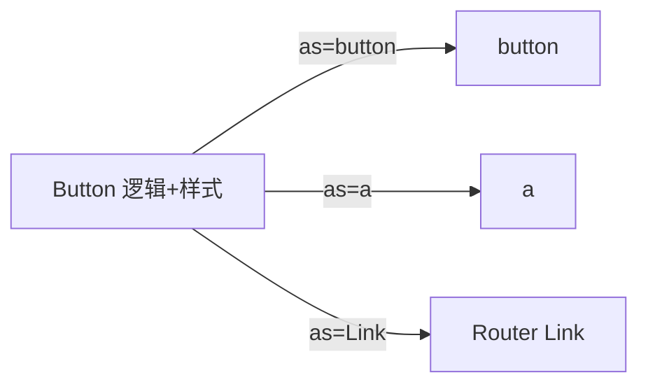

# 插槽、多态与 as prop

> 设计组件 API 时，常要回答：**根元素用什么标签？** **样式怎么扩展？** **能否渲染成 Link？** `as` prop 与 **多态组件** 是 TypeScript + React 中的标准解法。

---

## 一、as prop 模式

```tsx
type ButtonProps<E extends React.ElementType = 'button'> = {
  as?: E;
  variant?: 'primary' | 'ghost';
} & React.ComponentPropsWithoutRef<E>;

function Button<E extends React.ElementType = 'button'>({
  as,
  variant = 'primary',
  className,
  ...rest
}: ButtonProps<E>) {
  const Component = as ?? 'button';
  return (
    <Component
      className={clsx('btn', `btn-${variant}`, className)}
      {...rest}
    />
  );
}

// 用法
<Button>提交</Button>
<Button as="a" href="/docs">文档</Button>
<Button as={Link} to="/home">首页</Button>
```



| 好处 | 说明 |
|------|------|
| 语义正确 | 导航用 `<a>` / Link |
| 一套样式 | variant 复用 |
| a11y | 保留原生角色 |

---

## 二、TypeScript 多态组件

```tsx
type PolymorphicRef<E extends React.ElementType> =
  React.ComponentPropsWithRef<E>['ref'];

type PolymorphicProps<E extends React.ElementType, P = {}> = P &
  Omit<React.ComponentPropsWithoutRef<E>, keyof P | 'as'> & {
    as?: E;
  };
```

库如 **Radix Slot**、**MUI Box** 内置多态；手写可参考 `@radix-ui/react-slot`。

---

## 三、Slot 组件（合并 props）

```tsx
import { Slot } from '@radix-ui/react-slot';

function Button({ asChild, ...props }: { asChild?: boolean } & React.ComponentProps<'button'>) {
  const Comp = asChild ? Slot : 'button';
  return <Comp {...props} />;
}

// asChild：子元素成为实际 DOM，合并 className 与事件
<Button asChild>
  <Link to="/">首页</Link>
</Button>
```

| `as` prop | `asChild` + Slot |
|-----------|------------------|
| 指定标签类型 | 子元素必须是唯一 ReactElement |
| 常见手写 | shadcn / Radix 风格 |

---

## 四、插槽（具名 props）

见 [03-Children与组合模式](../03-组件基础/03-Children与组合模式.md)：

```tsx
<Layout header={<Header />} sidebar={<Sidebar />}>
  {content}
</Layout>
```

| children | header / footer props |
|----------|-------------------------|
| 默认槽 | 具名槽 |

---

## 五、variant 设计

```tsx
const variants = {
  primary: 'bg-brand text-white',
  ghost: 'bg-transparent',
  danger: 'bg-red-600 text-white',
} as const;

type Variant = keyof typeof variants;
```

配合 **class-variance-authority (cva)**：

```tsx
const button = cva('btn', {
  variants: {
    variant: { primary: '...', ghost: '...' },
    size: { sm: 'text-sm', md: 'text-base' },
  },
  defaultVariants: { variant: 'primary', size: 'md' },
});
```

---

## 六、反模式

| 反模式 | 问题 |
|--------|------|
| `isLink` `isButton` 多个 boolean | 组合爆炸 |
| 任何组件都 `as:any` | 丢类型安全 |
| div 模拟 button | a11y 差 |

---

## 七、小结

| 需求 | 方案 |
|------|------|
| 换标签 | `as` 或 `asChild` |
| 多 variant | cva + Tailwind |
| 布局槽 | children + 具名 props |

**上一篇**：[03-HOC与Render-Props](./03-HOC与Render-Props.md)  
**下一篇**：[05-特性目录与模块边界](./05-特性目录与模块边界.md)
