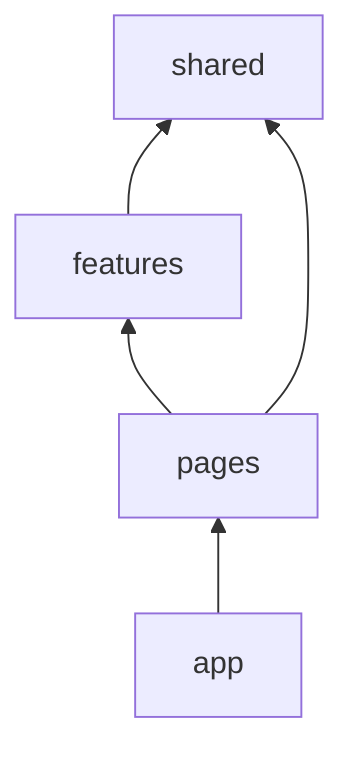

# 特性目录与模块边界

> 中大型 React 项目如何**分文件夹**、**划依赖**、避免「什么都 import 什么都」？本篇给出 **Feature-Sliced** 与 **领域目录** 的实用落地方式。

---

## 一、常见问题

| 症状 | 原因 |
|------|------|
| 改 utils 牵一片 | 无边界 |
| components 几百个平铺 | 无业务聚合 |
| 循环依赖 | 双向引用 |
| 新人找不到页面代码 | views/pages 混乱 |

---

## 二、推荐目录（SPA）

```plaintext
src/
├── app/                 # 应用壳：Provider、路由、全局样式
│   ├── App.tsx
│   ├── providers.tsx
│   └── router.tsx
├── pages/               # 路由级页面（薄，组装 features）
│   └── users/
│       └── UserListPage.tsx
├── features/            # 业务特性（核心）
│   └── users/
│       ├── api/
│       ├── hooks/
│       ├── components/
│       └── types.ts
├── entities/            # 可选：跨 feature 的领域实体 User
├── shared/              # 与业务无关
│   ├── ui/              # Button、Input
│   ├── lib/             # cn、formatDate
│   └── api/             # request 实例
└── main.tsx
```



| 层 | 可 import |
|----|-----------|
| `shared` | 无业务层 |
| `features` | shared、entities |
| `pages` | features、shared |
| `app` | 全部 |

**禁止** `shared` → `features`（反向依赖）。

---

## 三、Feature 内部结构

```plaintext
features/orders/
├── api/orders.api.ts
├── hooks/useOrderList.ts
├── components/
│   ├── OrderTable.tsx      # 展示
│   └── OrderStatusBadge.tsx
├── OrderListPage.tsx       # 或放在 pages/orders
└── types.ts
```

| 文件 | 职责 |
|------|------|
| `*.api.ts` | 接口函数，无 React |
| `hooks/` | Query、表单、组合逻辑 |
| `components/` | 仅本 feature 用的 UI |
| 跨 feature 组件 | 提升到 `entities` 或 `shared/ui` |

---

## 四、与编码规范对齐

[React 编码规范](../React编码规范.md) 中的 `views/`、`components/base` 与本结构对应：

| 规范 | 本结构 |
|------|--------|
| `views/` | `pages/` |
| `components/base` | `shared/ui` |
| `components/business` | `features/*/components` |

团队选一套命名，**全仓库统一**。

---

## 五、Public API（桶文件）

```tsx
// features/users/index.ts
export { UserListPage } from './UserListPage';
export type { User } from './types';
// 不 export 内部 OrderTableRow
```

外部只 `import { UserListPage } from '@/features/users'`，内部重构自由。

---

## 六、Monorepo 扩展

```
packages/
├── ui/          # 设计系统
├── utils/
apps/
└── web/         # 上述 src 结构
```

见 [脚手架与 Monorepo](../../../前端工程化体系/03-脚手架与项目初始化.md)。

---

## 七、边界检查工具

| 工具 | 作用 |
|------|------|
| ESLint `import/no-restricted-paths` | 禁反向依赖 |
| dependency-cruiser | 可视化依赖 |
| Nx module boundaries | Monorepo |

---

## 八、小结

| 原则 | 做法 |
|------|------|
| 按业务 feature 聚合 | 非按文件类型全局平铺 |
| 依赖单向 | shared 最底 |
| 页面薄 | 逻辑在 hooks |
| 桶 export | 隐藏内部 |

**上一篇**：[04-插槽-多态与as-prop](./04-插槽-多态与as-prop.md)  
**下一模块**：[08-状态管理](../08-状态管理/01-状态分类与放置原则.md)
