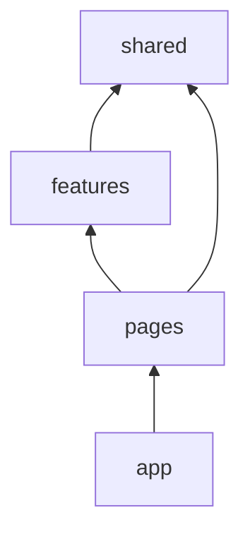

# 特性目录与模块边界

全局平铺 `components/`、`hooks/` 时，改一处 utils 常牵一片；按 **feature（业务域）** 聚合，配合单向依赖，能让页面代码可找、可 refactor； SPA 推荐目录、Public API 桶 export，以及 ESLint 约束跨 feature 引用。

---

## 常见问题

| 症状 | 原因 |
|------|------|
| 改 utils 牵一片 | 无边界 |
| components 几百个平铺 | 无业务聚合 |
| 循环依赖 | 双向引用 |
| 新人找不到页面代码 | views/pages 混乱 |

---

## 推荐目录（SPA）

```plaintext
src/
├── app/                 # 应用壳：Provider、路由、全局样式
│   ├── App.tsx
│   ├── providers.tsx
│   └── router.tsx
├── pages/               # 路由级页面（薄，组装 features）
│   └── users/
│       └── UserListPage.tsx
├── features/            # 业务特性（核心）
│   └── users/
│       ├── api/
│       ├── hooks/
│       ├── components/
│       └── types.ts
├── entities/            # 可选：跨 feature 的领域实体 User
├── shared/              # 与业务无关
│   ├── ui/              # Button、Input
│   ├── lib/             # cn、formatDate
│   └── api/             # request 实例
└── main.tsx
```



| 层 | 可 import |
|----|-----------|
| `shared` | 无业务层 |
| `features` | shared、entities |
| `pages` | features、shared |
| `app` | 全部 |

**禁止** `shared` → `features`（反向依赖）。

---

## Feature 内部结构

```plaintext
features/orders/
├── api/orders.api.ts
├── hooks/useOrderList.ts
├── components/
│   ├── OrderTable.tsx      # 展示
│   └── OrderStatusBadge.tsx
├── OrderListPage.tsx       # 或放在 pages/orders
└── types.ts
```

| 文件 | 职责 |
|------|------|
| `*.api.ts` | 接口函数，无 React |
| `hooks/` | Query、表单、组合逻辑 |
| `components/` | 仅本 feature 用的 UI |
| 跨 feature 组件 | 提升到 `entities` 或 `shared/ui` |

---

## 命名约定

团队可选 `pages/` 或 `views/`、`shared/ui` 或 `components/base`，**全仓库统一**即可：

| 常见叫法 | 对应层 |
|----------|--------|
| `views/` | `pages/` |
| `components/base` | `shared/ui` |
| `components/business` | `features/*/components` |

---

## Public API（桶文件）

```tsx
// features/users/index.ts
export { UserListPage } from './UserListPage';
export type { User } from './types';
// 不 export 内部 OrderTableRow
```

外部只 `import { UserListPage } from '@/features/users'`，内部重构自由。

---

## Monorepo 扩展

```
packages/
├── ui/          # 设计系统
├── utils/
apps/
└── web/         # 上述 src 结构
```

设计系统、工具包抽到 `packages/`，应用层仍按 feature 组织。

---

## 边界检查工具

| 工具 | 作用 |
|------|------|
| ESLint `import/no-restricted-paths` | 禁反向依赖 |
| dependency-cruiser | 可视化依赖 |
| Nx module boundaries | Monorepo |

---

## 小结

按 **feature（业务域）** 聚合，而非全局按 components/hooks 平铺。依赖单向：**shared → features → pages**；feature 间不互相 deep import。

页面组件**薄**，逻辑进 hooks；对外 **index 桶 export** 隐藏内部。可用 ESLint `no-restricted-imports`  enforce 边界。

常见错因：是否出现 shared 引用 features 的反向依赖？跨 feature 组件是否应提升到 entities 或 shared？
