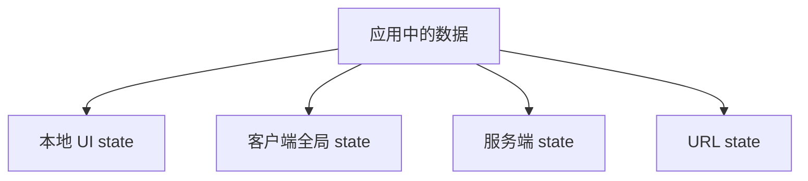
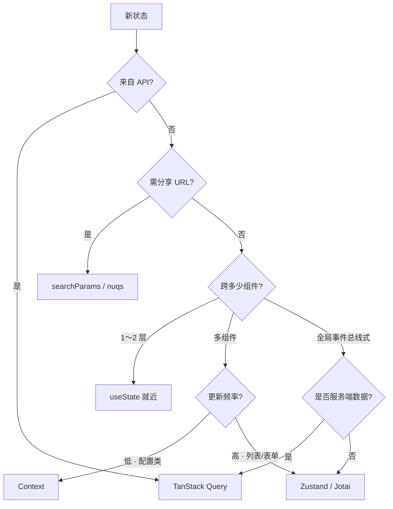

# 状态分类与放置原则

状态放错位置，后期一定乱：API 列表塞进 Redux、主题塞进 Query、弹窗 open 提到全局 store。下面按四分法（本地 UI / 客户端全局 / 服务端 / URL）和决策流程，看各类 state 该用 `useState`、Query、Zustand 还是 searchParams。

---

## 状态四分法



| 类型 | 例子 | 推荐存放 |
|------|------|----------|
| **本地 UI** | 弹窗开闭、输入框、tab | `useState` / 组件内 |
| **客户端全局** | 主题、登录用户、侧边栏 | Zustand / Context |
| **服务端** | 列表、详情、分页数据 | **TanStack Query** |
| **URL** | 页码、筛选、分享链接 | `searchParams` / nuqs |

---

## Colocation（就近放置）

**state 放在需要它的最小公共祖先**，能下放就不提升。

```tsx
// ✅ 对话框 state 在 Dialog 内
function Dialog() {
  const [open, setOpen] = useState(false);
  ...
}

// ❌ 无关的全局 store 存每个 modal 的 open
```

| 提升信号 | 说明 |
|----------|------|
| 兄弟都要 | 提到父 |
| 路由间共享 | URL 或全局 |
| 持久化 | localStorage / 服务端 |

---

## 服务端 vs 客户端

| 错误 | 正确 |
|------|------|
| fetch 进 Redux 当 cache | TanStack Query |
| Query 数据复制到 useState | 直接用 `data` |
| 把 theme 放 Query | theme 是客户端 |

```tsx
// 服务端状态
const { data: users } = useQuery({ queryKey: ['users'], queryFn: fetchUsers });

// 客户端 UI
const sidebarOpen = useUIStore(s => s.sidebarOpen);
```

---

## 表单 state

| 复杂度 | 方案 |
|--------|------|
| 1～2 字段 | useState |
| 多字段校验 | React Hook Form |
| 草稿持久化 | RHF + localStorage |

表单一般**不是**全局 state，除非跨页向导。

---

## 决策流程



---

## 场景对照表

| 场景 | 错误放法 | 推荐 |
|------|----------|------|
| 用户列表分页 | Redux + 手动 fetch | Query + URL `page` |
| 深色模式 | Query cache | Context 或 Zustand persist |
| Modal 开闭 | 全局 store 存每个 id | 组件内 `useState` |
| 筛选条件可分享 | 仅内存 store | `searchParams` |
| 购物车（高频） | 单一 AppContext | Zustand selector |
| 表单草稿 | Redux | RHF + localStorage |
| 服务端详情 | 复制到 useState | Query `data` 直读 |

---

## 代码决策示例

**URL 存筛选（可分享、可刷新）**：

```tsx
import { useSearchParams } from 'react-router-dom';

function ProductList() {
  const [params, setParams] = useSearchParams();
  const category = params.get('category') ?? 'all';
  const page = Number(params.get('page') ?? '1');

  const { data } = useQuery({
    queryKey: ['products', category, page],
    queryFn: () => fetchProducts({ category, page }),
  });

  const setCategory = (c: string) => {
    setParams({ category: c, page: '1' });
  };

  return (/* render */);
}
```

**局部 UI 不下沉全局**：

```tsx
// ✅ 删除确认框 state 在 Feature 内
function UserTable() {
  const [pendingDeleteId, setPendingDeleteId] = useState<string | null>(null);
  // ...
}
```

---

## 反模式

| 反模式 | 问题 |
|--------|------|
| 全放 Redux | 样板多、服务端数据难管 |
| 全放 Context | 大对象 → 全树 render |
| props 钻 10 层 | 应用组合 / Context / store |
| 复制 props → state | 不同步 |

---

## 小结

**先分类**：API 数据 → **Query**；全局 UI → **Zustand/Context**；可分享筛选 → **URL**；局部 → **useState**。

**Colocation**：state 放在需要它的最小组件树范围。勿把服务端列表塞进 Redux 当第二份 cache；勿用 Context 缓存 HTTP 数据。表单草稿用本地 state 或 RHF，与全局 store 分离。

常见错因：这份 state 谁拥有？是否把 props 复制进 state 导致 stale？是否该用 URL 而非内存 store 存筛选条件？
