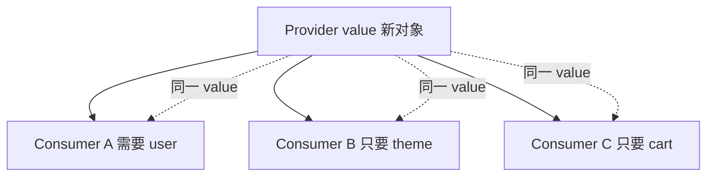

# Context 进阶与性能

Context 适合主题、locale 等**低频全局配置**；把高频变更的大对象塞进单一 Context，会导致所有 consumer 跟着 re-render；问题来源、拆分与 memo 优化，以及何时改用 Zustand selector。

---

## 性能问题从哪来？

```tsx
const AppContext = createContext({
  user,
  theme,
  cart,
  setCart,
});

// theme 变 → 所有 useContext(AppContext) 的组件都 render
```



---

## 拆分 Context（完整示例）

电商场景：user / theme / cart 分离，cart 再拆 state 与 dispatch。

```tsx
// contexts/cart.tsx
import { createContext, useContext, useReducer, useMemo, useCallback } from 'react';

type CartState = { items: { id: string; qty: number }[] };
type CartAction =
  | { type: 'ADD'; id: string }
  | { type: 'REMOVE'; id: string };

const CartStateContext = createContext<CartState | null>(null);
const CartDispatchContext = createContext<React.Dispatch<CartAction> | null>(null);

function cartReducer(state: CartState, action: CartAction): CartState {
  switch (action.type) {
    case 'ADD':
      return { items: [...state.items, { id: action.id, qty: 1 }] };
    case 'REMOVE':
      return { items: state.items.filter(i => i.id !== action.id) };
    default:
      return state;
  }
}

export function CartProvider({ children }: { children: React.ReactNode }) {
  const [state, dispatch] = useReducer(cartReducer, { items: [] });
  // dispatch 引用稳定，单独 Provider 不会因子项数量变化而触发「只读 dispatch」的组件
  return (
    <CartDispatchContext.Provider value={dispatch}>
      <CartStateContext.Provider value={state}>{children}</CartStateContext.Provider>
    </CartDispatchContext.Provider>
  );
}

export function useCartItems() {
  const ctx = useContext(CartStateContext);
  if (!ctx) throw new Error('useCartItems must be inside CartProvider');
  return ctx.items;
}

export function useCartDispatch() {
  const ctx = useContext(CartDispatchContext);
  if (!ctx) throw new Error('useCartDispatch must be inside CartProvider');
  return ctx;
}
```

**只显示数量的组件**仅订阅 `items.length` 时，仍会因 `items` 数组引用变化而 render，此时应改用 Zustand selector 或拆 `CartCountContext` 只传 `items.length`。

---

## 按变更频率拆分

```tsx
// ✅ 主题极少变，单独 Context
<ThemeContext.Provider value={theme}>
  {/* 购物车高频变，不拖累主题消费者 */}
  <CartProvider>{children}</CartProvider>
</ThemeContext.Provider>
```

| 拆分维度 | 示例 |
|----------|------|
| 读 / 写 | `StateContext` + `DispatchContext` |
| 业务域 | `AuthContext` / `UIContext` |
| 变更频率 | `ConfigContext` vs `LiveDataContext` |

---

## 稳定 value

```tsx
// ❌ 每次 render 新对象
<ThemeContext.Provider value={{ theme, setTheme }}>

// ✅ memo
const value = useMemo(() => ({ theme, setTheme }), [theme]);
<ThemeContext.Provider value={value}>
```

`setTheme` 若来自 `useState` 通常稳定；`theme` 变才新 value。

---

## Context 不能 selector

原生 `useContext` **全量订阅** value。需要「只订阅 cart.count」时：

| 方案 | 说明 |
|------|------|
| **Zustand** | `useStore(s => s.count)` |
| **use-context-selector** | 第三方 selector Context |
| 拆多个 Context | 手动 |

```tsx
const count = useStore(state => state.cart.itemCount);
```

---

## 何时仍用 Context

| ✅ | ❌ |
|----|-----|
| ThemeProvider | 高频购物车数量 |
| i18n locale | 服务端列表 |
| Router、QueryClient | 复杂表单 |

---

## 与 Zustand 对比

| | Context | Zustand |
|---|---------|---------|
| 内置 | ✅ | 依赖 |
| 细粒度订阅 | ❌ | ✅ |
| 样板 | Provider 嵌套 | 少 |
| DevTools | 无 | 有 |

---

## 小结

Context **value 变** → 所有 `useContext` 消费者 re-render，无内置 selector。优化：**拆分 Context**、**useMemo** 稳定 value、state/dispatch 分离。

高频变更或细订阅需求改用 **Zustand** 等 selector 库。Context 仍适合主题、locale 等**低频全局配置**；API 数据用 Query，勿塞进 Context。

常见错因：Provider value 是否每次 render 新建对象？能否拆分 Context 或改用 Zustand selector？
