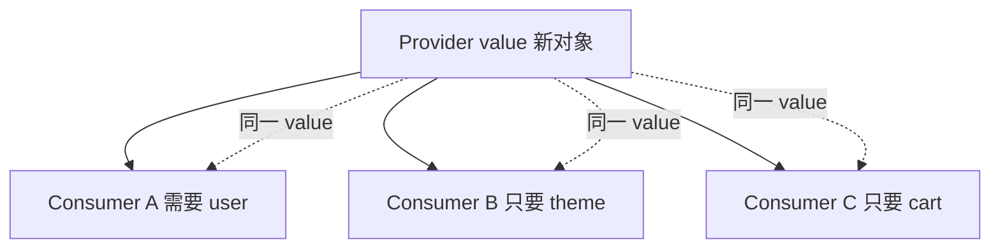

# Context 进阶与性能

> Context 适合**低频变更的全局配置**。用错会导致「改一行 theme，整页 re-render」。本篇讲拆分、memo、selector 替代思路。

---

## 一、性能问题从哪来？

```tsx
const AppContext = createContext({
  user,
  theme,
  cart,
  setCart,
});

// theme 变 → 所有 useContext(AppContext) 的组件都 render
```



---

## 二、拆分 Context

```tsx
<UserContext.Provider value={user}>
  <ThemeContext.Provider value={theme}>
    <CartDispatchContext.Provider value={dispatch}>
      <CartStateContext.Provider value={cartItems}>
        {children}
      </CartStateContext.Provider>
    </CartDispatchContext.Provider>
  </ThemeContext.Provider>
</UserContext.Provider>
```

| 策略 | 效果 |
|------|------|
| theme / user 分开 | 互不影响 |
| state / dispatch 分开 | 只 dispatch 的组件不随 items 变 |

---

## 三、稳定 value

```tsx
// ❌ 每次 render 新对象
<ThemeContext.Provider value={{ theme, setTheme }}>

// ✅ memo
const value = useMemo(() => ({ theme, setTheme }), [theme]);
<ThemeContext.Provider value={value}>
```

`setTheme` 若来自 `useState` 通常稳定；`theme` 变才新 value。

---

## 四、Context 不能 selector

原生 `useContext` **全量订阅** value。需要「只订阅 cart.count」时：

| 方案 | 说明 |
|------|------|
| **Zustand** | `useStore(s => s.count)` |
| **use-context-selector** | 第三方 selector Context |
| 拆多个 Context | 手动 |

```tsx
const count = useStore(state => state.cart.itemCount);
```

---

## 五、何时仍用 Context

| ✅ | ❌ |
|----|-----|
| ThemeProvider | 高频购物车数量 |
| i18n locale | 服务端列表 |
| Router、QueryClient | 复杂表单 |

---

## 六、与 Zustand 对比

| | Context | Zustand |
|---|---------|---------|
| 内置 | ✅ | 依赖 |
| 细粒度订阅 | ❌ | ✅ |
| 样板 | Provider 嵌套 | 少 |
| DevTools | 无 | 有 |

---

## 七、小结

| 优化 | 手段 |
|------|------|
| 少 re-render | 拆分 + useMemo value |
| 细订阅 | Zustand / selector 库 |
| 数据请求 | 不用 Context 缓存 |

**上一篇**：[01-状态分类与放置原则](./01-状态分类与放置原则.md)  
**下一篇**：[03-Zustand与轻量全局状态](./03-Zustand与轻量全局状态.md)
