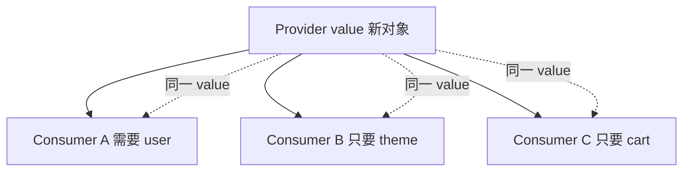

# Context 进阶与性能

Context 适合主题、locale 等**低频全局配置**；把高频变更的大对象塞进单一 Context，会导致所有 consumer 跟着 re-render；问题来源、拆分与 memo 优化，以及何时改用 Zustand selector。

---

## 性能问题从哪来？

```tsx
const AppContext = createContext({
  user,
  theme,
  cart,
  setCart,
});

// theme 变 → 所有 useContext(AppContext) 的组件都 render
```



---

## 拆分 Context

```tsx
<UserContext.Provider value={user}>
  <ThemeContext.Provider value={theme}>
    <CartDispatchContext.Provider value={dispatch}>
      <CartStateContext.Provider value={cartItems}>
        {children}
      </CartStateContext.Provider>
    </CartDispatchContext.Provider>
  </ThemeContext.Provider>
</UserContext.Provider>
```

| 策略 | 效果 |
|------|------|
| theme / user 分开 | 互不影响 |
| state / dispatch 分开 | 只 dispatch 的组件不随 items 变 |

---

## 稳定 value

```tsx
// ❌ 每次 render 新对象
<ThemeContext.Provider value={{ theme, setTheme }}>

// ✅ memo
const value = useMemo(() => ({ theme, setTheme }), [theme]);
<ThemeContext.Provider value={value}>
```

`setTheme` 若来自 `useState` 通常稳定；`theme` 变才新 value。

---

## Context 不能 selector

原生 `useContext` **全量订阅** value。需要「只订阅 cart.count」时：

| 方案 | 说明 |
|------|------|
| **Zustand** | `useStore(s => s.count)` |
| **use-context-selector** | 第三方 selector Context |
| 拆多个 Context | 手动 |

```tsx
const count = useStore(state => state.cart.itemCount);
```

---

## 何时仍用 Context

| ✅ | ❌ |
|----|-----|
| ThemeProvider | 高频购物车数量 |
| i18n locale | 服务端列表 |
| Router、QueryClient | 复杂表单 |

---

## 与 Zustand 对比

| | Context | Zustand |
|---|---------|---------|
| 内置 | ✅ | 依赖 |
| 细粒度订阅 | ❌ | ✅ |
| 样板 | Provider 嵌套 | 少 |
| DevTools | 无 | 有 |

---

## 小结

Context **value 变** → 所有 `useContext` 消费者 re-render，无内置 selector。优化：**拆分 Context**、**useMemo** 稳定 value、state/dispatch 分离。

高频变更或细订阅需求改用 **Zustand** 等 selector 库。Context 仍适合主题、locale 等**低频全局配置**；API 数据用 Query，勿塞进 Context。

常见错因：Provider value 是否每次 render 新建对象？能否拆分 Context 或改用 Zustand selector？
