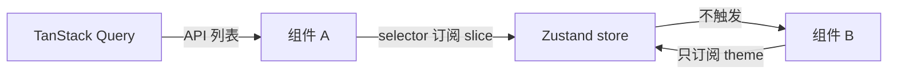

# Zustand 与轻量全局状态

侧边栏开关、主题、auth token 等**客户端全局 state**，Zustand 用 selector 细订阅、无 Provider 嵌套，比 Context 更适合高频变更场景。API 列表/详情仍应交给 TanStack Query，勿 duplicate cache 进 store。

---

## 最小示例

```bash
pnpm add zustand
```



```tsx
import { create } from 'zustand';

interface UIStore {
  sidebarOpen: boolean;
  toggleSidebar: () => void;
}

const useUIStore = create<UIStore>((set) => ({
  sidebarOpen: true,
  toggleSidebar: () => set(s => ({ sidebarOpen: !s.sidebarOpen })),
}));

function Sidebar() {
  const open = useUIStore(s => s.sidebarOpen);
  return open ? <aside>...</aside> : null;
}

function Toggle() {
  const toggle = useUIStore(s => s.toggleSidebar);
  return <button type="button" onClick={toggle}>切换</button>;
}
```

| 特点 | 说明 |
|------|------|
| 无 Provider | 任意处 import hook |
| selector | 只订阅用到的字段 |
| 外 mutative 可选 | `immer` 中间件 |

---

## 与 useState 对比

| | useState | Zustand |
|---|----------|---------|
| 范围 | 单组件 / 需 props 传递 | 全局 |
| 订阅 | — | selector |
| 持久化 | 手写 | `persist` 中间件 |

---

## immer 中间件

```tsx
import { create } from 'zustand';
import { immer } from 'zustand/middleware/immer';

const useCartStore = create(
  immer<{
    items: { id: string; qty: number }[];
    add: (id: string) => void;
  }>((set) => ({
    items: [],
    add: (id) =>
      set(state => {
        const item = state.items.find(i => i.id === id);
        if (item) item.qty += 1;
        else state.items.push({ id, qty: 1 });
      }),
  })),
);
```

---

## persist 持久化

```tsx
import { persist } from 'zustand/middleware';

const useSettingsStore = create(
  persist<{
    theme: 'light' | 'dark';
    setTheme: (t: 'light' | 'dark') => void;
  }>(
    (set) => ({
      theme: 'light',
      setTheme: theme => set({ theme }),
    }),
    { name: 'app-settings' },
  ),
);
```

---

## 分 store 还是单 store

| 多 store | 单 store slice |
|----------|----------------|
| `useUIStore` `useAuthStore` | 一个 store 多 domain |
| 边界清晰 | 易膨胀 |

中后台常见：**auth / ui / settings** 分开。

---

## 与 TanStack Query 分工

```tsx
// 用户资料：服务端
const { data: user } = useQuery(...);

// 仅 UI：客户端
const theme = useSettingsStore(s => s.theme);
```

不要把 API 列表塞 Zustand 除非离线缓存等特殊需求。

---

## 测试

```tsx
const state = useCartStore.getState();
useCartStore.setState({ items: [] });
```

可在测试里直接 `setState` 重置。

---

## 小结

**Zustand**：无 Provider、**selector 细订阅**，适合侧边栏、主题、auth token 等客户端全局 state。**immer / persist** 中间件简化更新与持久化。

**API 列表/详情**仍用 TanStack Query，勿 duplicate cache 进 Zustand。大项目可按 domain **拆多个 store**；store 逻辑可单测。

常见错因：是否把服务端数据误放进 Zustand？selector 是否订阅了过多字段导致多余 render？
