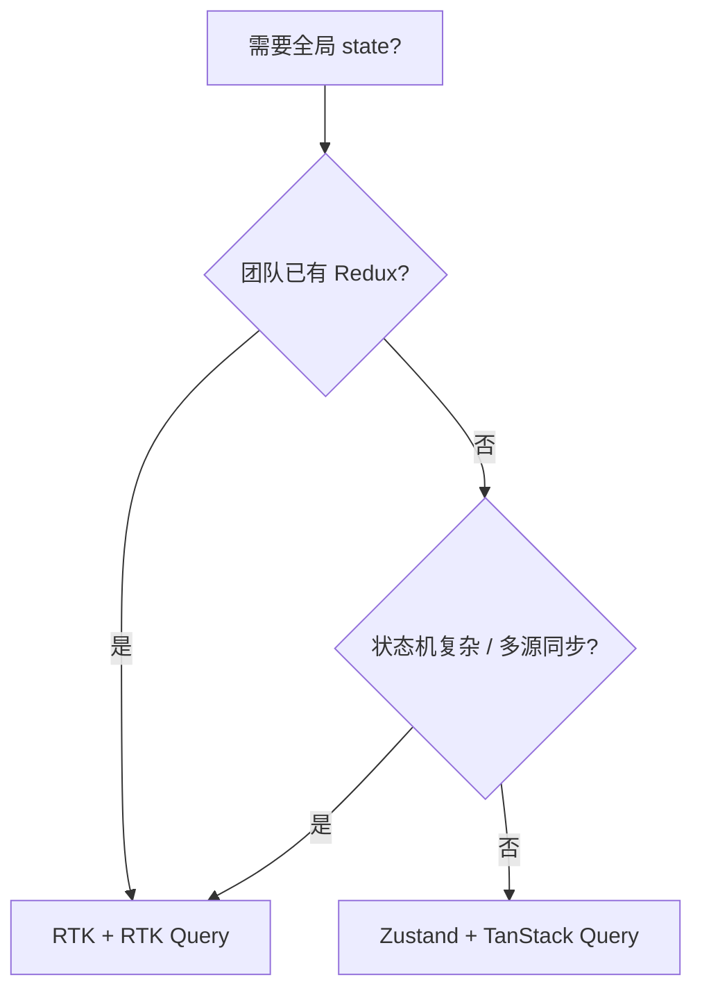

# Redux Toolkit 与 RTK Query

Redux 适合**已有 Redux 投资、强规范、复杂 reducer 流程**的团队；新项目若无 Redux 包袱，多数选 **TanStack Query + Zustand** 更轻； RTK createSlice、RTK Query，以及与 TanStack Query 的分工。

---

## 何时选 Redux？



| 选 RTK | 选 Zustand + Query |
|--------|---------------------|
| 大型协作、规范强 | 中小项目 |
| 复杂 reducer 流程 | 简单全局 UI |
| 已有 middleware 生态 | 更少样板 |

---

## RTK Store 基础

```tsx
import { configureStore, createSlice } from '@reduxjs/toolkit';

const counterSlice = createSlice({
  name: 'counter',
  initialState: { value: 0 },
  reducers: {
    increment: state => { state.value += 1; },
    addBy: (state, action: { payload: number }) => {
      state.value += action.payload;
    },
  },
});

export const { increment, addBy } = counterSlice.actions;

const store = configureStore({
  reducer: {
    counter: counterSlice.reducer,
  },
});

type RootState = ReturnType<typeof store.getState>;
type AppDispatch = typeof store.dispatch;
```

| createSlice | 自动生成 action + immer reducer |
|-------------|----------------------------------|

---

## 在 React 中使用

```tsx
import { Provider, useSelector, useDispatch } from 'react-redux';

function Counter() {
  const count = useSelector((s: RootState) => s.counter.value);
  const dispatch = useDispatch();
  return (
    <button type="button" onClick={() => dispatch(increment())}>
      {count}
    </button>
  );
}

// main
<Provider store={store}>
  <App />
</Provider>
```

推荐 typed hooks：

```tsx
const useAppDispatch = () => useDispatch<AppDispatch>();
const useAppSelector: TypedUseSelectorHook<RootState> = useSelector;
```

---

## RTK Query

```tsx
import { createApi, fetchBaseQuery } from '@reduxjs/toolkit/query/react';

const api = createApi({
  reducerPath: 'api',
  baseQuery: fetchBaseQuery({ baseUrl: '/api' }),
  tagTypes: ['User'],
  endpoints: builder => ({
    getUsers: builder.query<User[], void>({
      query: () => '/users',
      providesTags: ['User'],
    }),
    updateUser: builder.mutation<User, Partial<User> & { id: string }>({
      query: ({ id, ...patch }) => ({
        url: `/users/${id}`,
        method: 'PATCH',
        body: patch,
      }),
      invalidatesTags: ['User'],
    }),
  }),
});

export const { useGetUsersQuery, useUpdateUserMutation } = api;

const store = configureStore({
  reducer: {
    [api.reducerPath]: api.reducer,
  },
  middleware: getDefault => getDefault().concat(api.middleware),
});
```

| 概念 | TanStack Query 类似 |
|------|---------------------|
| `providesTags` | queryKey 关联 |
| `invalidatesTags` | invalidateQueries |

---

## RTK Query vs TanStack Query

| | RTK Query | TanStack Query |
|---|-----------|----------------|
| 绑定 Redux | 独立 |
| DevTools 一体 | 独立 DevTools |
| 学习曲线 | Redux 前置 | 较低 |
| 社区示例 | Redux 栈 | 更广 |

**新项目无 Redux 包袱**：多数选 TanStack Query + Zustand。

---

## 中间件与异步

```tsx
// 旧：redux-thunk
// RTK：createAsyncThunk
export const fetchUser = createAsyncThunk('users/fetch', async (id: string) => {
  return fetchUserApi(id);
});
```

复杂异步仍推荐 Query 层而非全塞 thunk。

---

## 小结

**RTK createSlice**：客户端同步 state（UI、权限缓存等）；**RTK Query**：可选的服务端 cache 层。新项目服务端数据更常选 **TanStack Query**；Redux 适合已有投资、强规范、DevTools 时间旅行。

**Provider** 注入 store；组件用 **useSelector** 细订阅。勿 Redux 与 Query 双缓存同一 API 数据。

常见错因：是否已有 Redux 才值得上 RTK Query？同一 API 是否被 Redux 与 Query 各缓存一份？
