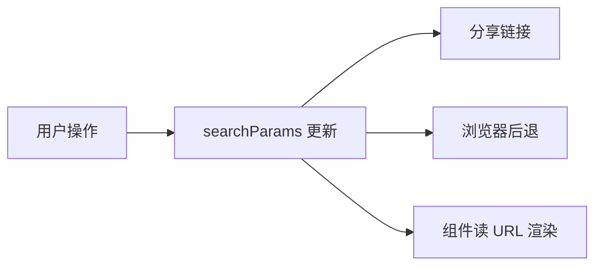

# URL 状态与路由参数

> **URL 即 state**：可分享、可收藏、可后退。筛选、分页、Tab 等适合放 **searchParams**，而非仅存在内存 store 里。

---

## 一、URL 存什么？

| 适合 URL | 不适合 URL |
|----------|------------|
| 页码 `?page=2` | 敏感 token |
| 筛选 `?status=open` | 巨大 JSON |
| 搜索词 `?q=react` | 临时 hover 状态 |
| Tab `?tab=settings` | 表单未提交草稿 |



---

## 二、React Router v6

### 2.1 路径参数

```tsx
// 路由 /users/:userId
function UserPage() {
  const { userId } = useParams<{ userId: string }>();
  ...
}
```

### 2.2 查询参数

```tsx
import { useSearchParams } from 'react-router-dom';

function ProductList() {
  const [searchParams, setSearchParams] = useSearchParams();
  const page = Number(searchParams.get('page') ?? '1');
  const q = searchParams.get('q') ?? '';

  function setPage(p: number) {
    setSearchParams(prev => {
      prev.set('page', String(p));
      return prev;
    });
  }

  const { data } = useQuery({
    queryKey: ['products', page, q],
    queryFn: () => fetchProducts({ page, q }),
  });
  ...
}
```

| API | 作用 |
|-----|------|
| `useSearchParams` | 读写 `?key=value` |
| `useParams` | 路径动态段 |

---

## 三、与 TanStack Query 联动

**URL 是 source of truth**，Query `queryKey` 包含 URL 参数：

```tsx
const [params] = useSearchParams();
const filters = {
  status: params.get('status') ?? 'all',
  page: Number(params.get('page') ?? 1),
};

useQuery({
  queryKey: ['orders', filters],
  queryFn: () => fetchOrders(filters),
});
```

改 URL → key 变 → 自动 refetch。

---

## 四、nuqs（类型安全 URL state）

```bash
pnpm add nuqs
```

```tsx
import { useQueryState } from 'nuqs';

function List() {
  const [page, setPage] = useQueryState('page', {
    defaultValue: 1,
    parse: Number,
  });
  ...
}
```

| 好处 | 说明 |
|------|------|
| 解析/序列化 | 类型安全 |
| 少样板 | 比手写 searchParams |

---

## 五、同步 Tab 到 URL

```tsx
const [tab, setTab] = useQueryState('tab', { defaultValue: 'overview' });

<Tabs value={tab} onValueChange={setTab}>
  ...
</Tabs>
```

刷新页面 Tab 不丢失。

---

## 六、注意点

| 问题 | 处理 |
|------|------|
| 字符串都是 string | `Number()` / zod parse |
| 默认值 | `??` 或 nuqs default |
| 过长 URL | 压缩或只存 id |

---

## 七、小结

| 场景 | 方案 |
|------|------|
| 分页筛选 | searchParams + Query |
| 动态路由 id | useParams |
| DX | nuqs |

**上一篇**：[05-Jotai-Recoil等原子化状态](./05-Jotai-Recoil等原子化状态.md)  
**下一模块**：[09-数据获取与缓存](../09-数据获取与缓存/01-服务端状态本质.md)
