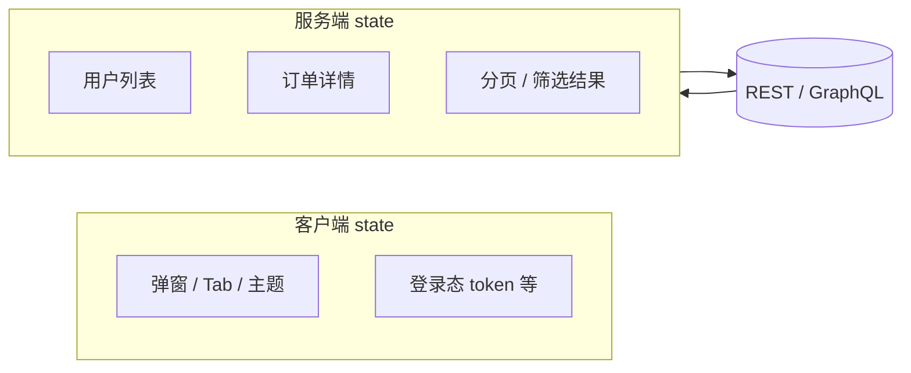
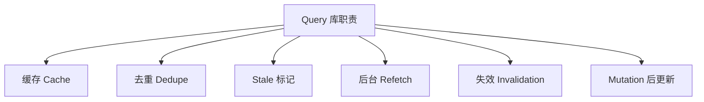

# 服务端状态本质

来自 API 的数据和弹窗开关、主题色不是同一类 state：**服务端 state 是远程数据的本地 cache + 同步策略**，真相在服务器，前端只是副本；与客户端 state 的差异、手写 fetch 的痛点，以及为何列表/详情应交给 TanStack Query 而非 Redux/Zustand。

---

## 客户端 state vs 服务端 state



| 维度 | 客户端 state | 服务端 state |
|------|--------------|--------------|
| **来源** | 用户交互、本地配置 | 远程 API |
| **真相在哪** | 浏览器内存 | **服务器**（前端只是副本） |
| **是否共享** | 常需全局 store | 多组件可读同一份 cache |
| **过期** | 一般不过期 | 会 stale，需 refetch |
| **典型工具** | useState、Zustand | **TanStack Query**、SWR |

---

## 手写 fetch 的痛点

```tsx
function UserList() {
  const [users, setUsers] = useState<User[]>([]);
  const [loading, setLoading] = useState(true);
  const [error, setError] = useState<Error | null>(null);

  useEffect(() => {
    let cancelled = false;
    setLoading(true);
    fetchUsers()
      .then(data => { if (!cancelled) setUsers(data); })
      .catch(e => { if (!cancelled) setError(e); })
      .finally(() => { if (!cancelled) setLoading(false); });
    return () => { cancelled = true; };
  }, []);

  if (loading) return <Spinner />;
  if (error) return <ErrorView error={error} />;
  return <ul>...</ul>;
}
```

| 问题 | 说明 |
|------|------|
| **重复请求** | 两个组件各写一遍 effect → 打两次 API |
| **无缓存** | 切路由回来又要 loading |
| **竞态** | 慢请求后返回覆盖新数据（需 cancelled 标志） |
| **样板代码** | loading / error / empty 每页重复 |
| **更新同步** | 改完用户资料，列表页还是旧数据 |

---

## 服务端 state 要解决什么？



| 能力 | 用户感知 |
|------|----------|
| **缓存** | 二次进入页面「秒开」旧数据 |
| **去重** | 10 个组件同时要 users → 只请求 1 次 |
| **staleTime** | 5 分钟内认为数据新鲜，不重复打 |
| **refetchOnFocus** | 切回标签页自动更新 |
| **invalidate** | 提交表单后列表自动刷新 |

---

## 不要放进 Redux / Zustand 的数据

| ❌ 常见误用 | ✅ 推荐 |
|-------------|---------|
| `dispatch(fetchUsers())` 进 Redux | `useQuery(['users'], fetchUsers)` |
| Zustand 存整个商品列表 | Query cache |
| useState 复制 Query 的 `data` | 直接用 `data` |

**例外**：离线优先、复杂本地同步（如 Notion 类）可能自建 sync 层；一般 B 端后台不必。

---

## 与 URL state 的关系

URL 描述「要查什么」，Query 负责「查回来并缓存」：

```tsx
const [params] = useSearchParams();
const page = Number(params.get('page') ?? 1);

const { data } = useQuery({
  queryKey: ['orders', { page }],
  queryFn: () => fetchOrders({ page }),
});
```

---

## 选型一览

| 库 | 特点 |
|----|------|
| **TanStack Query** | 功能最全，社区最大，推荐默认 |
| **SWR** | API 简洁，Vercel 生态 |
| **RTK Query** | 已用 Redux 时 |
| **Apollo Client** | GraphQL 专用 |

---

## 心智模型

**服务端 state = 远程数据的本地 cache + 同步策略**，不是「又一个 global store」。

| 问自己 | 答案指向 |
|--------|----------|
| 数据来自 API？ | Query |
| 只本组件、不共享？ | 仍可用 Query（去重）或简单 fetch |
| 改 API 后要更新多处 UI？ | `invalidateQueries` / `setQueryData` |

---

## 小结

**服务端 state** 与主题、弹窗等**客户端 state 分开管**；列表/详情用 **TanStack Query**（默认）或 SWR。手写 `useEffect + useState` 易竞态、无 dedupe、难缓存，中后台应换 Query。

URL 存可分享筛选；Query 的 **queryKey** 含 URL 参数。勿把 API 列表塞进 Redux/Zustand 当第二份 cache。

常见错因：是否两个组件各写 effect 打重复请求？mutation 后列表为何还是旧数据，是否忘了 invalidate？
