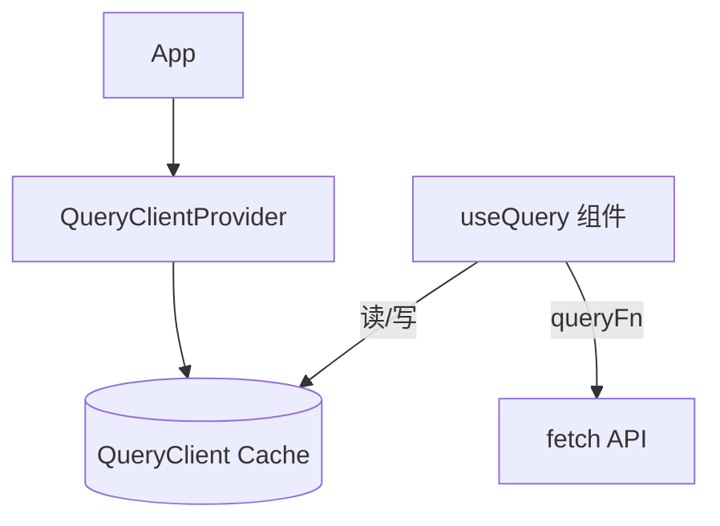
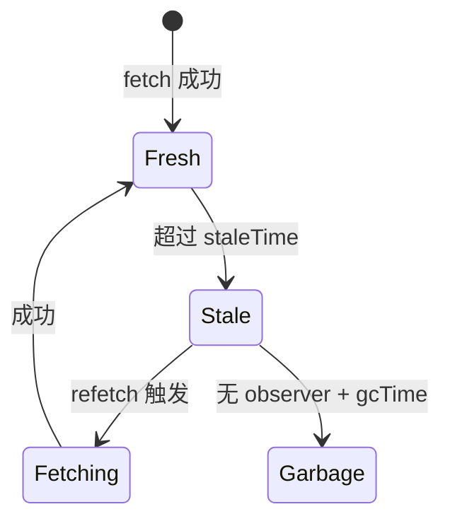

# TanStack Query 核心概念

> **TanStack Query（原 React Query）** 用 `queryKey` 标识缓存、`queryFn` 拉数据，统一管理 loading / error / 后台刷新。本篇讲安装、核心 API 与生命周期。

---

## 一、最小 setup

```bash
pnpm add @tanstack/react-query
```

```tsx
import { QueryClient, QueryClientProvider } from '@tanstack/react-query';

const queryClient = new QueryClient({
  defaultOptions: {
    queries: {
      staleTime: 60 * 1000, // 1 分钟内视为新鲜
      retry: 1,
    },
  },
});

function App() {
  return (
    <QueryClientProvider client={queryClient}>
      <UserList />
    </QueryClientProvider>
  );
}
```



---

## 二、useQuery

```tsx
import { useQuery } from '@tanstack/react-query';

function UserList() {
  const {
    data,
    error,
    isPending,      // 尚无数据且正在请求（v5）
    isFetching,     // 任意进行中的请求（含后台 refetch）
    isError,
    isSuccess,
    refetch,
  } = useQuery({
    queryKey: ['users'],
    queryFn: fetchUsers,
  });

  if (isPending) return <Spinner />;
  if (isError) return <p>{error.message}</p>;
  return (
    <ul>
      {data.map(u => <li key={u.id}>{u.name}</li>)}
    </ul>
  );
}
```

| 字段 | 含义 |
|------|------|
| `isPending` | 第一次加载、无 cache |
| `isFetching` | 正在请求（含 stale 后台刷新） |
| `data` | 成功后的数据（可能来自 cache） |
| `error` | 失败 Error 对象 |

---

## 三、queryKey：缓存的身份证

```tsx
// 全站用户列表
queryKey: ['users']

// 单个用户
queryKey: ['users', userId]

// 带筛选
queryKey: ['users', { role: 'admin', page: 2 }]
```

| 规则 | 说明 |
|------|------|
| **数组** | 从左到右越来越具体 |
| **可序列化** | 用 plain object，别放函数 |
| **变即新 cache** | `page` 变 → 新 entry |

```tsx
useQuery({
  queryKey: ['users', filters],
  queryFn: () => fetchUsers(filters),
});
```

---

## 四、staleTime vs gcTime

| 选项 | 默认（v5） | 含义 |
|------|------------|------|
| `staleTime` | `0` | 多久内算「新鲜」，不自动 refetch |
| `gcTime` | `5min` | 无人用后多久从内存清掉 |

```tsx
useQuery({
  queryKey: ['users'],
  queryFn: fetchUsers,
  staleTime: 5 * 60 * 1000,  // 5 分钟内切页回来不 refetch
  gcTime: 30 * 60 * 1000,
});
```



---

## 五、enabled 条件查询

```tsx
const { userId } = useParams();

const { data: user } = useQuery({
  queryKey: ['users', userId],
  queryFn: () => fetchUser(userId!),
  enabled: !!userId,  // 无 id 不请求
});
```

依赖未就绪时不要发无效请求。

---

## 六、useMutation 概览

```tsx
const mutation = useMutation({
  mutationFn: updateUser,
  onSuccess: () => {
    queryClient.invalidateQueries({ queryKey: ['users'] });
  },
});

mutation.mutate({ id: '1', name: '新名字' });
```

| | Query | Mutation |
|---|-------|----------|
| 用途 | 读 | 写 |
| 缓存 | 有 queryKey | 无（或手动更新 cache） |
| 触发 | 自动 / refetch | `mutate()` |

详见 [03-Query与Mutation实战模式](./03-Query与Mutation实战模式.md)。

---

## 七、DevTools

```tsx
import { ReactQueryDevtools } from '@tanstack/react-query-devtools';

<ReactQueryDevtools initialIsOpen={false} />
```

可查看每条 query 的 state、stale、observer 数量。

---

## 八、与 Suspense（可选）

```tsx
useQuery({
  queryKey: ['users'],
  queryFn: fetchUsers,
  suspense: true,
});
```

需 Error Boundary + Suspense 边界；并发模式见 [12-并发与Suspense](../12-并发与Suspense/)。

---

## 九、小结

| 概念 | 记住 |
|------|------|
| QueryClient | 全局 cache 容器 |
| queryKey | 缓存键 |
| queryFn | 实际请求 |
| staleTime | 控制「多快算过期」 |

**上一篇**：[01-服务端状态本质](./01-服务端状态本质.md)  
**下一篇**：[03-Query与Mutation实战模式](./03-Query与Mutation实战模式.md)
