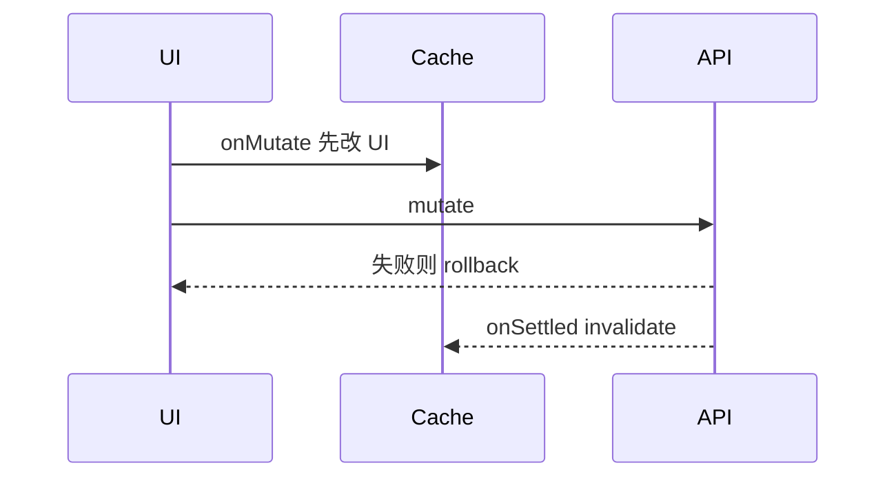

# Query 与 Mutation 实战模式

分页、无限滚动、依赖查询、prefetch、乐观更新，TanStack Query 的实战模式都围绕 **queryKey 设计** 和 **mutation 后如何更新 cache**；常见场景与反模式。

---

## 分页与无限滚动

### 页码分页

```tsx
import { keepPreviousData } from '@tanstack/react-query';

function OrderList() {
  const [page, setPage] = useState(1);

  const { data, isPending } = useQuery({
    queryKey: ['orders', page],
    queryFn: () => fetchOrders(page),
    placeholderData: keepPreviousData,
  });

  return (
    <>
      {data?.items.map(o => <OrderRow key={o.id} order={o} />)}
      <button disabled={page <= 1} onClick={() => setPage(p => p - 1)}>上一页</button>
      <button disabled={!data?.hasNext} onClick={() => setPage(p => p + 1)}>下一页</button>
    </>
  );
}
```

| `keepPreviousData` | 切页时先显示上一页数据，减少闪烁 |

### useInfiniteQuery

```tsx
const {
  data,
  fetchNextPage,
  hasNextPage,
  isFetchingNextPage,
} = useInfiniteQuery({
  queryKey: ['posts'],
  queryFn: ({ pageParam }) => fetchPosts(pageParam),
  initialPageParam: 0,
  getNextPageParam: (lastPage) => lastPage.nextCursor,
});

const posts = data?.pages.flatMap(p => p.items) ?? [];
```


---

## 依赖查询（串行）

```tsx
const { data: user } = useQuery({
  queryKey: ['user', userId],
  queryFn: () => fetchUser(userId),
});

const { data: projects } = useQuery({
  queryKey: ['projects', user?.teamId],
  queryFn: () => fetchProjects(user!.teamId),
  enabled: !!user?.teamId,
});
```

B 依赖 A 的结果 → B 的 `enabled` 等 A 就绪。

---

## 并行查询

```tsx
const results = useQueries({
  queries: userIds.map(id => ({
    queryKey: ['users', id],
    queryFn: () => fetchUser(id),
  })),
});
```

或组件层多个 `useQuery`（同 key 会去重）。

---

## 预取 prefetchQuery

```tsx
function UserRow({ id, name }: { id: string; name: string }) {
  const queryClient = useQueryClient();

  return (
    <Link
      to={`/users/${id}`}
      onMouseEnter={() =>
        queryClient.prefetchQuery({
          queryKey: ['users', id],
          queryFn: () => fetchUser(id),
        })
      }
    >
      {name}
    </Link>
  );
}
```

悬停时预拉详情，点击进入页几乎无 loading。

---

## Mutation 后更新 cache

### invalidate（简单可靠）

```tsx
const queryClient = useQueryClient();

useMutation({
  mutationFn: createTodo,
  onSuccess: () => {
    queryClient.invalidateQueries({ queryKey: ['todos'] });
  },
});
```

标记 stale → 有 observer 的 query 自动 refetch。

### setQueryData（即时 UI）

```tsx
useMutation({
  mutationFn: updateTodo,
  onSuccess: (updated) => {
    queryClient.setQueryData(['todos'], (old: Todo[] | undefined) =>
      old?.map(t => (t.id === updated.id ? updated : t)),
    );
  },
});
```

| 方式 | 何时用 |
|------|--------|
| invalidate | 列表复杂、服务端算字段 |
| setQueryData | 已知如何合并、要快 |

### 乐观更新

```tsx
useMutation({
  mutationFn: toggleTodo,
  onMutate: async (id) => {
    await queryClient.cancelQueries({ queryKey: ['todos'] });
    const previous = queryClient.getQueryData(['todos']);
    queryClient.setQueryData(['todos'], (old: Todo[]) =>
      old.map(t => (t.id === id ? { ...t, done: !t.done } : t)),
    );
    return { previous };
  },
  onError: (_err, _id, ctx) => {
    queryClient.setQueryData(['todos'], ctx?.previous);
  },
  onSettled: () => {
    queryClient.invalidateQueries({ queryKey: ['todos'] });
  },
});
```



---

## select 派生数据

```tsx
const { data: names } = useQuery({
  queryKey: ['users'],
  queryFn: fetchUsers,
  select: users => users.map(u => u.name),
});
```

`select` 结果变才触发组件 re-render，减少大列表引用不变时的渲染。

---

## Query 与表单

| 模式 | 说明 |
|------|------|
| 详情页 | `useQuery` 填初始值 → RHF `values` / `reset` |
| 提交 | `useMutation` + toast |
| 编辑后 | invalidate 详情 + 列表 key |

```tsx
const { data } = useQuery({ queryKey: ['user', id], queryFn: () => fetchUser(id) });
const form = useForm({ values: data }); // RHF v7+ values 同步
```

---

## 反模式

| ❌ | ✅ |
|----|-----|
| mutation 成功手动 `setUsers` 在 useState | invalidate / setQueryData |
| queryKey 不含筛选参数 | key 含 filters |
| 每个列表项里 useQuery 同一 key 不同 fn | 统一 key + 正确 fn |

---

## 小结

**分页**：`keepPreviousData` 减闪烁；**无限滚动**：`useInfiniteQuery` + `fetchNextPage`。**依赖查询**：下游 `enabled: !!upstreamId`；并行用 **useQueries**。

**prefetchQuery** 悬停预取；mutation 后 **invalidateQueries** 或 **setQueryData**。**乐观更新**：onMutate 改 cache，失败 rollback。

常见错因：queryKey 是否含 filters？mutation 后 UI 未更新，invalidate 还是 setQueryData 更合适？
