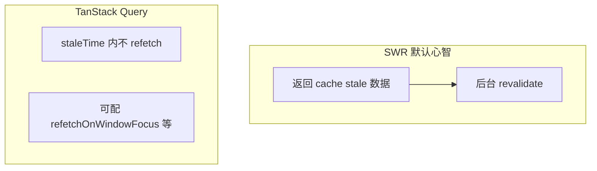

# SWR 与 Alternatives 对比

TanStack Query 与 SWR 都是服务端 cache 方案，API 与默认策略略有不同。**团队应统一一种**，勿在同一页面混用两套 cache 管同一数据。

---

## SWR 最小示例

```bash
pnpm add swr
```

```tsx
import useSWR from 'swr';

const fetcher = (url: string) => fetch(url).then(r => r.json());

function Profile() {
  const { data, error, isLoading, mutate } = useSWR('/api/user', fetcher);

  if (isLoading) return <Spinner />;
  if (error) return <Error />;
  return <div>{data.name}</div>;
}
```

| 概念 | 对应 TanStack Query |
|------|---------------------|
| key 字符串 `/api/user` | `queryKey` |
| `fetcher` | `queryFn` |
| `mutate()` | `invalidate` / 手动改 cache |

---

## 缓存策略对比



| | SWR | TanStack Query |
|---|-----|----------------|
| **默认 stale** | 立即 stale，常后台刷 | `staleTime: 0`，行为可配 |
| **全局配置** | `SWRConfig` | `QueryClient` defaultOptions |
| **DevTools** | 较弱 | 官方 DevTools 完善 |
| **Mutation 模式** | `mutate` 为主 | `useMutation` + 生命周期钩子 |
| **无限滚动** | `useSWRInfinite` | `useInfiniteQuery` |
| **并行** | 多个 `useSWR` | `useQueries` |
| **包体积** | 较小 | 稍大 |
| **框架** | React 为主（有 Vue 版） | React / Vue / Solid 等 |

---

## SWR 常用 API

```tsx
// 条件请求
useSWR(userId ? `/api/users/${userId}` : null, fetcher);

// 全局 fetcher
<SWRConfig value={{ fetcher: (url) => fetch(url).then(r => r.json()) }}>
  <App />
</SWRConfig>

// 乐观更新
mutate('/api/todos', optimisticData, { revalidate: false });
```

---

## 何时选 SWR？

| 选 SWR | 选 TanStack Query |
|--------|-------------------|
| Next.js / Vercel 栈习惯 | 需要细粒度 cache 控制 |
| 项目小、读多写少 | 复杂 mutation、乐观更新 |
| 喜欢极简 API | 需要强大 DevTools、文档生态 |

**二者择一**，不要同一页面混用两套 cache（除非边界清晰）。

---

## 其他方案

| 方案 | 场景 |
|------|------|
| **RTK Query** | 已深度使用 Redux |
| **Apollo / urql** | GraphQL |
| **tRPC + Query** | 全栈 TS，端到端类型 |
| **Relay** | 大型 GraphQL、Facebook 栈 |

---

## 迁移对照表

| TanStack Query | SWR |
|----------------|-----|
| `useQuery({ queryKey, queryFn })` | `useSWR(key, fetcher)` |
| `queryClient.invalidateQueries` | `mutate(key)` |
| `useMutation` | 手写 fetch + `mutate` |
| `useInfiniteQuery` | `useSWRInfinite` |
| `enabled: false` | `key: null` |

---

## 与 React 19 / RSC

| 环境 | 说明 |
|------|------|
| **CSR SPA** | Query / SWR 主战场 |
| **RSC** | 首屏可在服务端 fetch，客户端 hydration 后仍可用 Query 做交互 refetch |
| **Server Actions** | 写操作可走 Action + `revalidatePath`，与 Query invalidate 配合 |

---

## 小结

**TanStack Query** 功能与 DevTools 更全，**中后台默认推荐**。**SWR** API 更短，适合轻量或 Next 生态已有 SWR 的项目。

**原则**：一种服务端 cache 策略打到底，勿 Query + SWR 混用同一数据。RTK Query 适合已深度使用 Redux 的团队。

常见错因：同一数据是否被 Query 与 SWR 各缓存一份？迁移时 API 如何一一对照？
