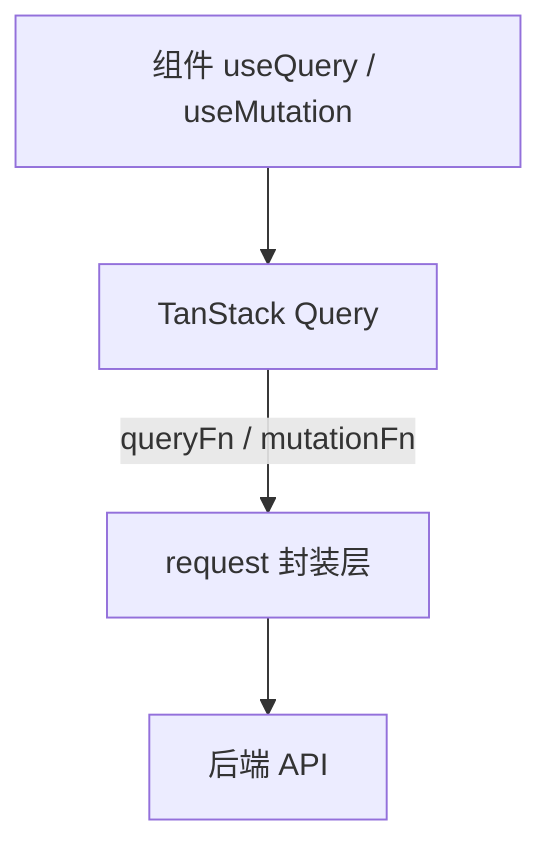

# 请求封装、错误与重试策略

> Query 库管 cache，**底层的 fetch / axios 封装**仍要统一：baseURL、鉴权头、错误格式、401 跳转、超时与重试。本篇把「HTTP 层」和「Query 层」分工讲清楚。

---

## 一、分层架构



| 层 | 职责 |
|----|------|
| **组件** | 展示 loading / error |
| **Query** | cache、重试策略（可配）、去重 |
| **request** | URL、headers、body 序列化、业务错误码 |

---

## 二、统一 request 示例

```tsx
// lib/request.ts
const BASE = import.meta.env.VITE_API_BASE;

export class ApiError extends Error {
  constructor(
    message: string,
    public status: number,
    public code?: string,
  ) {
    super(message);
    this.name = 'ApiError';
  }
}

export async function request<T>(
  path: string,
  init?: RequestInit,
): Promise<T> {
  const res = await fetch(`${BASE}${path}`, {
    ...init,
    headers: {
      'Content-Type': 'application/json',
      Authorization: `Bearer ${getToken()}`,
      ...init?.headers,
    },
  });

  if (!res.ok) {
    const body = await res.json().catch(() => ({}));
    throw new ApiError(body.message ?? res.statusText, res.status, body.code);
  }

  return res.json() as Promise<T>;
}

export const api = {
  get: <T,>(path: string) => request<T>(path),
  post: <T,>(path: string, body: unknown) =>
    request<T>(path, { method: 'POST', body: JSON.stringify(body) }),
};
```

```tsx
// queries/users.ts
export function fetchUsers() {
  return api.get<User[]>('/users');
}
```

---

## 三、axios 版本（可选）

```tsx
import axios from 'axios';

export const http = axios.create({
  baseURL: '/api',
  timeout: 15_000,
});

http.interceptors.request.use(config => {
  const token = getToken();
  if (token) config.headers.Authorization = `Bearer ${token}`;
  return config;
});

http.interceptors.response.use(
  res => res.data,
  err => {
    if (err.response?.status === 401) logout();
    return Promise.reject(err);
  },
);
```

| fetch | axios |
|-------|-------|
| 原生、轻 | 拦截器、取消现成 |
| 需自己包 JSON | 广泛使用中后台 |

---

## 四、错误分类与 UI

| 类型 | 处理 |
|------|------|
| **网络错误** | 提示「请检查网络」、Query retry |
| **4xx 业务** | 展示 message，一般不重试 |
| **401** | 清 token、跳登录 |
| **403** | 无权限页 |
| **5xx** | 重试 + 告警 |

```tsx
function getErrorMessage(error: unknown): string {
  if (error instanceof ApiError) return error.message;
  if (error instanceof Error) return error.message;
  return '未知错误';
}

function UserList() {
  const { isError, error, refetch } = useQuery({
    queryKey: ['users'],
    queryFn: fetchUsers,
    retry: (count, err) => {
      if (err instanceof ApiError && err.status < 500) return false;
      return count < 2;
    },
  });

  if (isError) {
    return (
      <div>
        <p>{getErrorMessage(error)}</p>
        <button type="button" onClick={() => refetch()}>重试</button>
      </div>
    );
  }
  ...
}
```

---

## 五、Query 层 retry 配置

```tsx
// 全局
const queryClient = new QueryClient({
  defaultOptions: {
    queries: {
      retry: 1,
      retryDelay: attempt => Math.min(1000 * 2 ** attempt, 30_000),
    },
  },
});

// 单 query
useQuery({
  queryKey: ['report'],
  queryFn: fetchHeavyReport,
  retry: false, // 报表失败不自动重试
});
```

| 重试在哪 | 建议 |
|----------|------|
| GET 列表 | Query retry 1～2 次 |
| POST 支付 | **不要**自动 retry |
| 幂等 PUT | 视业务 |

---

## 六、全局错误与 toast

```tsx
const queryClient = new QueryClient({
  queryCache: new QueryCache({
    onError: (error, query) => {
      if (query.meta?.silent) return;
      toast.error(getErrorMessage(error));
    },
  }),
  mutationCache: new MutationCache({
    onError: (error) => toast.error(getErrorMessage(error)),
  }),
});

useQuery({
  queryKey: ['users'],
  queryFn: fetchUsers,
  meta: { silent: true }, // 本 query 不弹全局 toast
});
```

---

## 七、取消与竞态

fetch 原生支持 `AbortSignal`：

```tsx
function fetchUsers({ signal }: { signal?: AbortSignal }) {
  return request<User[]>('/users', { signal });
}

useQuery({
  queryKey: ['users'],
  queryFn: ({ signal }) => fetchUsers({ signal }),
});
```

Query 在 key 变或 unmount 时会 abort，**无需**手写 `cancelled` 标志。

---

## 八、类型与 OpenAPI

| 方式 | 说明 |
|------|------|
| 手写 `User` 类型 | 小项目 |
| **openapi-typescript** | 从 OpenAPI 生成 |
| **tRPC** | 前后端共享 router 类型 |

与 [13-React与TypeScript](../13-React与TypeScript/) 衔接。

---

## 九、Checklist

| 项 | 是否完成 |
|----|----------|
| 统一 baseURL / 鉴权 | |
| 业务错误转 `ApiError` | |
| 401 统一处理 | |
| queryFn 走同一 request | |
| POST 谨慎 retry | |
| 敏感错误不泄露 stack 给用户 | |

---

## 十、小结

| 层 | 做什么 |
|----|--------|
| request | HTTP、拦截器、错误类型 |
| Query | cache、retry、abort |
| UI | 局部 ErrorBoundary + 重试按钮 |

**上一篇**：[04-SWR与Alternatives对比](./04-SWR与Alternatives对比.md)  
**下一模块**：[10-路由](../10-路由/01-React-Router-v6基础.md)
