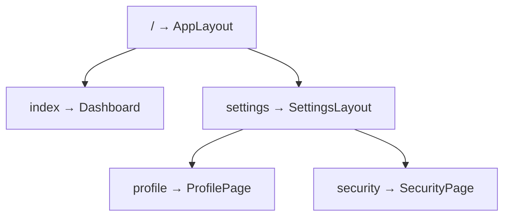

# 嵌套路由与 Layout

嵌套路由让 **Layout 只 mount 一次**，子页在 `<Outlet />` 里切换，顶栏、侧栏不必每页重复包一层； children 配置、index 默认子页、相对 Link 与鉴权 Layout 模式。

---

## 结构示意



URL 示例：

| URL | 渲染 |
|-----|------|
| `/` | AppLayout → Dashboard |
| `/settings/profile` | AppLayout → SettingsLayout → ProfilePage |

---

## 路由配置

```tsx
const router = createBrowserRouter([
  {
    path: '/',
    element: <AppLayout />,
    children: [
      { index: true, element: <Dashboard /> },
      {
        path: 'settings',
        element: <SettingsLayout />,
        children: [
          { index: true, element: <Navigate to="profile" replace /> },
          { path: 'profile', element: <ProfilePage /> },
          { path: 'security', element: <SecurityPage /> },
        ],
      },
      { path: 'users/:userId', element: <UserDetail /> },
    ],
  },
]);
```

```tsx
function AppLayout() {
  return (
    <div className="app">
      <Header />
      <Sidebar />
      <div className="content">
        <Outlet />  {/* 子路由在这里 */}
      </div>
    </div>
  );
}
```

---

## index 路由

| 写法 | 含义 |
|------|------|
| `index: true` | 父 path 的**默认子页** |
| `/` + index | 访问 `/` 时显示 Dashboard |
| `/settings` + index | 可重定向到 `profile` |

```tsx
{ index: true, element: <Navigate to="profile" replace /> }
```

---

## Outlet 与嵌套层级

```tsx
function SettingsLayout() {
  return (
    <div className="settings">
      <SettingsNav />
      <Outlet />  {/* profile / security */}
    </div>
  );
}
```

每一层 Layout 负责自己的壳子；**业务页在最内层**。

---

## 相对 Link

```tsx
// 在 /settings/profile 页面内
<Link to="../security">安全设置</Link>   // → /settings/security
<Link to="..">返回设置根</Link>
```

| to 值 | 相对谁 |
|-------|--------|
| `"security"` | 当前路由段同级 |
| `"../x"` | 上一级 |

---

## 布局复用模式

### 无 UI 的路径分组

```tsx
{
  path: 'admin',
  element: <RequireAdmin />,  // 鉴权 + Outlet
  children: [
    { path: 'users', element: <AdminUsers /> },
  ],
}
```

```tsx
function RequireAdmin() {
  const user = useAuth();
  if (!user?.isAdmin) return <Navigate to="/login" replace />;
  return <Outlet />;
}
```

### 多 Layout 切换

```tsx
{
  element: <Root />,
  children: [
    { element: <MarketingLayout />, children: [...] },
    { element: <AppLayout />, children: [...] },
  ],
}
```

---

## 路由与菜单高亮

```tsx
<NavLink to="/settings/profile" end>资料</NavLink>
```

| `end` | 仅 path 完全匹配时 active |
|-------|---------------------------|
| 无 end | `/settings` 在 `/settings/profile` 时也可能 active |

侧栏子菜单通常加 `end`。

---

## 反模式

| ❌ | ✅ |
|----|-----|
| 每个页面包一层相同 Header | Layout + Outlet |
| path 写绝对 `/settings/profile` 在深层 | 相对 path |
| Layout 里 fetch 子页数据 | loader 或子页 Query |

---

## 小结

**嵌套路由**：父 Route 渲染 Layout，**`<Outlet />`** 渲染子页，壳子只 mount 一次。**index** 路由作为默认子页（如 `/` → Dashboard）。

**相对 Link** 在嵌套内简化路径；多级 Layout 逐层 Outlet。菜单高亮与 **NavLink**、路由 meta 同步；勿每页重复包 Layout。

常见错因：侧栏 NavLink 是否应加 `end`？鉴权 Layout 是否用 Outlet 而非重复包每页？
