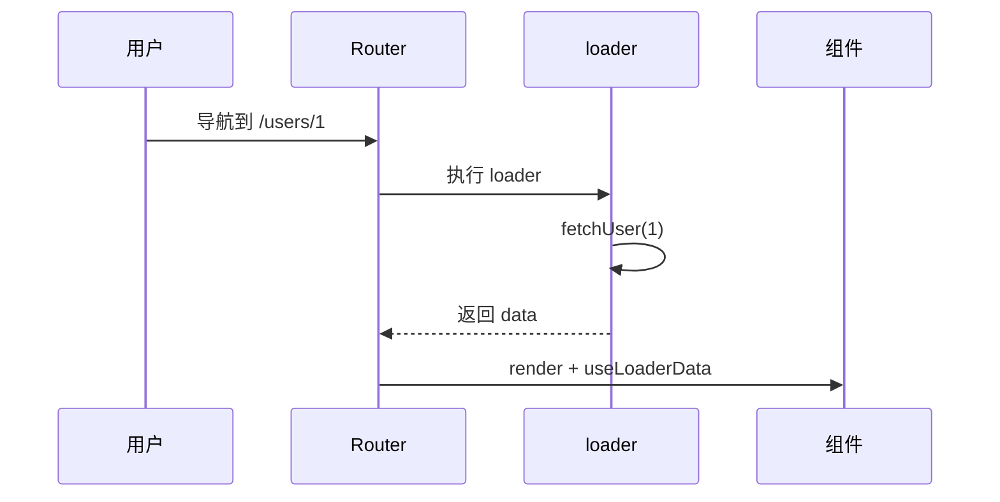
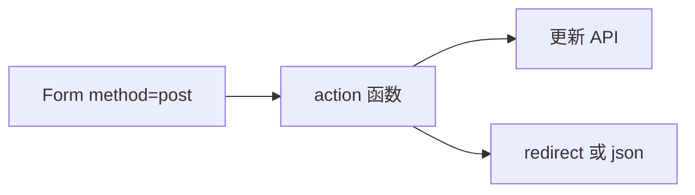

# Data Router 与 Loader / Action

> **Data Router**（`createBrowserRouter`）在**进页面前**就能跑 `loader` 拉数据、用 `action` 处理表单提交，并内置 pending / error 状态——与 TanStack Query 可互补或替代部分场景。

---

## 一、数据流对比



| 传统 | Data Router |
|------|-------------|
| mount 后 useEffect fetch | 导航时 loader 先跑 |
| 自己管 loading | `useNavigation()` |
| 错误边界手写 | `errorElement` |

---

## 二、loader 基础

```tsx
async function userLoader({ params }: LoaderFunctionArgs) {
  const user = await fetchUser(params.userId!);
  if (!user) throw new Response('Not Found', { status: 404 });
  return user;
}

const router = createBrowserRouter([
  {
    path: '/users/:userId',
    loader: userLoader,
    element: <UserDetail />,
    errorElement: <RouteError />,
  },
]);

function UserDetail() {
  const user = useLoaderData() as User;
  return <h1>{user.name}</h1>;
}
```

| API | 作用 |
|-----|------|
| `loader` | 进入路由前异步取数 |
| `useLoaderData()` | 读 loader 返回值 |
| `errorElement` | loader throw 时展示 |

---

## 三、action 与 Form

```tsx
async function updateUserAction({ request, params }: ActionFunctionArgs) {
  const formData = await request.formData();
  const name = formData.get('name') as string;
  await apiUpdateUser(params.userId!, { name });
  return redirect(`/users/${params.userId}`);
}

{
  path: '/users/:userId/edit',
  loader: userLoader,
  action: updateUserAction,
  element: <UserEdit />,
}

function UserEdit() {
  const user = useLoaderData() as User;
  const navigation = useNavigation();
  const isSubmitting = navigation.state === 'submitting';

  return (
    <Form method="post">
      <input name="name" defaultValue={user.name} />
      <button type="submit" disabled={isSubmitting}>保存</button>
    </Form>
  );
}
```



---

## 四、useNavigation 状态

| state | 含义 |
|-------|------|
| `idle` | 无进行中的导航/提交 |
| `loading` | loader 运行中 |
| `submitting` | action 提交中 |

```tsx
const navigation = useNavigation();
if (navigation.state === 'loading') return <PageSkeleton />;
```

---

## 五、与 TanStack Query 如何选

| 场景 | 建议 |
|------|------|
| 路由级首屏数据、SSR 对齐 | loader |
| 列表 cache、后台 refetch、乐观更新 | TanStack Query |
| 混用 | loader 做首屏，Query 做客户端 cache |

```tsx
// 混用：loader 脱水进 Query
export async function userLoader({ params }: LoaderFunctionArgs) {
  const user = await fetchUser(params.userId!);
  queryClient.ensureQueryData({ queryKey: ['users', params.userId], queryFn: () => user });
  return user;
}
```

---

## 六、defer 流式（概览）

```tsx
async function slowLoader() {
  const fast = await fetchFast();
  const slow = fetchSlow(); // Promise
  return defer({ fast, slow });
}

function Page() {
  const { fast, slow } = useLoaderData() as { fast: Fast; slow: Promise<Slow> };
  return (
    <>
      <FastPart data={fast} />
      <Suspense fallback={<Spinner />}>
        <Await resolve={slow}>{data => <SlowPart data={data} />}</Await>
      </Suspense>
    </>
  );
}
```

与 [12-并发与Suspense](../12-并发与Suspense/03-Suspense与数据加载.md) 衔接。

---

## 七、shouldRevalidate

控制 loader 何时重跑：

```tsx
{
  loader: userLoader,
  shouldRevalidate: ({ currentParams, nextParams, formAction }) => {
    return currentParams.userId !== nextParams.userId;
  },
}
```

---

## 八、小结

| 概念 | 用途 |
|------|------|
| loader | 读数据 |
| action | 写数据 / 表单 |
| Form | 声明式提交 |
| errorElement | 路由级错误 UI |

**上一篇**：[02-嵌套路由与Layout](./02-嵌套路由与Layout.md)  
**下一篇**：[04-路由鉴权与导航守卫](./04-路由鉴权与导航守卫.md)
