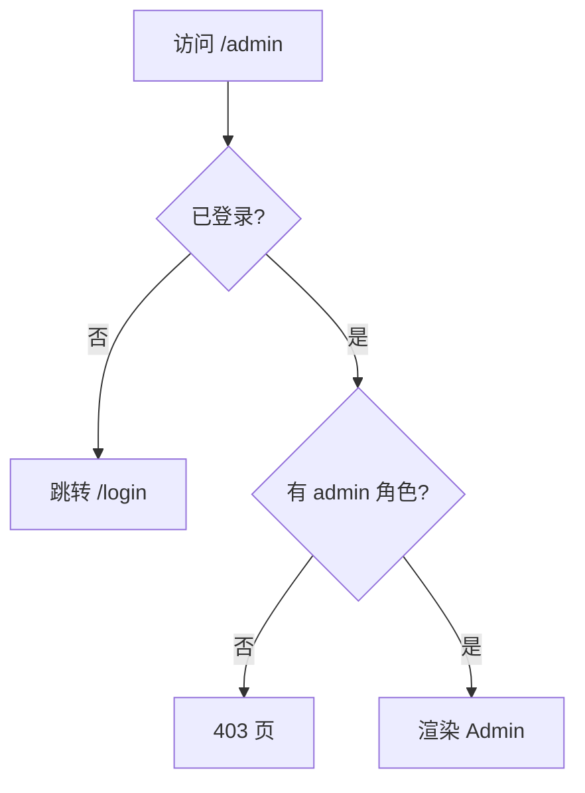

# 路由鉴权与导航守卫

路由鉴权管「能不能进页」：未登录跳登录、无角色显 403。CSR 默认用 **ProtectedRoute + Outlet**；Data Router 可在 loader 里 redirect。HTTP 401 由 request 层处理 mid-session token 过期，两层分工不同。

---

## 常见需求



| 层级 | 例子 |
|------|------|
| 未登录 | 跳登录，带 `returnUrl` |
| 已登录无权限 | 403 或首页 |
| 已登录访问登录页 | 重定向到 dashboard |

---

## Layout 守卫（最常用）

```tsx
function ProtectedRoute() {
  const { user, isLoading } = useAuth();
  const location = useLocation();

  if (isLoading) return <FullPageSpinner />;

  if (!user) {
    return <Navigate to="/login" state={{ from: location }} replace />;
  }

  return <Outlet />;
}

// 路由
{
  element: <ProtectedRoute />,
  children: [
    { path: 'dashboard', element: <Dashboard /> },
    { path: 'settings', element: <Settings /> },
  ],
}
```

登录成功后跳回：

```tsx
function LoginPage() {
  const navigate = useNavigate();
  const location = useLocation();
  const from = location.state?.from?.pathname ?? '/dashboard';

  async function onSuccess() {
    navigate(from, { replace: true });
  }
  ...
}
```

---

## 角色守卫

```tsx
function RequireRole({ roles }: { roles: string[] }) {
  const { user } = useAuth();

  if (!user) return <Navigate to="/login" replace />;
  if (!roles.some(r => user.roles.includes(r))) {
    return <Forbidden />;
  }

  return <Outlet />;
}

{
  path: 'admin',
  element: <RequireRole roles={['admin']} />,
  children: [
    { path: 'users', element: <AdminUsers /> },
  ],
}
```

---

## loader 里鉴权

```tsx
async function adminLoader({ request }: LoaderFunctionArgs) {
  const session = await getSession(request);
  if (!session) throw redirect('/login');
  if (!session.roles.includes('admin')) throw new Response('Forbidden', { status: 403 });
  return null;
}
```

| Layout 守卫 | loader 守卫 |
|-------------|-------------|
| 纯 CSR、读 Context | 可配合 SSR / cookie |
| 简单直观 | 数据请求前即拦截 |

---

## token 与 401

```tsx
// request 层
http.interceptors.response.use(
  res => res,
  err => {
    if (err.response?.status === 401) {
      authStore.logout();
      window.location.href = '/login';
    }
    return Promise.reject(err);
  },
);
```

路由守卫管「能不能进页」；HTTP 401 管「token 过期 mid-session」。

---

## 菜单与路由权限同步

| 做法 | 说明 |
|------|------|
| 路由表带 `meta.roles` | 菜单 filter 同一份配置 |
| 后端返回 permissions | 前端只渲染有权限的项 |
| **不要**只藏菜单不拦路由 | 用户仍可手输 URL |

```tsx
const routes = [
  { path: '/admin/users', element: <AdminUsers />, meta: { roles: ['admin'] } },
];

function Sidebar() {
  const { user } = useAuth();
  const items = routes.filter(r =>
    !r.meta?.roles || r.meta.roles.some(role => user?.roles.includes(role)),
  );
  ...
}
```

---

## AuthProvider 模式

社区常见：**AuthProvider** + **ProtectedRoute** + **loader 可选**。

```tsx
<AuthProvider>
  <RouterProvider router={router} />
</AuthProvider>
```

`useAuth` 可读 token、user profile（TanStack Query 拉 profile 亦可）。

---

## 反模式

| ❌ | ✅ |
|----|-----|
| 每个页面复制 if (!user) | 统一 ProtectedRoute |
| 鉴权只在前端 | 敏感 API 后端必校验 |
| login 页不 prevent 已登录用户 | `<Navigate to="/" />` |

---

## 小结

CSR 默认：**ProtectedRoute** 包 `<Outlet />`，未登录 redirect 登录页。**loader redirect** 适合首屏前鉴权（SSR/Data Router）。

路由 **meta.roles** 与侧栏菜单共用；401 由 request 层统一跳登录。鉴权逻辑集中配置，勿在每个页面组件里散落 if；**只藏菜单不拦路由**不安全。

常见错因：手输 URL 能否绕过菜单隐藏？401 与路由守卫是否各管一层？
