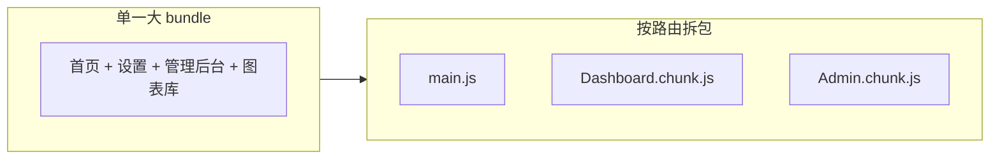

# 懒加载与代码分割

> 路由是 **按页拆包** 的天然边界。用 `React.lazy` + `Suspense` 让非首屏路由延迟加载，减小首包体积、加快 TTI。

---

## 一、为什么按路由拆？



| 问题 | 拆包后 |
|------|--------|
| 首屏下载整站 JS | 只下当前路由 |
| 管理后台很少访问 | 访问时才拉 chunk |

---

## 二、React.lazy 基础

```tsx
import { lazy, Suspense } from 'react';

const Dashboard = lazy(() => import('./pages/Dashboard'));
const Settings = lazy(() => import('./pages/Settings'));

const router = createBrowserRouter([
  {
    path: '/',
    element: <RootLayout />,
    children: [
      {
        path: 'dashboard',
        element: (
          <Suspense fallback={<PageSkeleton />}>
            <Dashboard />
          </Suspense>
        ),
      },
    ],
  },
]);
```

| 要点 | 说明 |
|------|------|
| `import()` | 动态 import，构建工具自动分包 |
| `Suspense` | lazy 组件 loading 时显示 fallback |
| **default export** | lazy 要求模块 default 导出组件 |

---

## 三、封装 lazyRoute

```tsx
function lazyRoute(factory: () => Promise<{ default: ComponentType }>) {
  const Component = lazy(factory);
  return (
    <Suspense fallback={<PageSkeleton />}>
      <Component />
    </Suspense>
  );
}

const router = createBrowserRouter([
  { path: 'dashboard', element: lazyRoute(() => import('./pages/Dashboard')) },
]);
```

---

## 四、Layout 与 lazy 分层

| 策略 | 说明 |
|------|------|
| Layout **不** lazy | 壳子常驻，切换快 |
| 叶子页 lazy | 业务页按需加载 |
| 重型库随页 lazy | 如图表页再 import echarts |

```tsx
// pages/Analytics.tsx — 仅访问时加载 recharts
const Chart = lazy(() => import('./AnalyticsChart'));
```

---

## 五、Vite 与 prefetch

```tsx
<Link
  to="/dashboard"
  onMouseEnter={() => import('./pages/Dashboard')}
>
  仪表盘
</Link>
```

悬停预加载 chunk，点击进入几乎无等待。

React Router v6.4+ 对部分场景有 **route.lazy**：

```tsx
{
  path: 'dashboard',
  lazy: async () => {
    const { Dashboard } = await import('./pages/Dashboard');
    return { Component: Dashboard };
  },
}
```

loader / action 可与 `lazy` 同文件导出。

---

## 六、错误边界

lazy 加载失败（网络断）需 Error Boundary：

```tsx
<RouteErrorBoundary>
  <Suspense fallback={<PageSkeleton />}>
    <Dashboard />
  </Suspense>
</RouteErrorBoundary>
```

见 [12-Error-Boundary](../12-并发与Suspense/05-Error-Boundary与错误恢复.md)。

---

## 七、与性能模块衔接

| 话题 | 文档 |
|------|------|
| memo、Profiler | [11-性能优化](../11-性能优化/) |
| 虚拟列表 | 大列表页内优化 |
| Web Vitals | LCP、INP 与首包相关 |

---

## 八、Checklist

| 项 | |
|----|---|
| 首屏路由在 main bundle | |
| 重页 lazy + Suspense | |
| fallback 有骨架屏 | |
| 404 / 加载失败可重试 | |
| 分析 bundle（rollup-plugin-visualizer） | |

---

## 九、小结

| API | 用途 |
|-----|------|
| `lazy(() => import())` | 异步组件 |
| `Suspense` | loading UI |
| 路由级拆包 | SPA 性能标配 |

**上一篇**：[04-路由鉴权与导航守卫](./04-路由鉴权与导航守卫.md)  
**下一模块**：[11-性能优化](../11-性能优化/01-React渲染性能原理.md)
