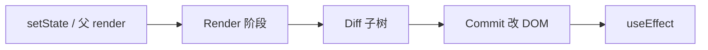
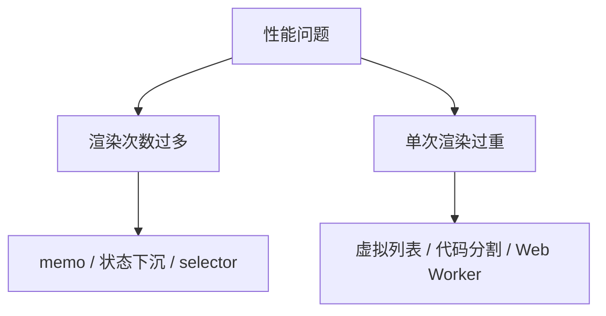

# React 渲染性能原理

优化前先弄清 **何时 re-render、代价在哪**。多数性能问题来自不必要的渲染，或单次渲染太重，而不是 React 本身慢。

---

## 一次更新发生什么



| 阶段 | 成本 |
|------|------|
| **Render** | 执行组件函数、生成 JSX |
| **Diff** | 对比新旧 Fiber 树 |
| **Commit** | 真实 DOM 读写（通常最贵） |
| **Effect** | 异步副作用 |

一次 state 更新会依次经过 Render → Diff → Commit → Effect。Render 阶段执行组件函数并生成新的 JSX 描述；Diff 对比新旧 Fiber 树找出变更点；Commit 把变更写入真实 DOM，这一步往往最耗时；最后 Effect 在浏览器绘制后异步执行副作用。

---

## 默认：父 render → 子也 render

```tsx
function App() {
  const [count, setCount] = useState(0);
  return (
    <>
      <button onClick={() => setCount(c => c + 1)}>{count}</button>
      <HeavyList />  {/* count 变也会 re-render */}
    </>
  );
}
```

**React 默认不跳过子组件**，父组件 re-render 时，子组件也会跟着执行，除非用了 `memo`、把 state 隔离到子树，或并发特性跳过了部分更新。

---

## 性能问题两类



| 类型 | 症状 | 方向 |
|------|------|------|
| **过多 render** | 输入卡顿、Profiler 火焰图全绿 | memo、状态下沉 |
| **过重 render** | 长列表、大表格卡 | 虚拟化、分片 |
| **过大 bundle** | 白屏久 | 路由 lazy |
| **布局抖动** | CLS 高 | 骨架屏、固定尺寸 |

排查时先区分是「渲染次数过多」还是「单次渲染过重」。前者常见原因是父 state 变化牵连整棵子树；后者常见于万级 DOM 或复杂计算。bundle 过大和布局抖动属于加载与体验维度，也要分开看。

---

## Profiler 快速看一眼

React DevTools → **Profiler** → 录制交互 → 看哪次 commit 耗时、哪组件 render 多。

| 指标 | 含义 |
|------|------|
| render duration | 该次提交组件耗时 |
| 为什么 render | props 变 / 父 render / hook 变 |

Profiler 是定位瓶颈的首选工具：录制真实交互后，火焰图里条块越宽表示该组件及子树耗时占比越大；开启「Why did this render」能直接看到触发原因。

---

## 状态下沉

把 state 放到**真正需要它的子树**，避免兄弟无关更新：

```tsx
// ❌ state 在 App，Typing 导致 Page 也 render
function App() {
  const [text, setText] = useState('');
  return (
    <>
      <input value={text} onChange={e => setText(e.target.value)} />
      <ExpensivePage />
    </>
  );
}

// ✅ 输入区独立组件
function SearchBox() {
  const [text, setText] = useState('');
  return <input value={text} onChange={e => setText(e.target.value)} />;
}

function App() {
  return (
    <>
      <SearchBox />
      <ExpensivePage />
    </>
  );
}
```

输入框的 state 若放在顶层 App，每次按键都会让 `ExpensivePage` 跟着 re-render。把输入区抽成独立组件，state 变更范围就限制在子树内，这往往比给整页套 memo 更干净。

---

## Context 与全局 store

Context value 变 → **所有 consumer render**。大对象放 Context 是常见瓶颈。

| 方案 | 说明 |
|------|------|
| 拆分 Context | 按关注点拆多个 Provider，减少无关更新 |
| Zustand selector | 只订阅需要的字段，变更范围更小 |

Context 适合低频、范围明确的数据；若 value 是一个大对象且频繁更新，所有 consumer 都会 re-render。拆分 Context 或用带 selector 的 store 可以收窄订阅范围。

---

## 何时不必优化

| 不必过早 | 原因 |
|----------|------|
| 每个组件 memo | 比较 props 也有成本 |
| 每个回调 useCallback | 子组件未 memo 则无效 |
| 小列表虚拟化 | 复杂度 > 收益 |

**先测量，再优化**。没有 Profiler 证据时，全文件套 memo 和 useCallback 只会增加维护成本，收益可能为零。

---

## 与并发模式

`useTransition` 把低优先级更新让路给输入：搜索框即时响应，过滤结果可以稍后更新。并发模式不改变「父 render 连带子 render」的默认规则，但能让交互在重计算期间保持流畅。

---

## 小结

性能优化从理解 render 触发链入手：区分「渲染次数过多」与「单次渲染过重」，用 Profiler 定位后再下手；状态下沉和 Context 拆分往往比全文件 memo 更有效。

一次更新经过 Render、Diff、Commit、Effect 四个阶段，Commit 写 DOM 通常最贵。React 默认父 render 会连带子 render，除非 memo 或 state 隔离。问题分两类：次数过多（状态下沉、memo、selector）和单次过重（虚拟列表、代码分割）。Context 大 value 会让所有 consumer 重渲染，应拆分或换带 selector 的 store。优化前先 Profiler 测量，避免无证据地滥用 memo；并发模式下 `useTransition` 可改善交互延迟。
