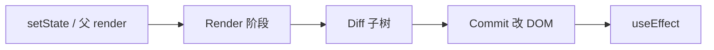
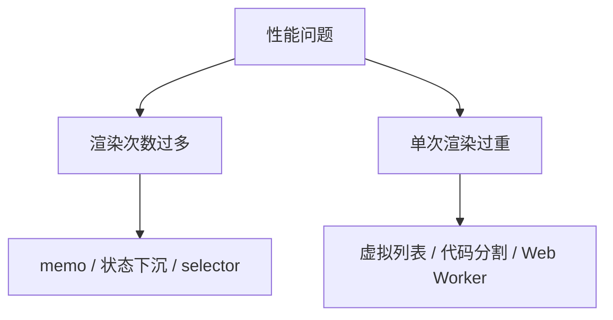

# React 渲染性能原理

> 优化前先懂 **何时 re-render、代价在哪**。多数性能问题不是 React 慢，而是**不必要的渲染**或**单次渲染太重**。

---

## 一、一次更新发生什么？



| 阶段 | 成本 |
|------|------|
| **Render** | 执行组件函数、生成 JSX |
| **Diff** | 对比新旧 Fiber 树 |
| **Commit** | 真实 DOM 读写（通常最贵） |
| **Effect** | 异步副作用 |

见 [06-渲染与调和](../06-渲染与调和/01-渲染流程总览.md)。

---

## 二、默认：父 render → 子也 render

```tsx
function App() {
  const [count, setCount] = useState(0);
  return (
    <>
      <button onClick={() => setCount(c => c + 1)}>{count}</button>
      <HeavyList />  {/* count 变也会 re-render */}
    </>
  );
}
```

**React 默认不跳过子组件**——除非 `memo`、state 隔离、或并发特性跳过。

---

## 三、性能问题两类



| 类型 | 症状 | 方向 |
|------|------|------|
| **过多 render** | 输入卡顿、Profiler 火焰图全绿 | memo、状态下沉 |
| **过重 render** | 长列表、大表格卡 | 虚拟化、分片 |
| **过大 bundle** | 白屏久 | 路由 lazy |
| **布局抖动** | CLS 高 | 骨架屏、固定尺寸 |

---

## 四、Profiler 快速看一眼

React DevTools → **Profiler** → 录制交互 → 看哪次 commit 耗时、哪组件 render 多。

| 指标 | 含义 |
|------|------|
| render duration | 该次提交组件耗时 |
| 为什么 render | props 变 / 父 render / hook 变 |

详见 [03-Profiler与性能分析](./03-Profiler与性能分析.md)。

---

## 五、状态下沉（Lifting State Down 的反面）

把 state 放到**真正需要它的子树**，避免兄弟无关更新：

```tsx
// ❌ state 在 App，Typing 导致 Page 也 render
function App() {
  const [text, setText] = useState('');
  return (
    <>
      <input value={text} onChange={e => setText(e.target.value)} />
      <ExpensivePage />
    </>
  );
}

// ✅ 输入区独立组件
function SearchBox() {
  const [text, setText] = useState('');
  return <input value={text} onChange={e => setText(e.target.value)} />;
}

function App() {
  return (
    <>
      <SearchBox />
      <ExpensivePage />
    </>
  );
}
```

---

## 六、Context 与全局 store

Context value 变 → **所有 consumer render**。大对象放 Context 是常见瓶颈。

| 方案 | 见 |
|------|-----|
| 拆分 Context | [08-Context进阶](../08-状态管理/02-Context进阶与性能.md) |
| Zustand selector | 只订阅字段 |

---

## 七、何时不必优化

| 不必过早 | 原因 |
|----------|------|
| 每个组件 memo | 比较 props 也有成本 |
| 每个回调 useCallback | 子组件未 memo 则无效 |
| 小列表虚拟化 | 复杂度 > 收益 |

**先测量，再优化**。

---

## 八、与并发模式

`useTransition` 把低优先级更新让路给输入，见 [12-并发](../12-并发与Suspense/02-useTransition与useDeferredValue.md)。

---

## 九、小结

| 原则 | |
|------|--|
| 理解 render 触发链 | |
| 区分「次数」与「重量」 | |
| Profiler 定位再动手 | |

**下一篇**：[02-memo-useMemo-useCallback](./02-memo-useMemo-useCallback.md)
