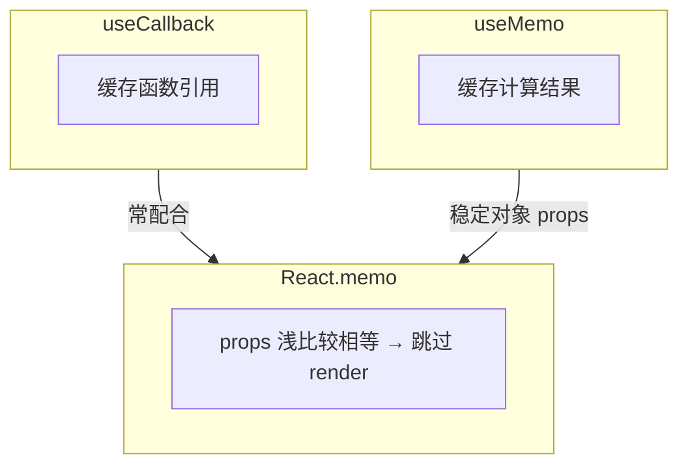

# memo、useMemo 与 useCallback

> 三者常被误用。**memo** 跳过组件 render；**useMemo / useCallback** 稳定引用。只有当下游依赖引用相等时才有意义。

---

## 一、三者分工



| API | 缓存什么 | 典型用途 |
|-----|----------|----------|
| `memo(Component)` | 组件 render | 纯展示、props 少变 |
| `useMemo(fn, deps)` | 计算结果 | 重计算、稳定对象 |
| `useCallback(fn, deps)` | 函数引用 | 传给 memo 子组件 |

---

## 二、React.memo

```tsx
const UserRow = memo(function UserRow({ user }: { user: User }) {
  console.log('UserRow', user.id);
  return <tr><td>{user.name}</td></tr>;
});

function UserList({ users }: { users: User[] }) {
  const [filter, setFilter] = useState('');
  return (
    <>
      <input value={filter} onChange={e => setFilter(e.target.value)} />
      <table>
        {users.map(u => <UserRow key={u.id} user={u} />)}
      </table>
    </>
  );
}
```

`filter` 变时：**UserRow 若 user 引用未变 → 不 re-render**。

### 自定义比较

```tsx
const UserRow = memo(UserRowInner, (prev, next) => prev.user.id === next.user.id);
```

---

## 三、useCallback

```tsx
function Parent() {
  const [count, setCount] = useState(0);
  const handleClick = useCallback(() => {
    console.log('click');
  }, []);  // 稳定引用

  return (
    <>
      <button onClick={() => setCount(c => c + 1)}>{count}</button>
      <MemoChild onClick={handleClick} />
    </>
  );
}

const MemoChild = memo(function MemoChild({ onClick }: { onClick: () => void }) {
  return <button onClick={onClick}>子按钮</button>;
});
```

| 无效场景 | 原因 |
|----------|------|
| 子组件未 memo | 父 render 子照样 render |
| deps 每变都变 | 引用仍变 |

```tsx
// ❌ 每 render 新 inline 函数，memo 失效
<MemoChild onClick={() => doSomething(id)} />

// ✅
const onClick = useCallback(() => doSomething(id), [id]);
<MemoChild onClick={onClick} />
```

---

## 四、useMemo

```tsx
function Report({ items }: { items: Item[] }) {
  const sorted = useMemo(
    () => [...items].sort((a, b) => b.amount - a.amount),
    [items],
  );

  const config = useMemo(() => ({ theme: 'dark', sorted }), [sorted]);

  return <Chart data={sorted} config={config} />;
}
```

| 用途 | 说明 |
|------|------|
| 昂贵计算 | sort、filter 大数组 |
| 稳定 props 对象 | 避免 memo 子组件误判 |
| **不是**语义保证 | 仅性能 hint |

---

## 五、决策表

| 情况 | 建议 |
|------|------|
| 大列表纯行组件 | `memo` 行 |
| 传 callback 给 memo 子 | `useCallback` |
| 重 derived 数据 | `useMemo` |
| Context value 对象 | `useMemo` 包 value |
| 普通小组件 | 通常不需要 |

---

## 六、与 React Compiler（前瞻）

React 19 **Compiler** 可自动 memoize，减少手写 memo/useMemo。未启用前仍要理解手动优化逻辑。见 [18-React19](../18-React19与新特性/)。

---

## 七、反模式

| ❌ | ✅ |
|----|-----|
| 全文件 useCallback | 按需 |
| useMemo 包简单 `a + b` | 直接算 |
| memo 包会频繁变的 props | 状态下沉 |

---

## 八、小结

| 口诀 | |
|------|--|
| memo 防 render | |
| useCallback 稳函数 | |
| useMemo 稳值/省计算 | |
| 配合使用才有效 | |

**上一篇**：[01-React渲染性能原理](./01-React渲染性能原理.md)  
**下一篇**：[03-Profiler与性能分析](./03-Profiler与性能分析.md)
