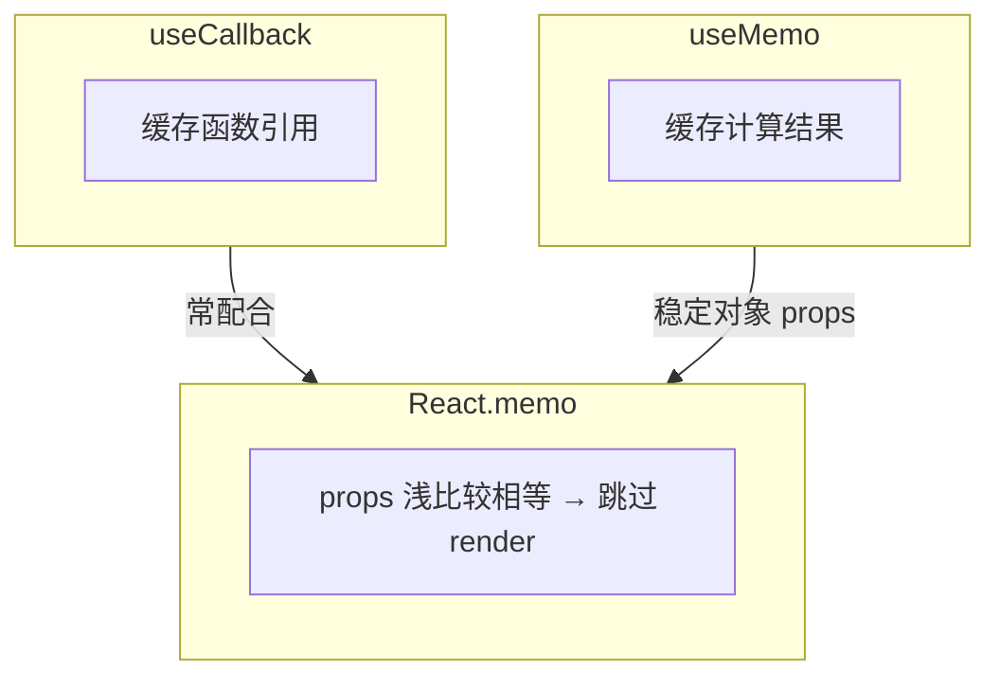

# memo、useMemo 与 useCallback

三者常被误用。**memo** 跳过组件 render；**useMemo / useCallback** 稳定引用。只有当下游依赖引用相等时才有意义。

---

## 三者分工



| API | 缓存什么 | 典型用途 |
|-----|----------|----------|
| `memo(Component)` | 组件 render | 纯展示、props 少变 |
| `useMemo(fn, deps)` | 计算结果 | 重计算、稳定对象 |
| `useCallback(fn, deps)` | 函数引用 | 传给 memo 子组件 |

三者是组合技：`memo` 靠 props 浅比较决定是否跳过 render；`useCallback` 稳定函数引用、`useMemo` 稳定对象或缓存重计算结果，目的都是让 memo 子组件的 props 在无关更新时保持不变。

---

## React.memo

```tsx
const UserRow = memo(function UserRow({ user }: { user: User }) {
  console.log('UserRow', user.id);
  return <tr><td>{user.name}</td></tr>;
});

function UserList({ users }: { users: User[] }) {
  const [filter, setFilter] = useState('');
  return (
    <>
      <input value={filter} onChange={e => setFilter(e.target.value)} />
      <table>
        {users.map(u => <UserRow key={u.id} user={u} />)}
      </table>
    </>
  );
}
```

`filter` 变时：**UserRow 若 user 引用未变 → 不 re-render**。大列表的行组件是最常见的 memo 场景。

### 自定义比较

```tsx
const UserRow = memo(UserRowInner, (prev, next) => prev.user.id === next.user.id);
```

默认浅比较对对象 props 看引用。若父组件每次 render 都新建 user 对象但 id 不变，可写自定义比较函数，但要谨慎，错误的比较函数会导致 UI 不更新。

---

## useCallback

```tsx
function Parent() {
  const [count, setCount] = useState(0);
  const handleClick = useCallback(() => {
    console.log('click');
  }, []);  // 稳定引用

  return (
    <>
      <button onClick={() => setCount(c => c + 1)}>{count}</button>
      <MemoChild onClick={handleClick} />
    </>
  );
}

const MemoChild = memo(function MemoChild({ onClick }: { onClick: () => void }) {
  return <button onClick={onClick}>子按钮</button>;
});
```

| 无效场景 | 原因 |
|----------|------|
| 子组件未 memo | 父 render 子照样 render |
| deps 每变都变 | 引用仍变 |

```tsx
// ❌ 每 render 新 inline 函数，memo 失效
<MemoChild onClick={() => doSomething(id)} />

// ✅
const onClick = useCallback(() => doSomething(id), [id]);
<MemoChild onClick={onClick} />
```

子组件未包 memo 时，单独 useCallback 几乎无效，父 render 子照样 render。inline 箭头函数每次 render 都是新引用，会让 memo 子组件误判 props 变了。

---

## useMemo

```tsx
function Report({ items }: { items: Item[] }) {
  const sorted = useMemo(
    () => [...items].sort((a, b) => b.amount - a.amount),
    [items],
  );

  const config = useMemo(() => ({ theme: 'dark', sorted }), [sorted]);

  return <Chart data={sorted} config={config} />;
}
```

| 用途 | 说明 |
|------|------|
| 昂贵计算 | sort、filter 大数组 |
| 稳定 props 对象 | 避免 memo 子组件误判 |
| **不是**语义保证 | 仅性能 hint |

`useMemo` 适合大数组排序过滤等重计算，也常用在 Context value 或传给 memo 子组件的配置对象上。简单算术不必包 useMemo，缓存本身也有成本。

---

## 决策表

| 情况 | 建议 |
|------|------|
| 大列表纯行组件 | `memo` 行 |
| 传 callback 给 memo 子 | `useCallback` |
| 重 derived 数据 | `useMemo` |
| Context value 对象 | `useMemo` 包 value |
| 普通小组件 | 通常不需要 |

---

## 与 React Compiler（前瞻）

React 19 **Compiler** 可自动 memoize，减少手写 memo/useMemo。未启用前仍要理解手动优化逻辑，Compiler 不是银弹，排障时还是要能读懂 render 触发链。

---

## 反模式

| ❌ | ✅ |
|----|-----|
| 全文件 useCallback | 按需 |
| useMemo 包简单 `a + b` | 直接算 |
| memo 包会频繁变的 props | 状态下沉 |

---

## 小结

memo 跳过组件 render，useMemo/useCallback 稳定引用，三者必须配合使用才有意义；子组件未 memo 时单独 useCallback 无效。

`React.memo` 在 props 浅比较相等时跳过 render，适合大列表行组件等纯展示场景。`useCallback` 稳定函数引用，只有传给 memo 子组件时才有明显收益。`useMemo` 缓存重计算结果或稳定对象 props，Context value 也常用它包裹。决策上：大列表行 memo、传 callback 给 memo 子用 useCallback、重 derived 数据用 useMemo；普通小组件通常不必优化。React Compiler 落地后可减少样板代码，但理解手动优化仍是排障基础。避免全文件 useCallback、用 useMemo 包 trivial 计算、以及 memo 频繁变化的 props，状态下沉往往是更好的解法。
